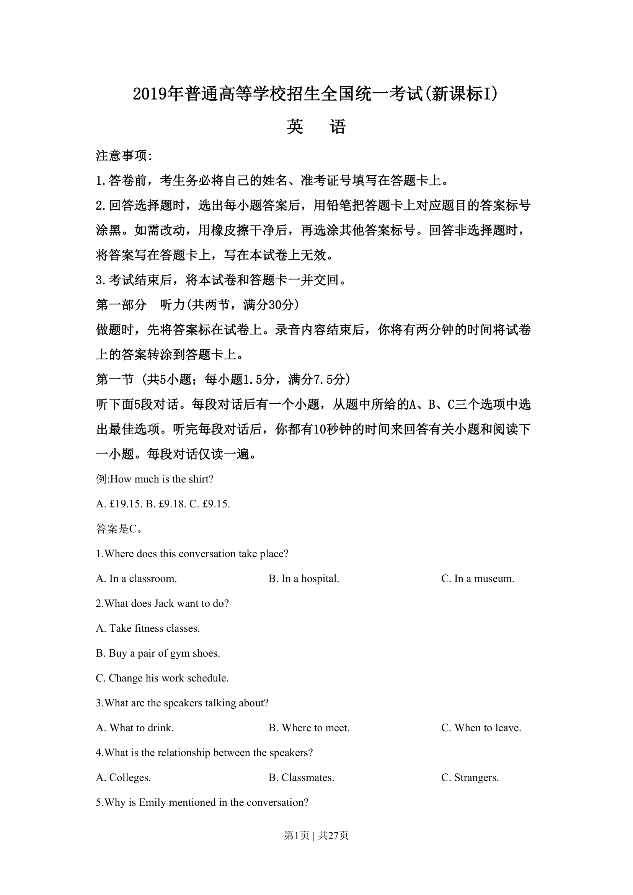
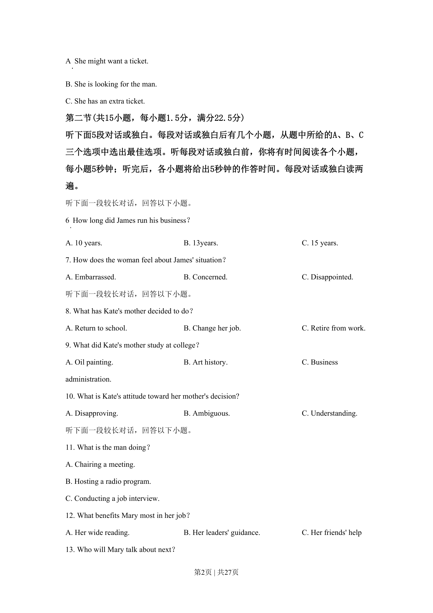
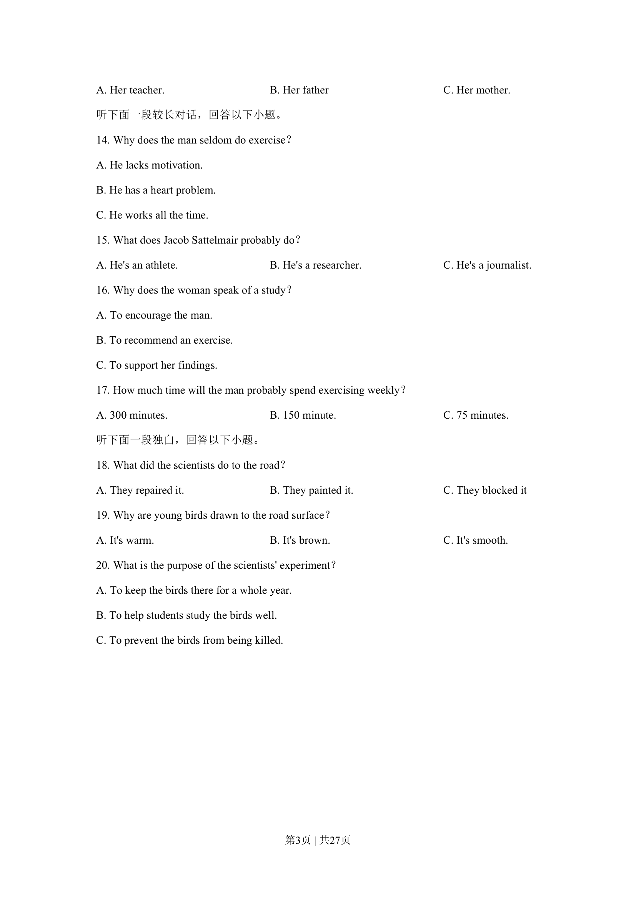
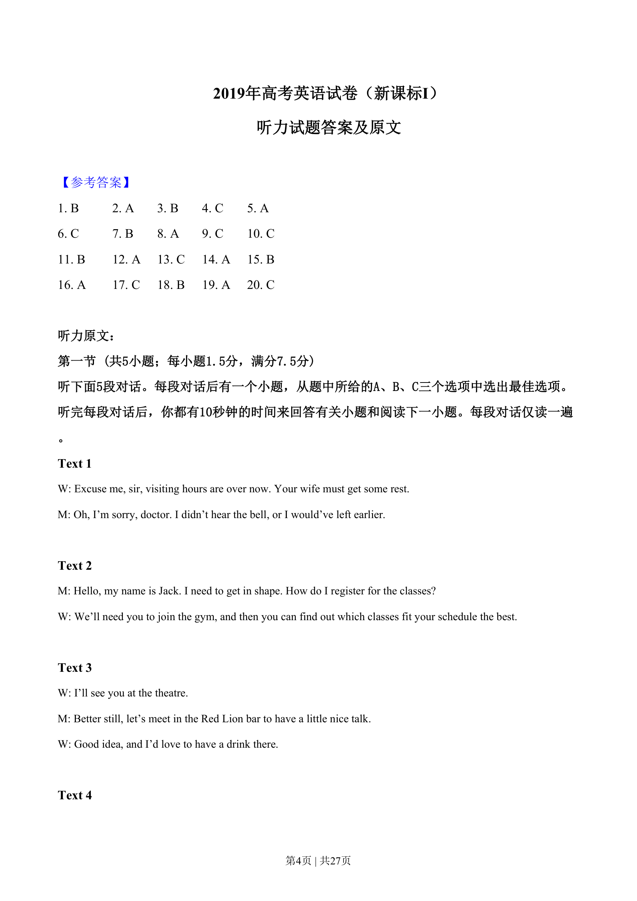
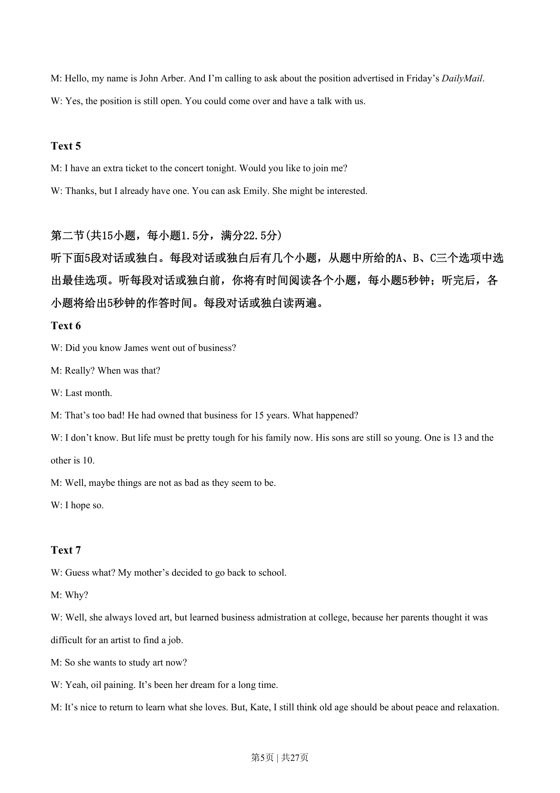
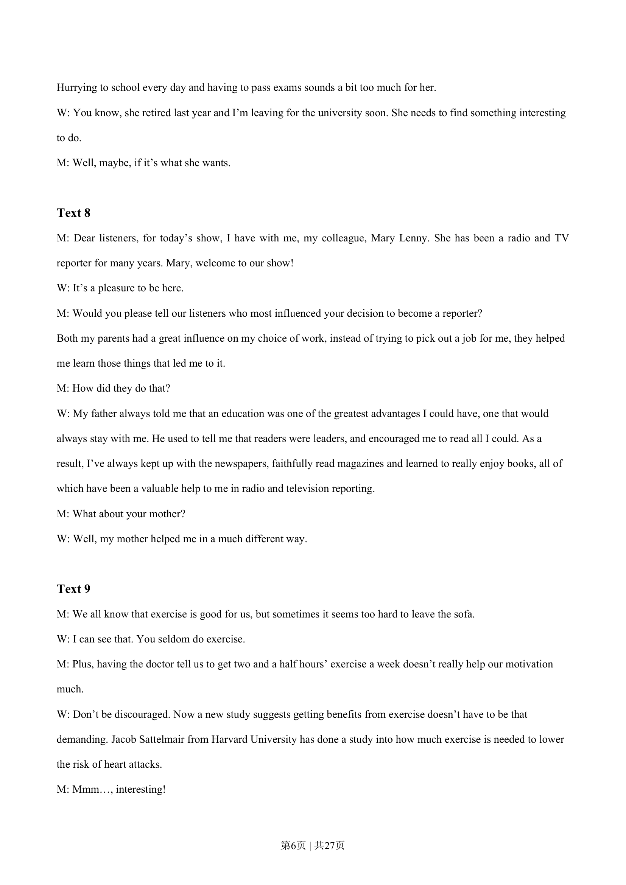
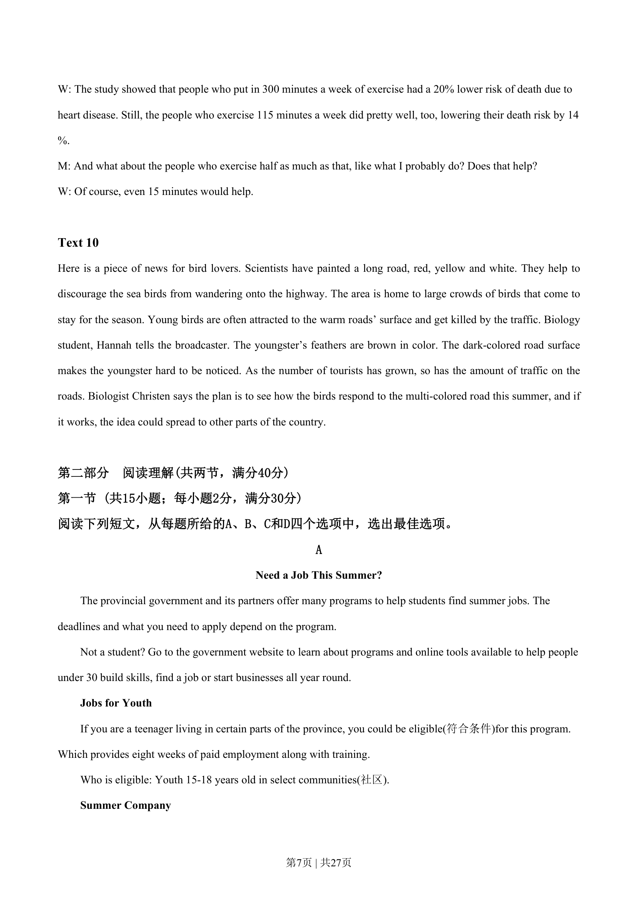
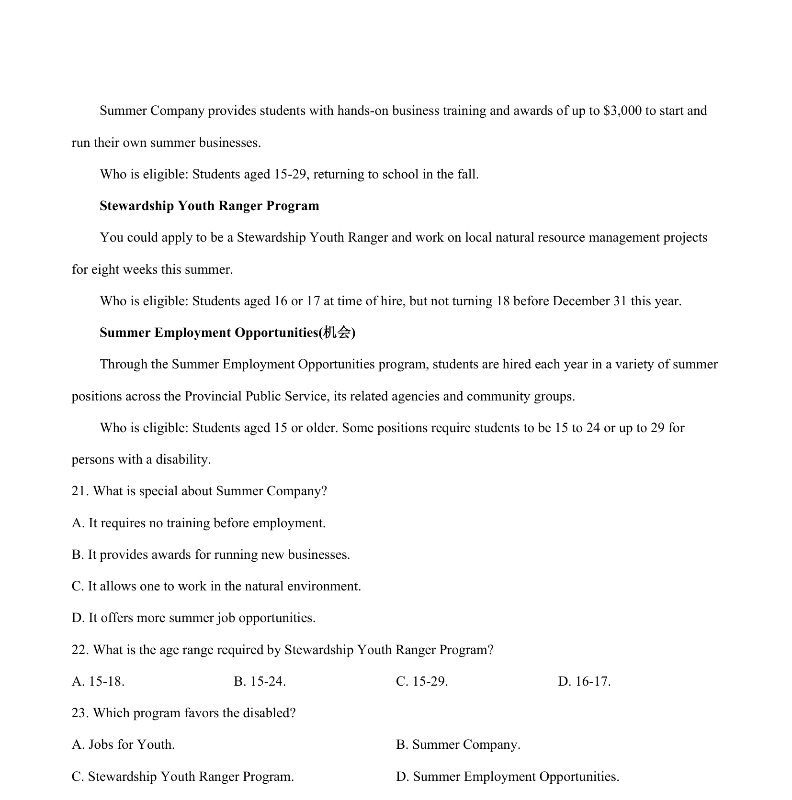

## 篇章题面

## 摘要

本文为应用文。本文叙述了省政府及其合作伙伴提供了许多项目来帮助学生暑期在找到工作。

## 关联考点

- [[724-reading comprehension|阅读理解]]
- [[689-Specific Information|细节理解]]
- [[887-推理判断|推理判断]]

## 答案

`21. B 22. D 23. D`

## 解析

> 📄 原 PDF 第 8 页：`素材/真题/湖南/2008-2024·（湖南）英语高考真题/2019年高考英语试卷（新课标Ⅰ卷）（解析卷）.pdf`
