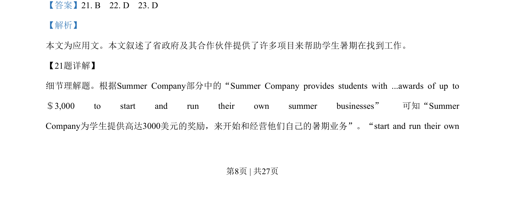
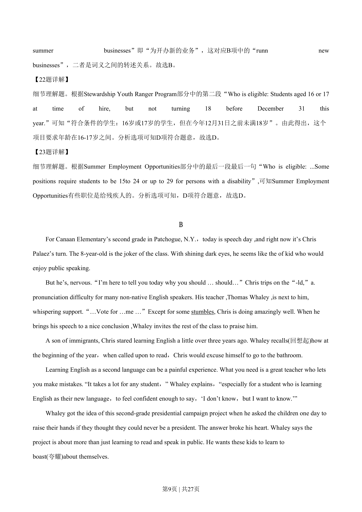
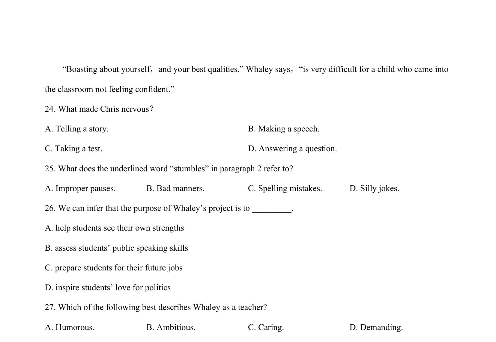
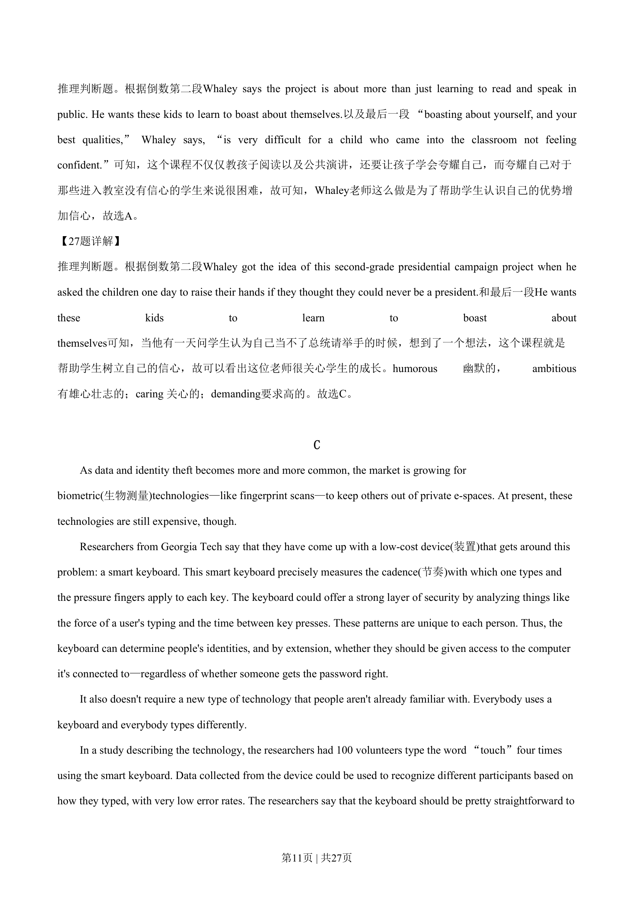

## 篇章题面

## 摘要

本文属于记叙文，讲述Thomas Whaley为了帮助学生学英语以及树立信心专门开展了一个演讲课程。

## 关联考点

- [[724-reading comprehension|阅读理解]]
- [[689-Specific Information|细节理解]]
- [[887-推理判断|推理判断]]

## 答案

`24. B 25. A 26. A 27. C`

## 解析

> 📄 原 PDF 第 10 页：`素材/真题/湖南/2008-2024·（湖南）英语高考真题/2019年高考英语试卷（新课标Ⅰ卷）（解析卷）.pdf`
