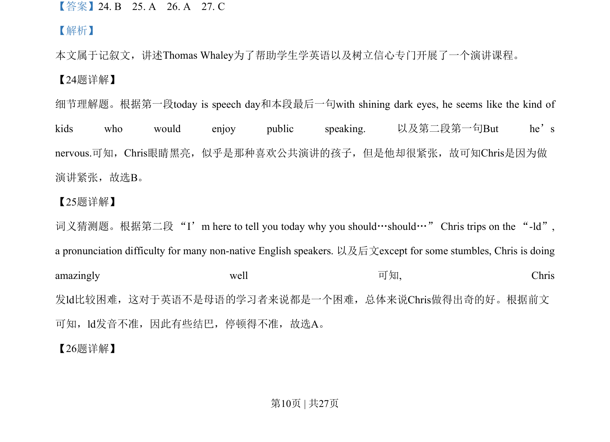
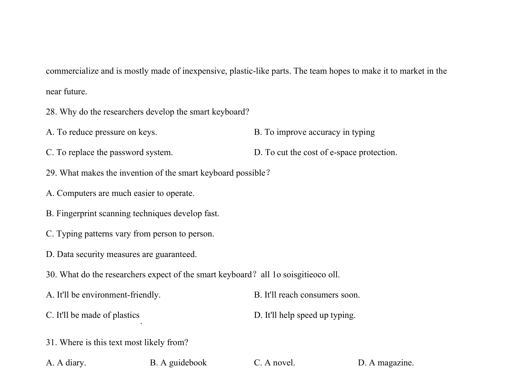
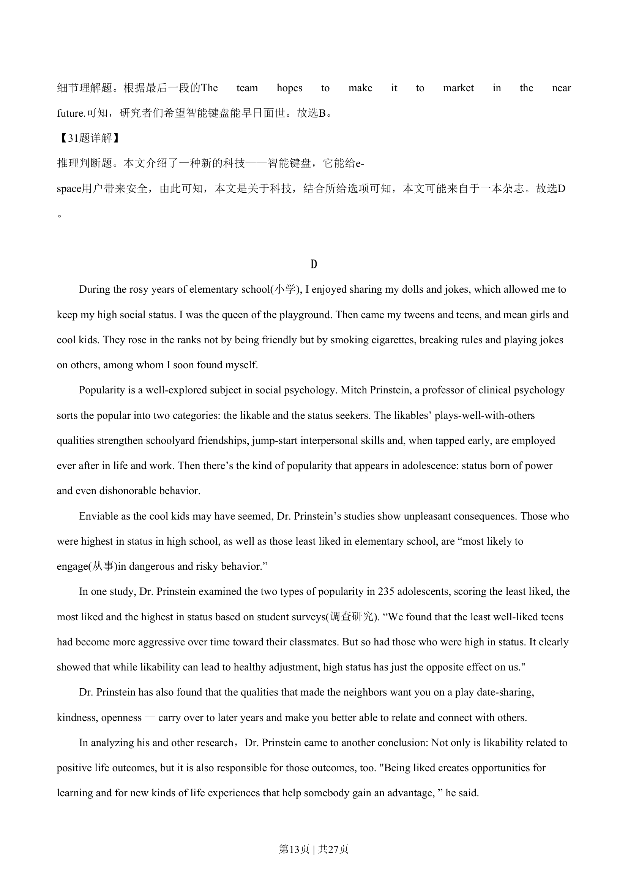

## 篇章题面

## 摘要

这是一篇说明文。数据和身份盗窃变得越来越普遍，目前，向指纹扫描等这些技术仍然是昂贵的。本文介 绍了一种新的科技——智能键盘，它能给e-space用户带来安全，而且这项技术也不贵。

## 关联考点

- [[724-reading comprehension|阅读理解]]
- [[689-Specific Information|细节理解]]
- [[887-推理判断|推理判断]]

## 答案

`28. D 29. C 30. B 31. D`

## 解析

> 📄 原 PDF 第 12 页：`素材/真题/湖南/2008-2024·（湖南）英语高考真题/2019年高考英语试卷（新课标Ⅰ卷）（解析卷）.pdf`
