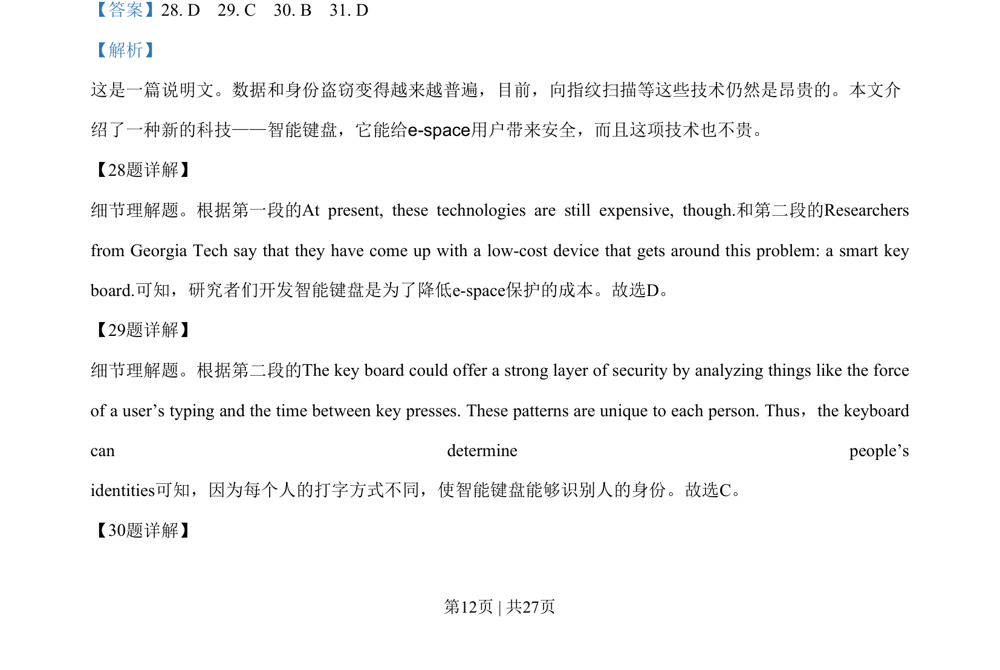
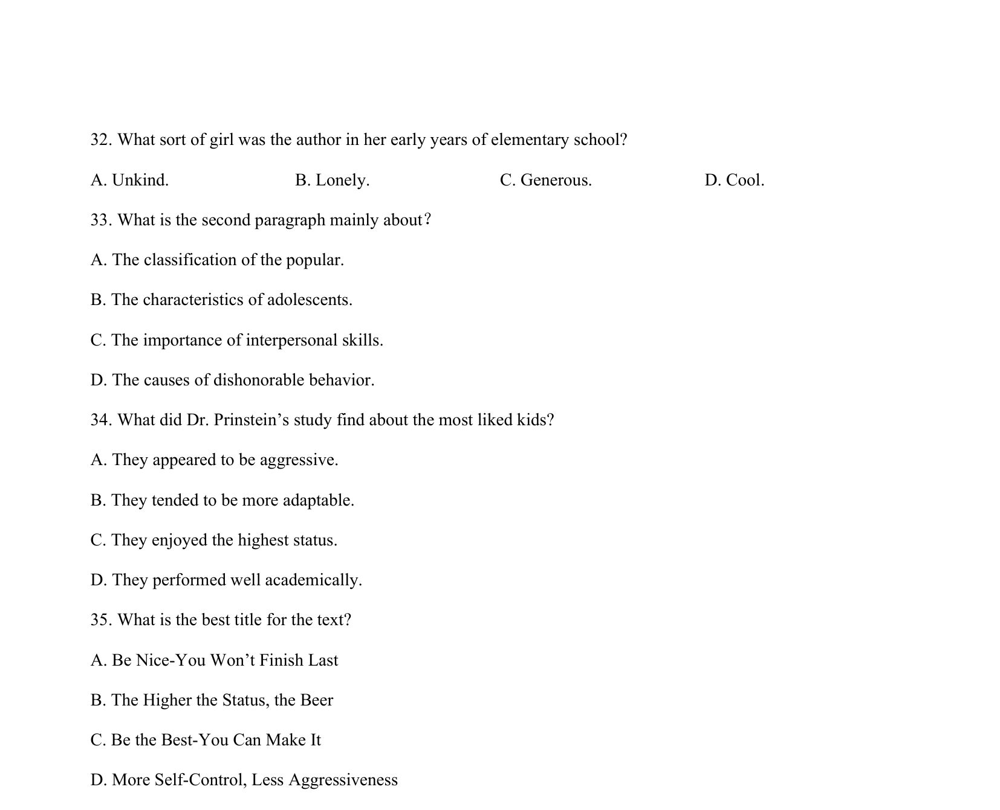
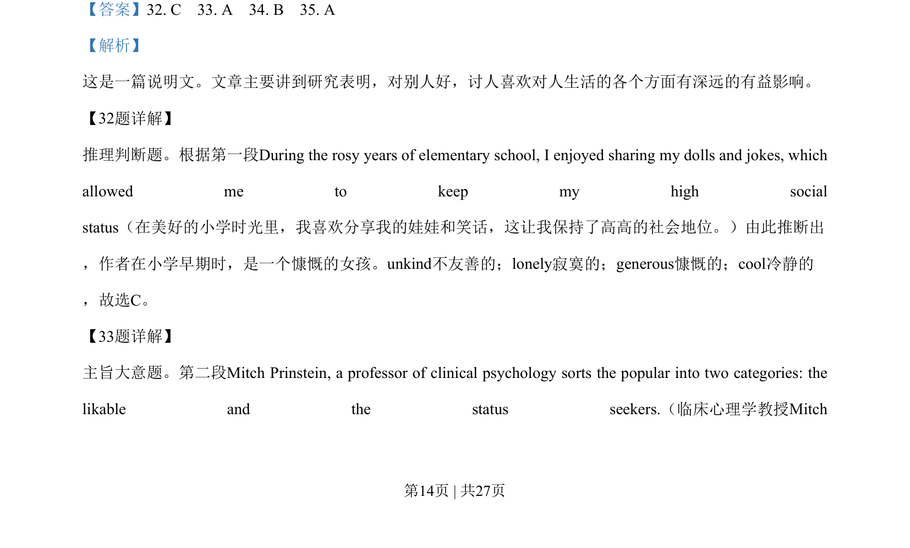
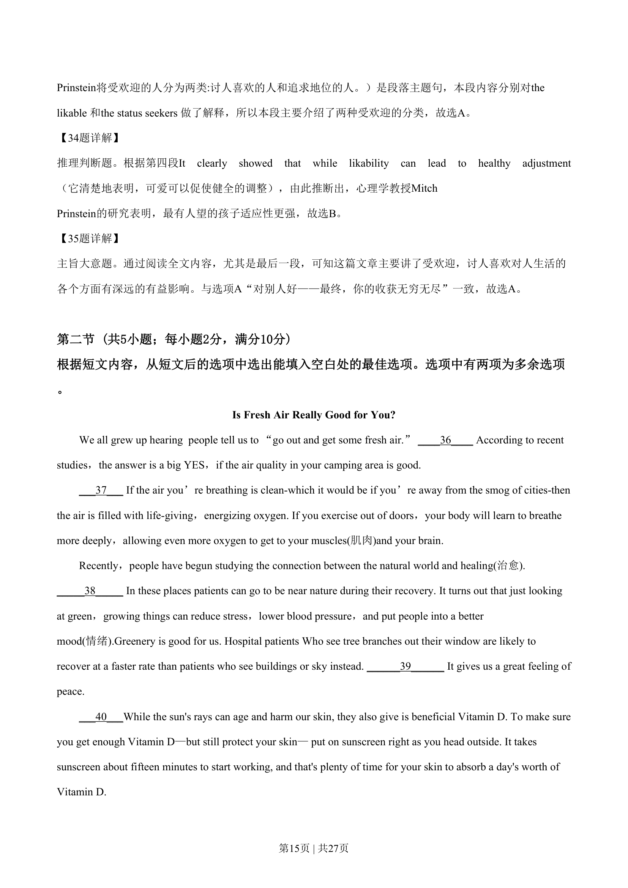
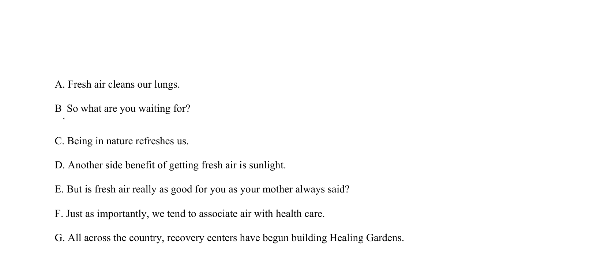

## 篇章题面

## 摘要

这是一篇说明文。文章主要讲到研究表明，对别人好，讨人喜欢对人生活的各个方面有深远的有益影响。

## 关联考点

- [[724-reading comprehension|阅读理解]]
- [[689-Specific Information|细节理解]]
- [[887-推理判断|推理判断]]

## 答案

`32. C 33. A 34. B 35. A`

## 解析

> 📄 原 PDF 第 14 页：`素材/真题/湖南/2008-2024·（湖南）英语高考真题/2019年高考英语试卷（新课标Ⅰ卷）（解析卷）.pdf`
