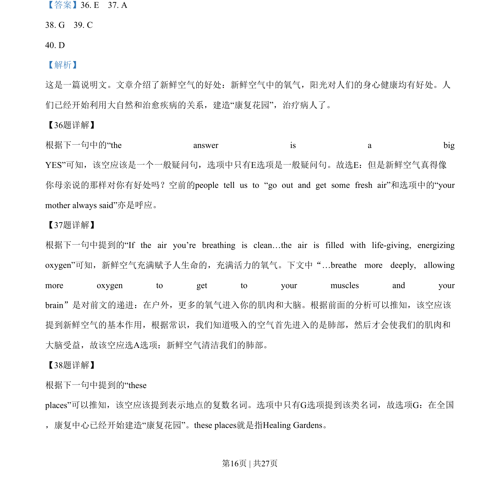
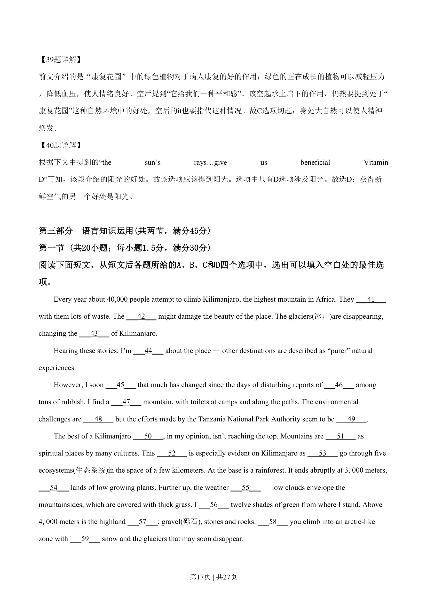
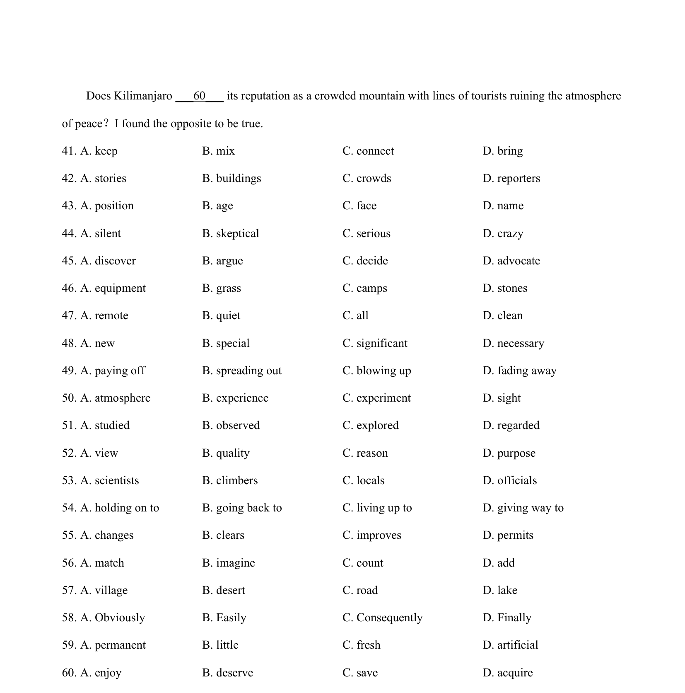
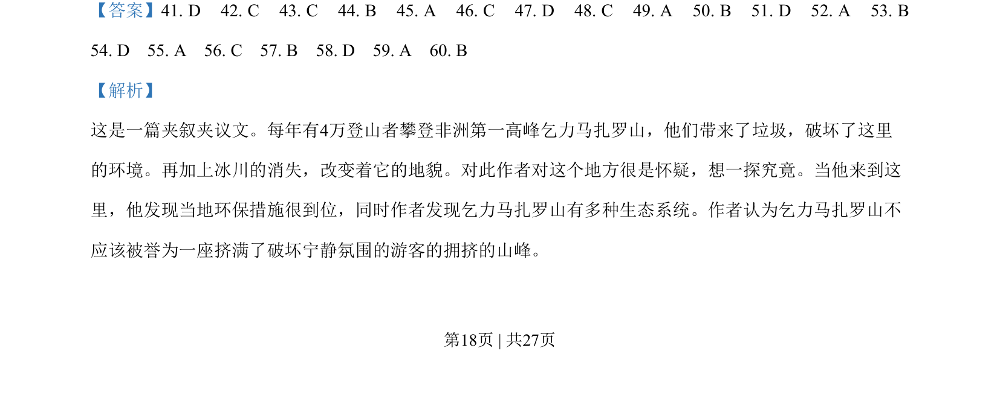
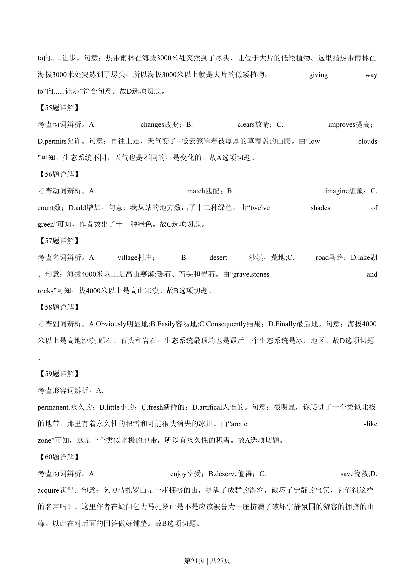
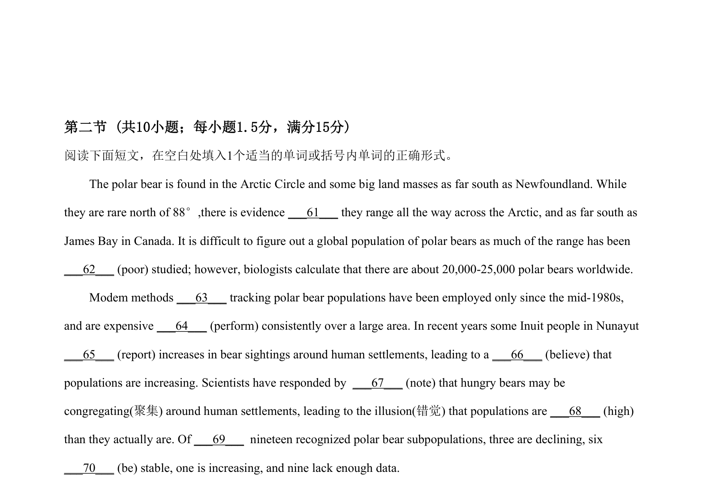

## 篇章题面

## 摘要

这是一篇夹叙夹议文。每年有4万登山者攀登非洲第一高峰乞力马扎罗山，他们带来了垃圾，破坏了这里 的环境。再加上冰川的消失，改变着它的地貌。对此作者对这个地方很是怀疑，想一探究竟。当他来到这 里，他发现当地环保措施很到位，同时作者发现乞力马扎罗山有多种生态系统。作者认为乞力马扎罗山不 应该被誉为一座挤满了破坏宁静氛围的游客的拥挤的山峰。

## 关联考点

- [[810-完形填空|完形填空]]
- [[900-词义辨析|词义辨析]]
- [[908-语境理解|语境理解]]

## 答案

`41. D 42. C 43. C 44. B 45. A 46. C 47. D 48. C 49. A 50. B 51. D 52. A 53. B 54. D 55. A 56. C 57. B 58. D 59. A 60. B`

## 解析

> 📄 原 PDF 第 18 页：`素材/真题/湖南/2008-2024·（湖南）英语高考真题/2019年高考英语试卷（新课标Ⅰ卷）（解析卷）.pdf`
