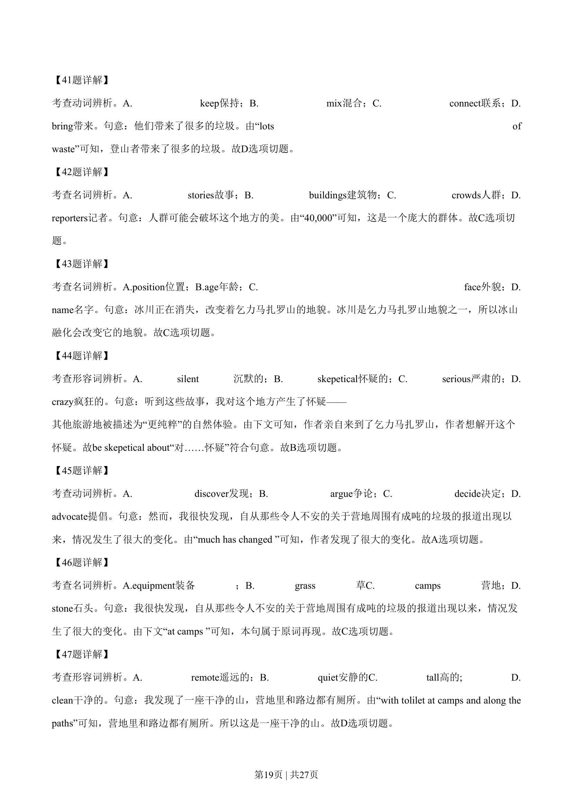
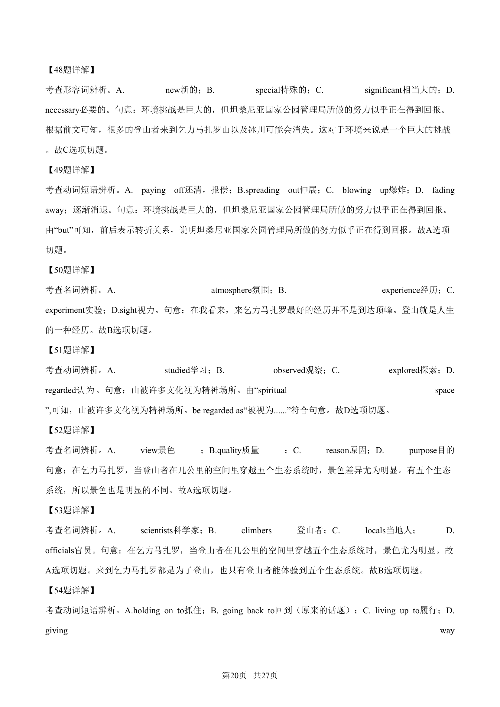
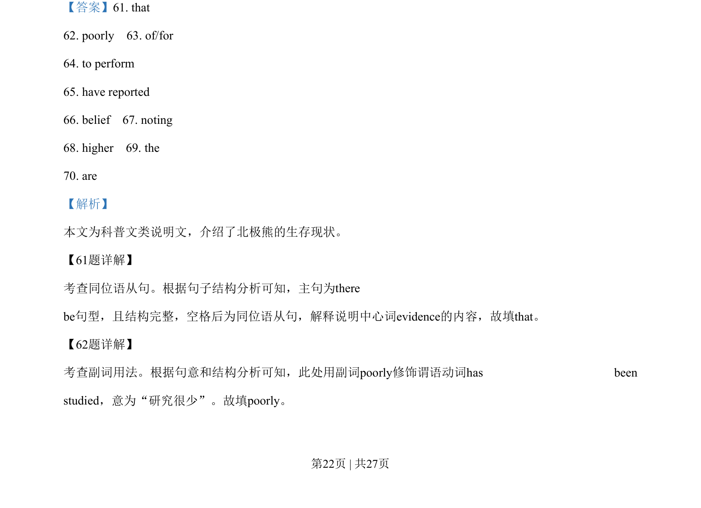
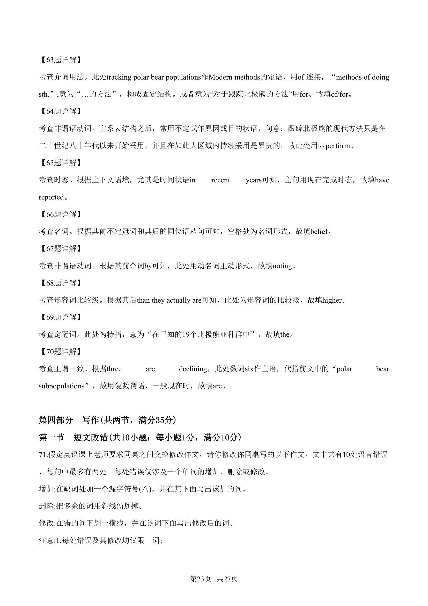

## 篇章题面

## 摘要

本文为科普文类说明文，介绍了北极熊的生存现状。

## 关联考点

- [[996-书面表达|书面表达]]
- [[1007-应用文写作|应用文写作]]

## 答案

`61. that 62. poorly 63. of/for 64. to perform 65. have reported 66. belief 67. noting 68. higher 69. the 70. are`

## 解析

> 📄 原 PDF 第 22 页：`素材/真题/湖南/2008-2024·（湖南）英语高考真题/2019年高考英语试卷（新课标Ⅰ卷）（解析卷）.pdf`
