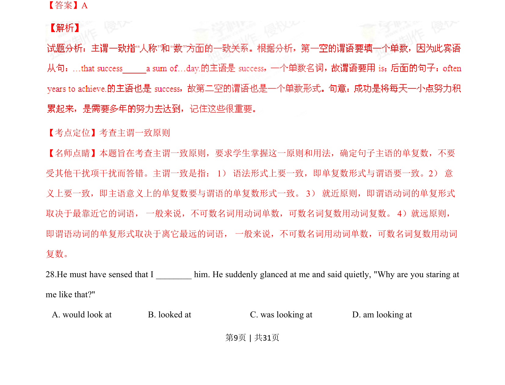
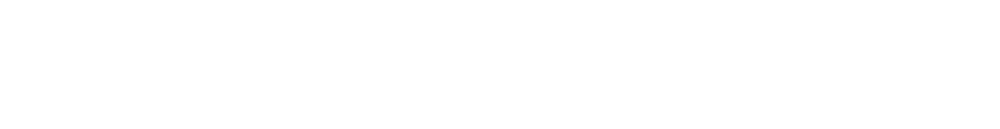
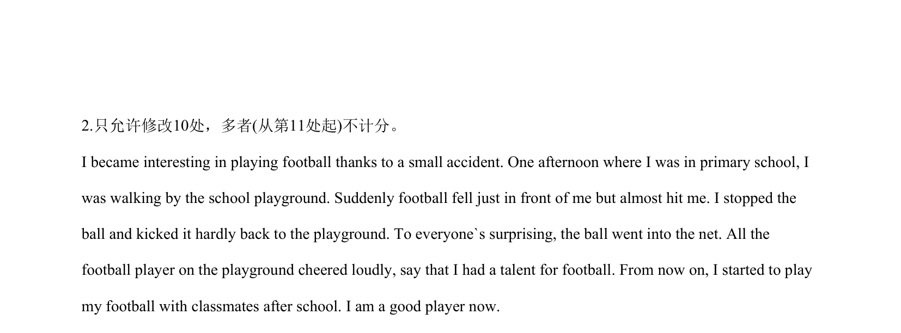
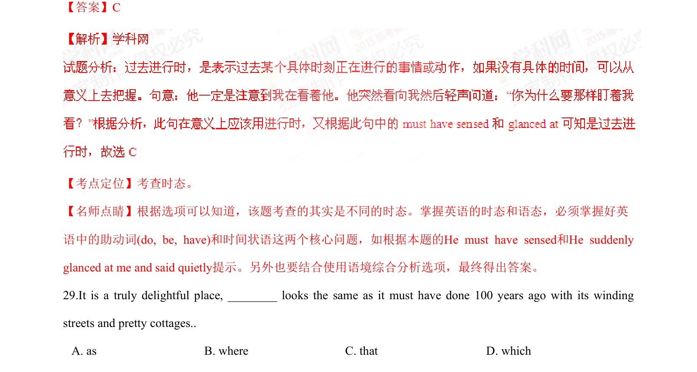
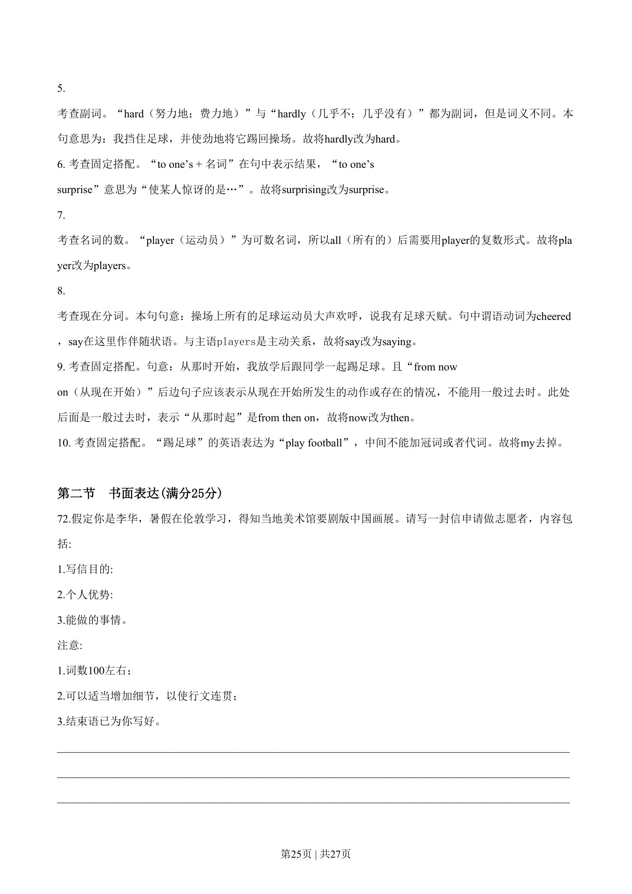

## 篇章题面

## 摘要

【分析】 这是一篇记叙文。作者讲述了由于一次偶然的经历，自己喜欢上了踢足球。从此成了一名优秀球员。

## 关联考点

- [[996-书面表达|书面表达]]
- [[1007-应用文写作|应用文写作]]

## 答案

`interesting→interested where→when football前面加上a but→and hardly→hard surprising→surprise player→players say→saying now→then 去掉my`

## 解析

> 📄 原 PDF 第 24 页：`素材/真题/湖南/2008-2024·（湖南）英语高考真题/2019年高考英语试卷（新课标Ⅰ卷）（解析卷）.pdf`
