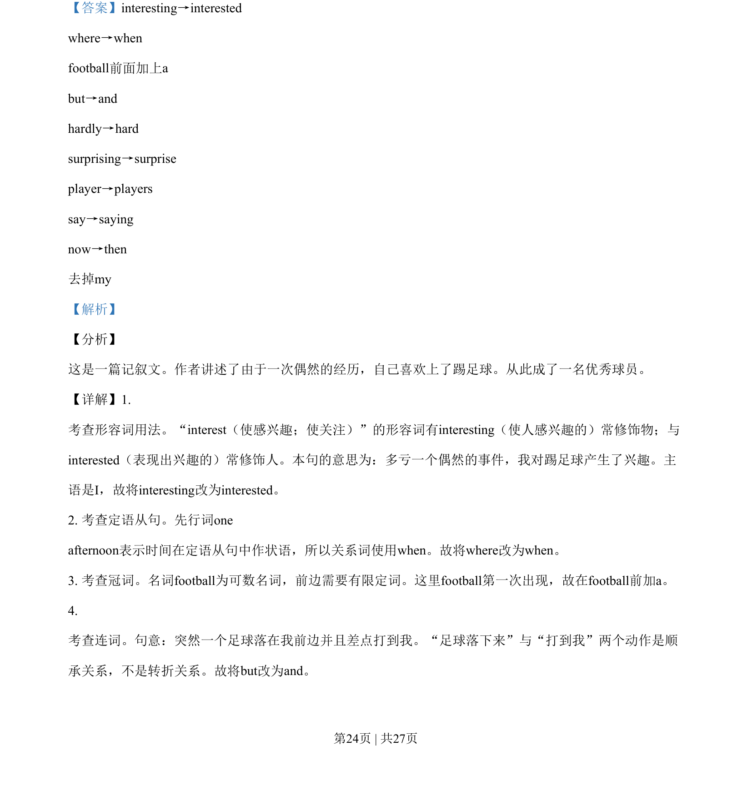
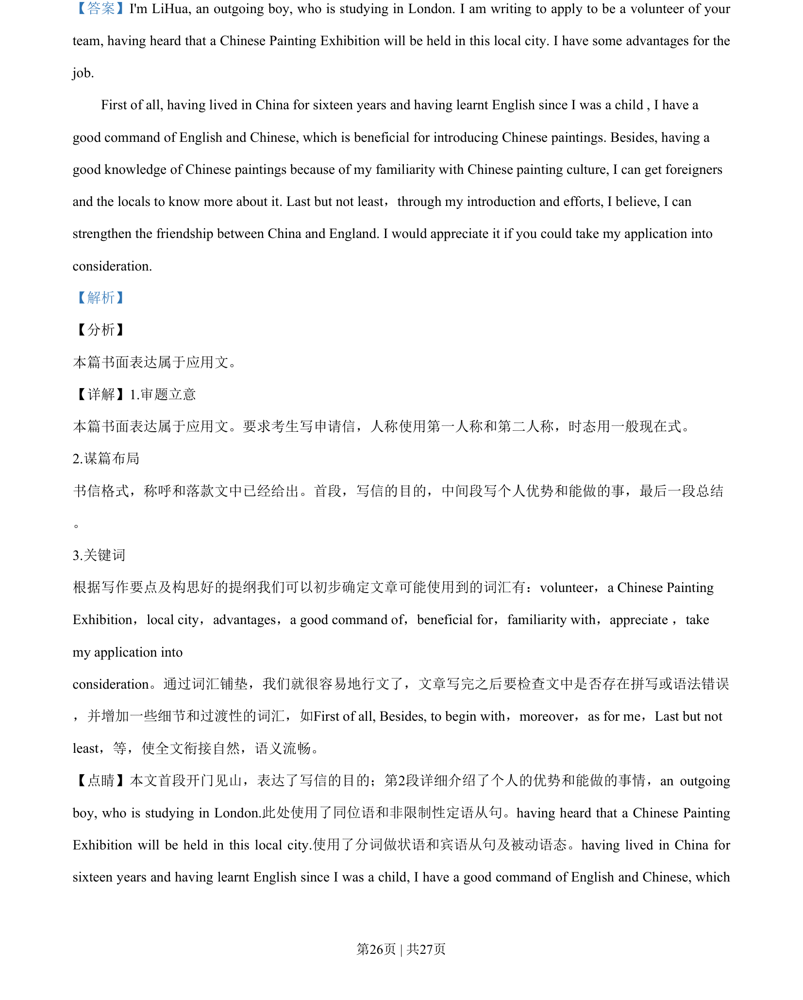
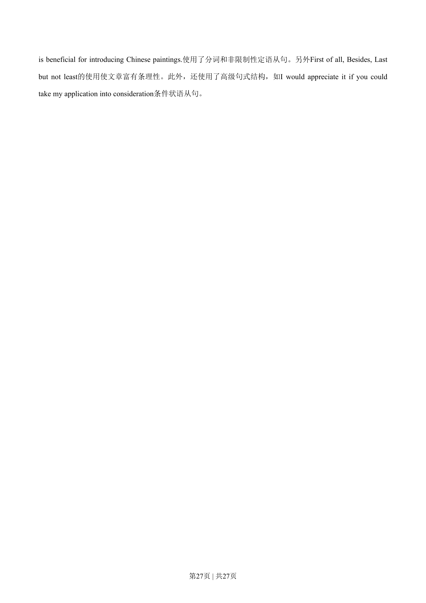

## 篇章题面

## 摘要

【分析】 本篇书面表达属于应用文。

## 关联考点

- [[996-书面表达|书面表达]]
- [[1007-应用文写作|应用文写作]]

## 答案

`I'm LiHua, an outgoing boy, who is studying in London. I am writing to apply to be a volunteer of your team, having heard that a Chinese Painting Exhibition will be held in this local city. I have some advantages for the job. First of all, having lived in China for sixteen years and having learnt En`

## 解析

> 📄 原 PDF 第 26 页：`素材/真题/湖南/2008-2024·（湖南）英语高考真题/2019年高考英语试卷（新课标Ⅰ卷）（解析卷）.pdf`
