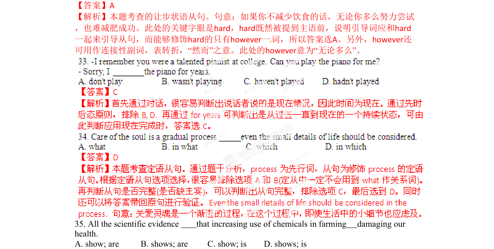

## 篇章题面

## 摘要

（待补）

## 关联考点

- [[810-完形填空|完形填空]]
- [[900-词义辨析|词义辨析]]
- [[908-语境理解|语境理解]]

## 答案

`8. A 9. C 10. B 听下面一段较长对话，回答以下小题。 11. How did the man feel about his performance today? A. Greatly encouraged. B. A bit dissatisfied. C. Terribly disappointed. 12. What did the man say helped him overcome the problem? A. Patience. B. Luck. C. Determination. 13. What is the woman doing? A. Conducting`

## 解析

> 📄 原 PDF 第 2 页：`素材/真题/湖南/2008-2024·（湖南）英语高考真题/2020年高考英语试卷（新课标Ⅰ卷）（解析卷）.pdf`
