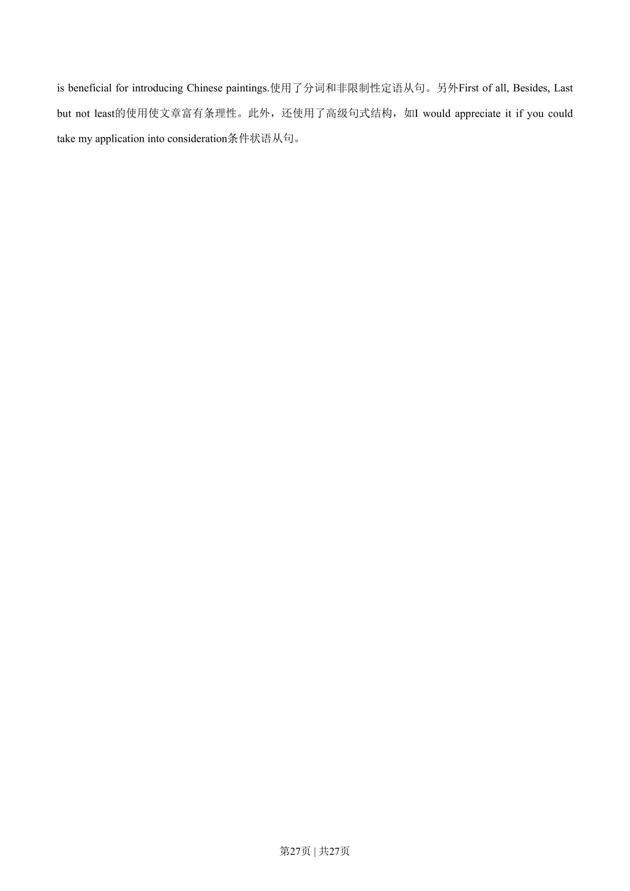

## 篇章题面

## 摘要

（待补）

## 关联考点

- [[1031-语篇填空|语篇填空]]
- [[1018-语法填空|语法填空]]

## 答案

`14. C 15. A 16. C 听下面一段独白，回答以下小题。 17. Where is Jeff from？ A. Liverpool. B. Coventry. C. Newcastle. 18. Where do young men go to watch big games according to Jeff？ A. Pubs. B. Stadiums. C. Friends’ homes. 19. Why does Jeff have to pick a team to support？ A. To avoid being bothered. B. To open a conve`

## 解析

> 📄 原 PDF 第 3 页：`素材/真题/湖南/2008-2024·（湖南）英语高考真题/2020年高考英语试卷（新课标Ⅰ卷）（解析卷）.pdf`
