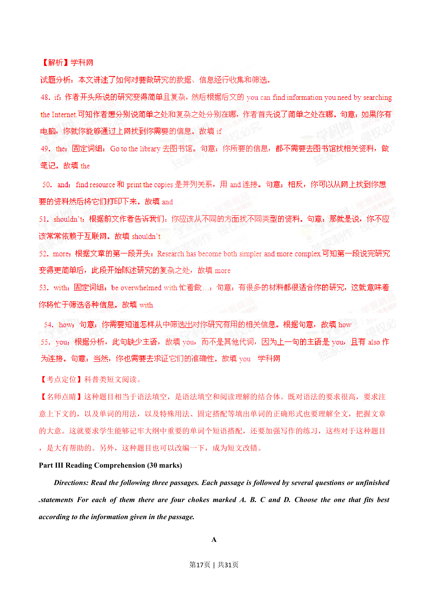
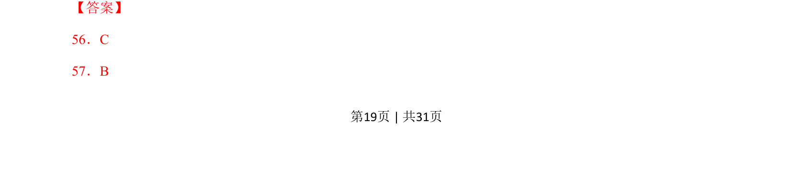

## 篇章题面

## 摘要

（待补）

## 关联考点

- [[810-完形填空|完形填空]]
- [[900-词义辨析|词义辨析]]
- [[908-语境理解|语境理解]]

## 答案

`8. C 9. C 听下面一段较长对话，回答以下小题。 10. What kind of camera does the man want? A. A TV camera. B. A video camera. C. A movie camera. 11. Which function is the man most interested in? A. Underwater filming. B. A large memory. C. Auto-focus. 12. How much would the man pay for the second camera? A. 950 euros. `

## 解析

> 📄 原 PDF 第 6 页：`素材/真题/湖南/2008-2024·（湖南）英语高考真题/2020年高考英语试卷（新课标Ⅰ卷）（解析卷）.pdf`
