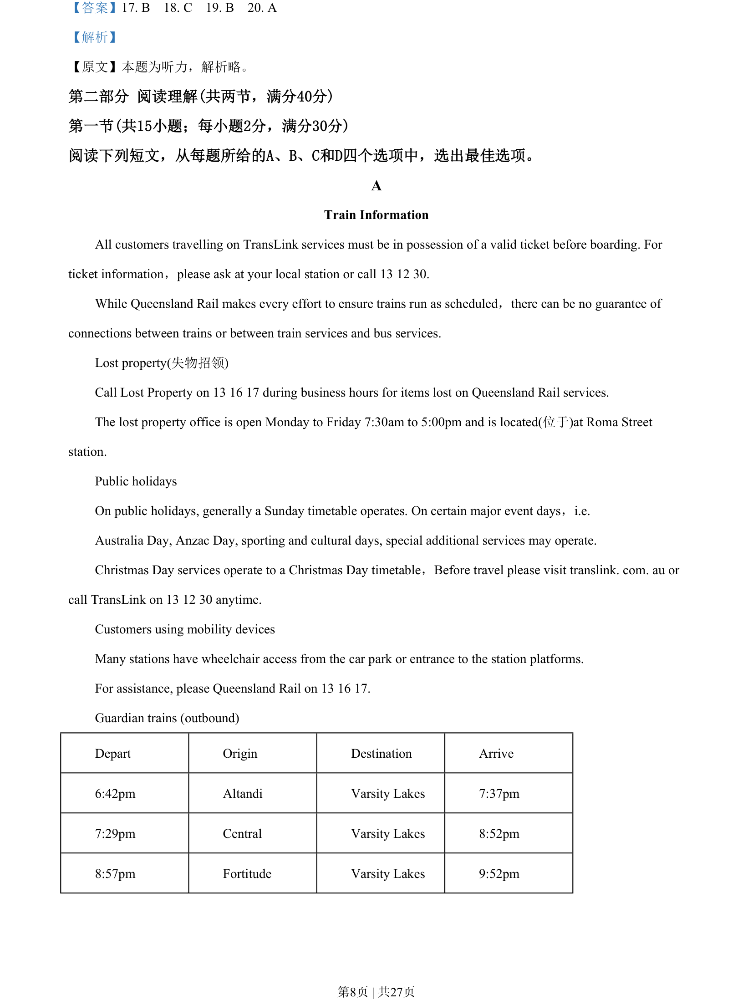
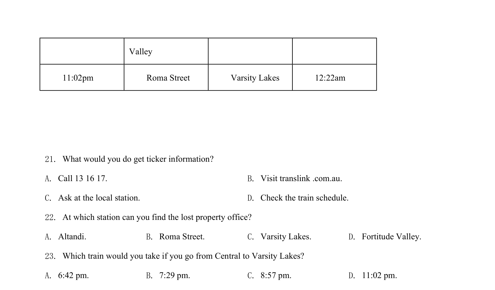
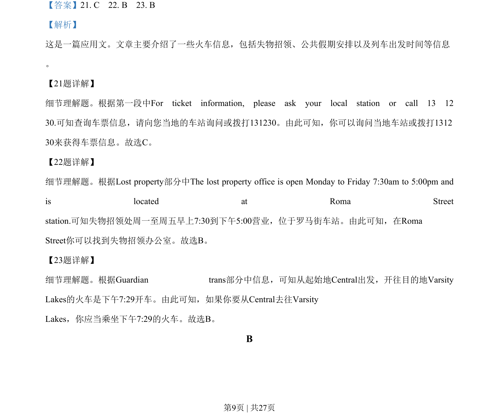
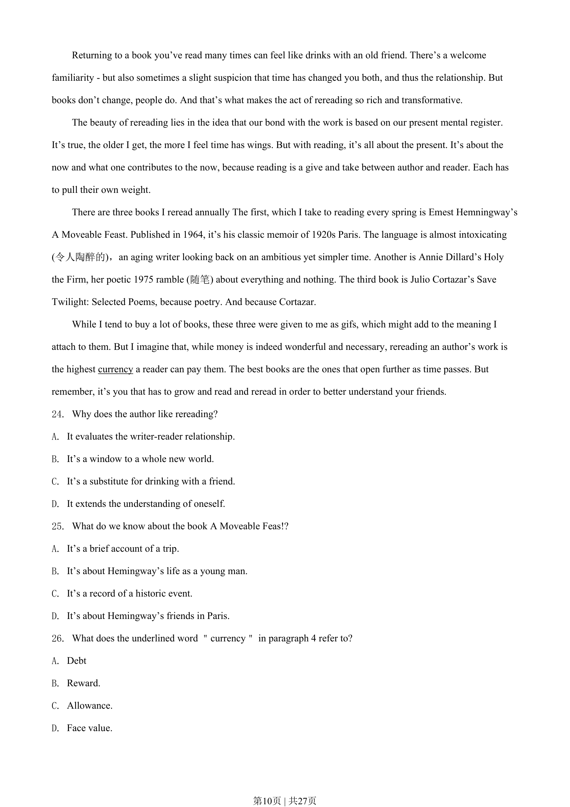
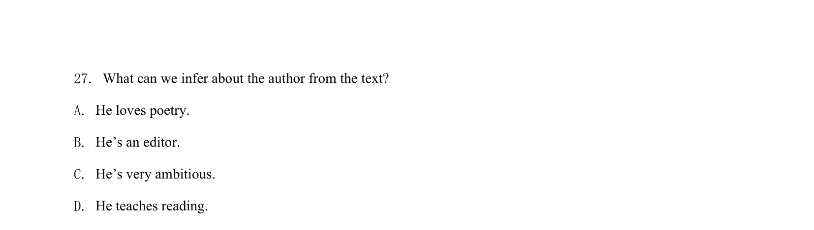

## 篇章题面

## 摘要

这是一篇应用文。文章主要介绍了一些火车信息，包括失物招领、公共假期安排以及列车出发时间等信息 。

## 关联考点

- [[724-reading comprehension|阅读理解]]
- [[689-Specific Information|细节理解]]
- [[887-推理判断|推理判断]]

## 答案

`21. C 22. B 23. B`

## 解析

> 📄 原 PDF 第 9 页：`素材/真题/湖南/2008-2024·（湖南）英语高考真题/2020年高考英语试卷（新课标Ⅰ卷）（解析卷）.pdf`
