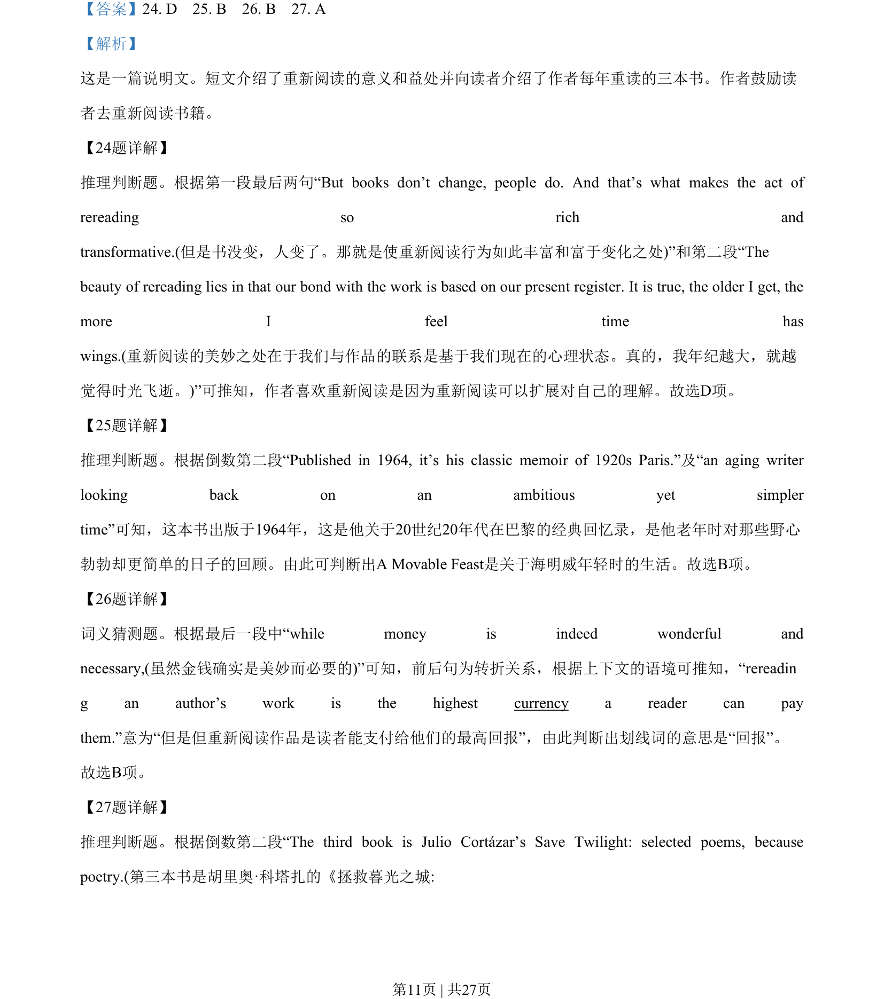
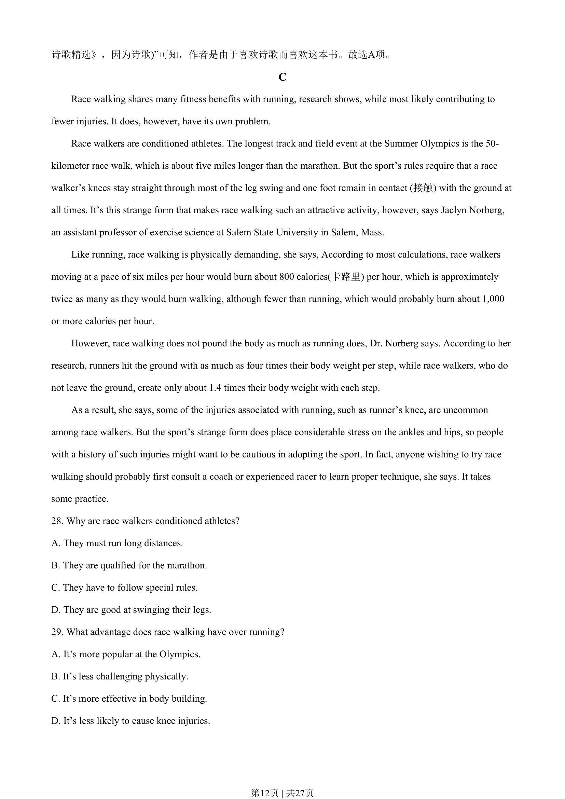
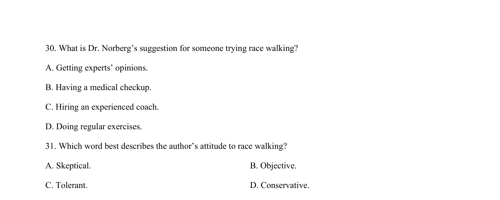
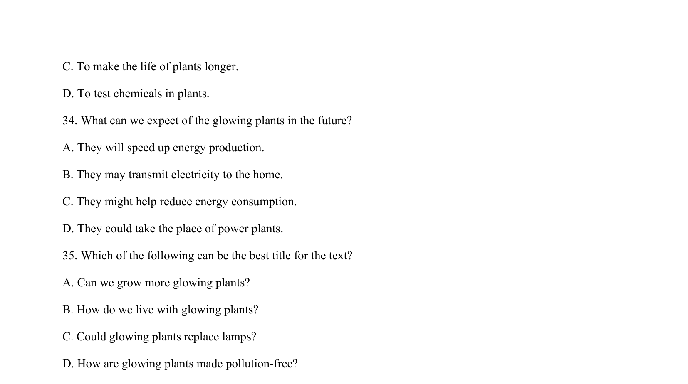

## 篇章题面

## 摘要

这是一篇说明文。短文介绍了竞走相比跑步有诸多的优势，但是之前受过伤的人，要想从事这样运动要谨 慎，最好咨询专家的建议。

## 关联考点

- [[724-reading comprehension|阅读理解]]
- [[689-Specific Information|细节理解]]
- [[887-推理判断|推理判断]]

## 答案

`28. C 29. D 30. A 31. B`

## 解析

> 📄 原 PDF 第 13 页：`素材/真题/湖南/2008-2024·（湖南）英语高考真题/2020年高考英语试卷（新课标Ⅰ卷）（解析卷）.pdf`
