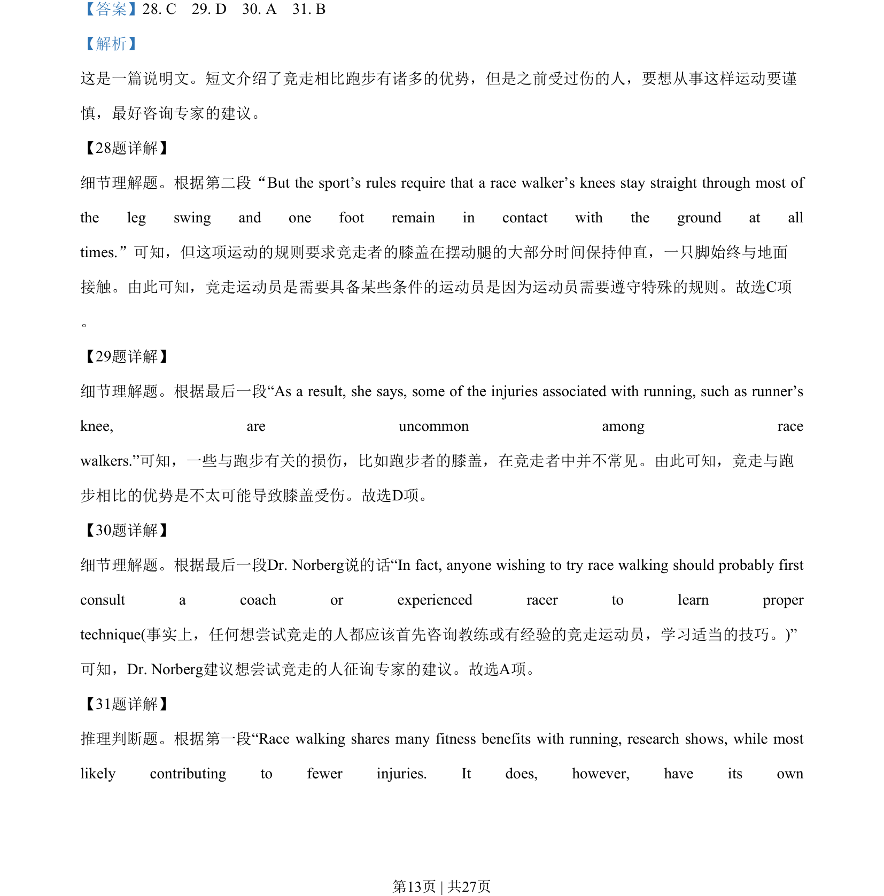
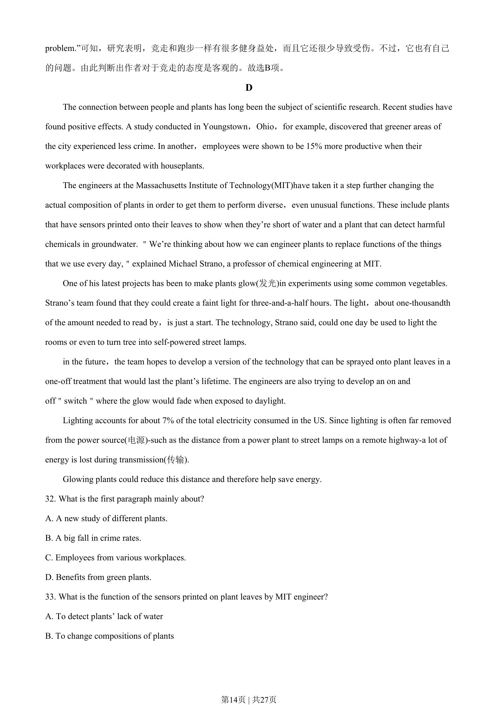
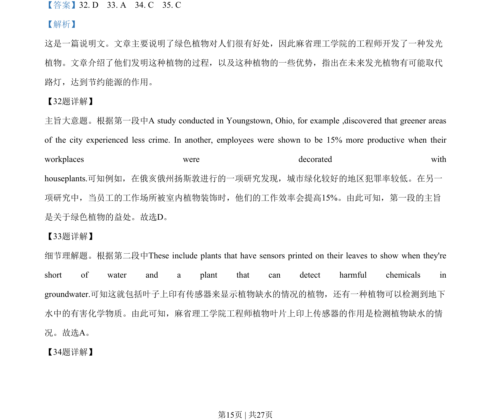
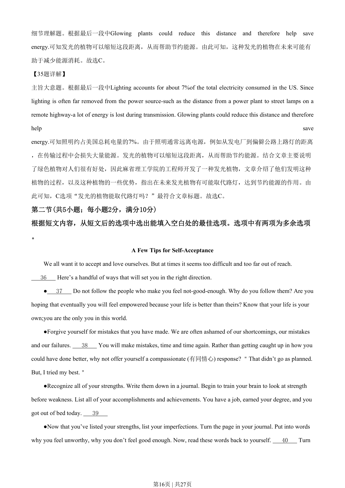
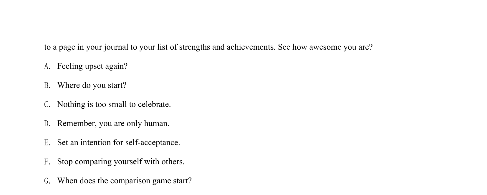

## 篇章题面

## 摘要

这是一篇说明文。文章主要说明了绿色植物对人们很有好处，因此麻省理工学院的工程师开发了一种发光 植物。文章介绍了他们发明这种植物的过程，以及这种植物的一些优势，指出在未来发光植物有可能取代 路灯，达到节约能源的作用。

## 关联考点

- [[724-reading comprehension|阅读理解]]
- [[689-Specific Information|细节理解]]
- [[887-推理判断|推理判断]]

## 答案

`32. D 33. A 34. C 35. C`

## 解析

> 📄 原 PDF 第 15 页：`素材/真题/湖南/2008-2024·（湖南）英语高考真题/2020年高考英语试卷（新课标Ⅰ卷）（解析卷）.pdf`
