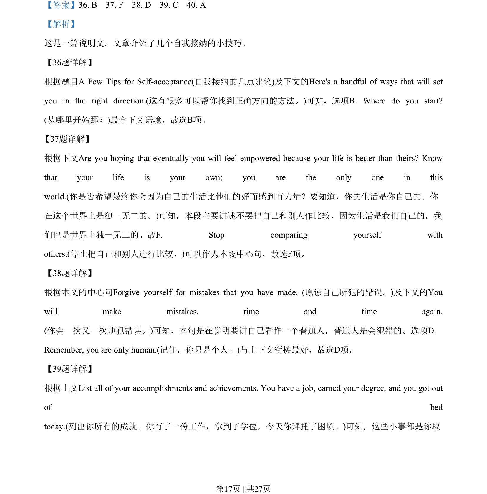
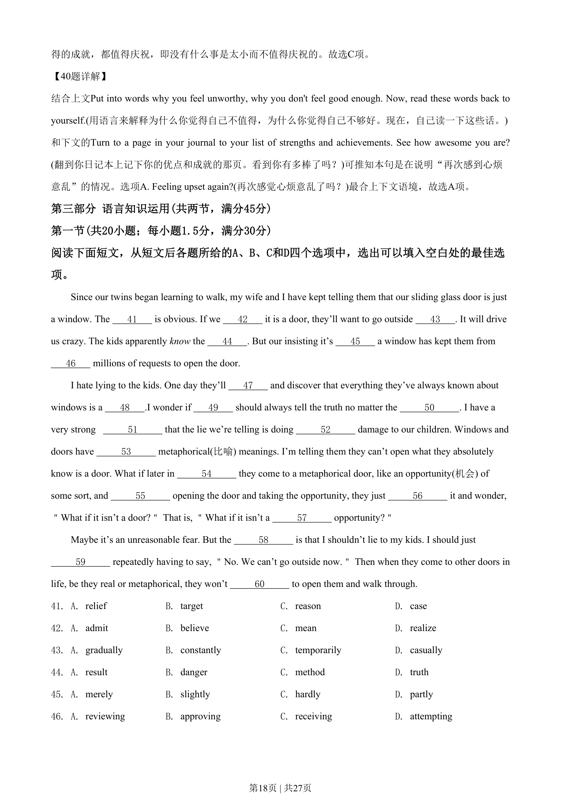
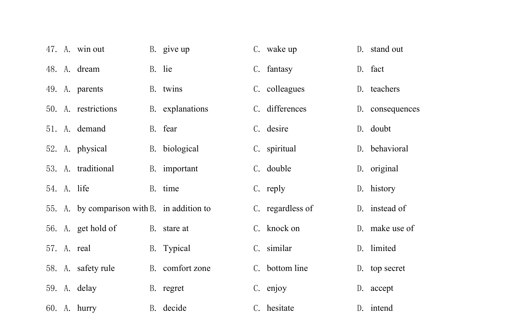

## 篇章题面

## 摘要

这是一篇说明文。文章介绍了几个自我接纳的小技巧。

## 关联考点

- [[994-七选五|七选五]]
- [[1014-篇章结构|篇章结构]]

## 答案

`36. B 37. F 38. D 39. C 40. A`

## 解析

> 📄 原 PDF 第 17 页：`素材/真题/湖南/2008-2024·（湖南）英语高考真题/2020年高考英语试卷（新课标Ⅰ卷）（解析卷）.pdf`
