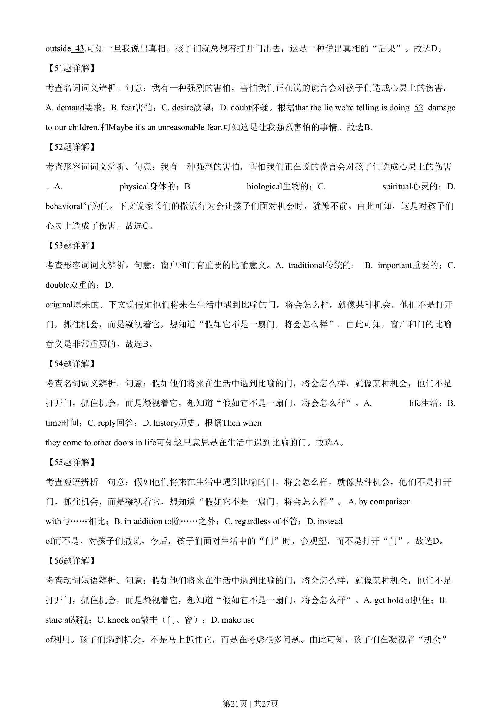

## 篇章题面

## 摘要

这是一篇夹叙夹议的文章。作者以现实中的门，引申出生活中的“门”，从而探讨了一种教育理念。作者 认为家长们不要害怕告诉孩子们真相，这样，孩子们才可以在生活的道路上，不再被各种“进退两难”所 困扰，从而抓住机遇，勇往直前。

## 关联考点

- [[810-完形填空|完形填空]]
- [[900-词义辨析|词义辨析]]
- [[908-语境理解|语境理解]]

## 答案

`41. C 42. A 43. B 44. D 45. A 46. D 47. C 48. B 49. A 50. D 51. B 52. C 53. B 54. A 55. D 56. B 57. A 58. C 59. D 60. C`

## 解析

> 📄 原 PDF 第 19 页：`素材/真题/湖南/2008-2024·（湖南）英语高考真题/2020年高考英语试卷（新课标Ⅰ卷）（解析卷）.pdf`
