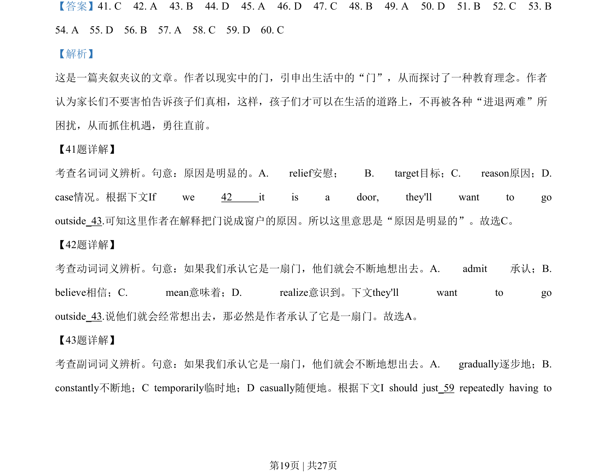
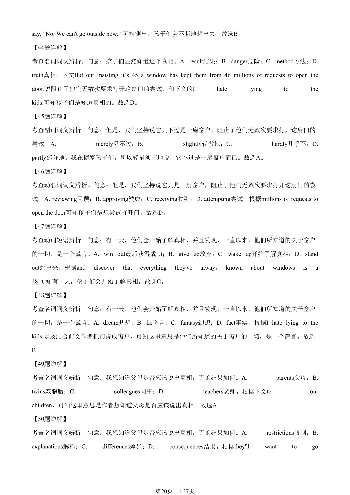
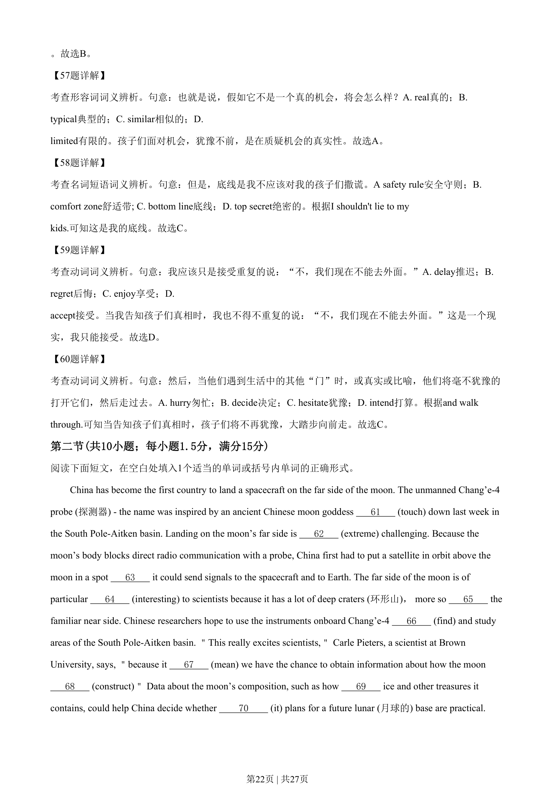
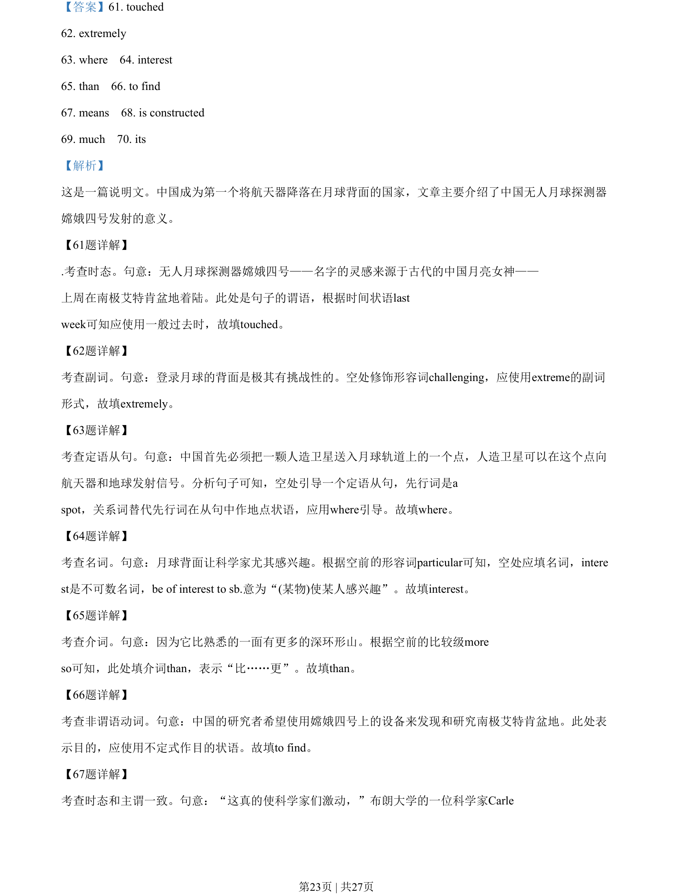
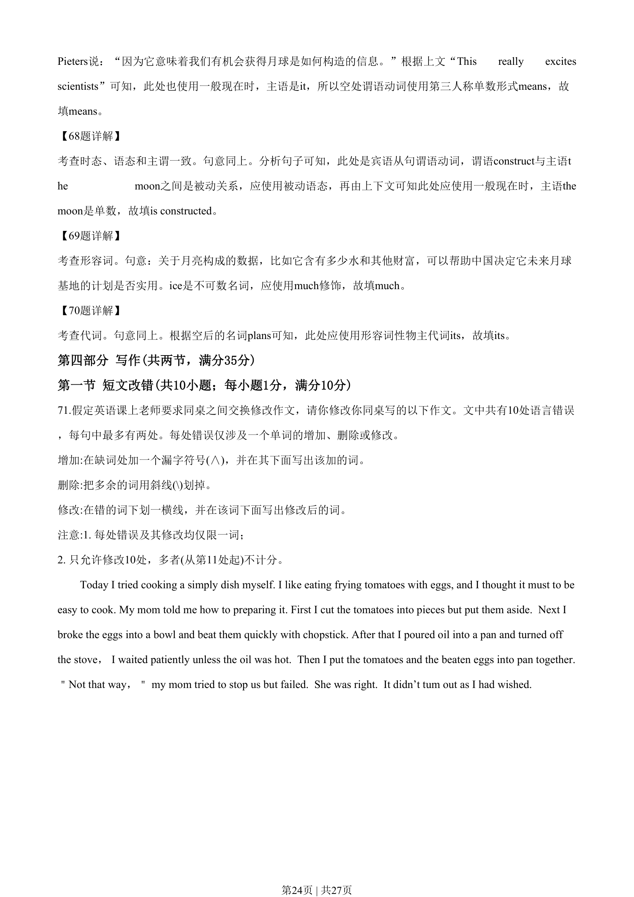

## 篇章题面

## 摘要

这是一篇说明文。中国成为第一个将航天器降落在月球背面的国家，文章主要介绍了中国无人月球探测器 嫦娥四号发射的意义。

## 关联考点

- [[996-书面表达|书面表达]]
- [[1007-应用文写作|应用文写作]]

## 答案

`61. touched 62. extremely 63. where 64. interest 65. than 66. to find 67. means 68. is constructed 69. much 70. its`

## 解析

> 📄 原 PDF 第 23 页：`素材/真题/湖南/2008-2024·（湖南）英语高考真题/2020年高考英语试卷（新课标Ⅰ卷）（解析卷）.pdf`
