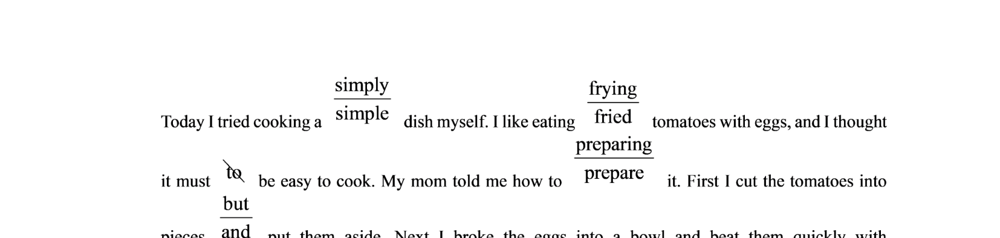
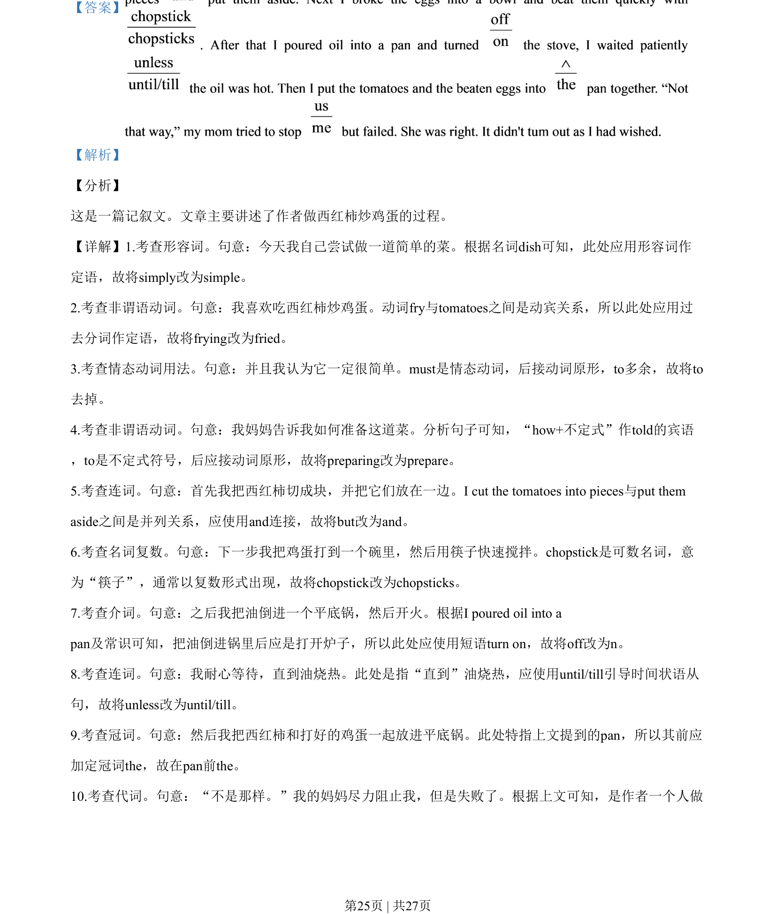

## 篇章题面

## 摘要

【分析】 这是一篇记叙文。文章主要讲述了作者做西红柿炒鸡蛋的过程。

## 关联考点

- [[996-书面表达|书面表达]]
- [[1007-应用文写作|应用文写作]]

## 答案

``

## 解析

> 📄 原 PDF 第 25 页：`素材/真题/湖南/2008-2024·（湖南）英语高考真题/2020年高考英语试卷（新课标Ⅰ卷）（解析卷）.pdf`
