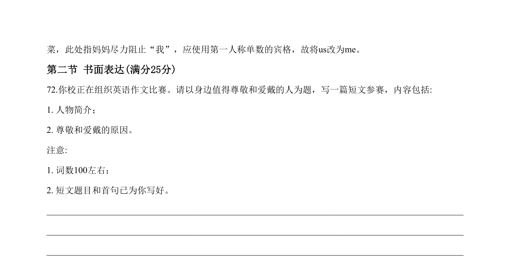
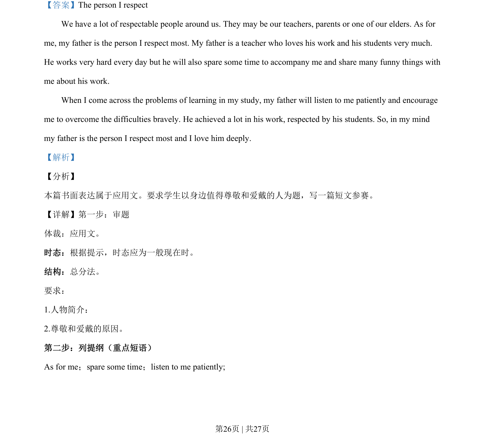
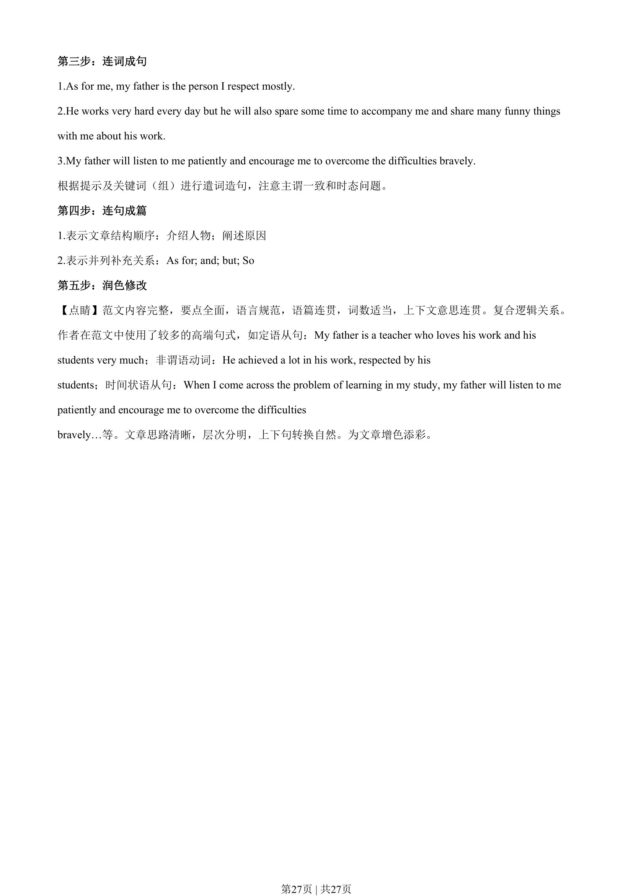

## 篇章题面

## 摘要

【分析】 本篇书面表达属于应用文。要求学生以身边值得尊敬和爱戴的人为题，写一篇短文参赛。

## 关联考点

- [[996-书面表达|书面表达]]
- [[1007-应用文写作|应用文写作]]

## 答案

`The person I respect We have a lot of respectable people around us. They may be our teachers, parents or one of our elders. As for me, my father is the person I respect most. My father is a teacher who loves his work and his students very much. He works very hard every day but he will also spare som`

## 解析

> 📄 原 PDF 第 26 页：`素材/真题/湖南/2008-2024·（湖南）英语高考真题/2020年高考英语试卷（新课标Ⅰ卷）（解析卷）.pdf`
