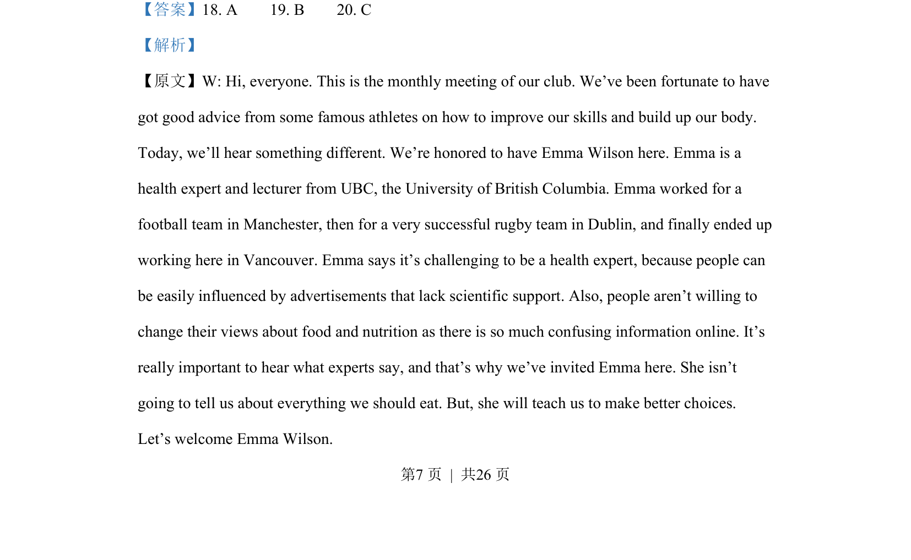
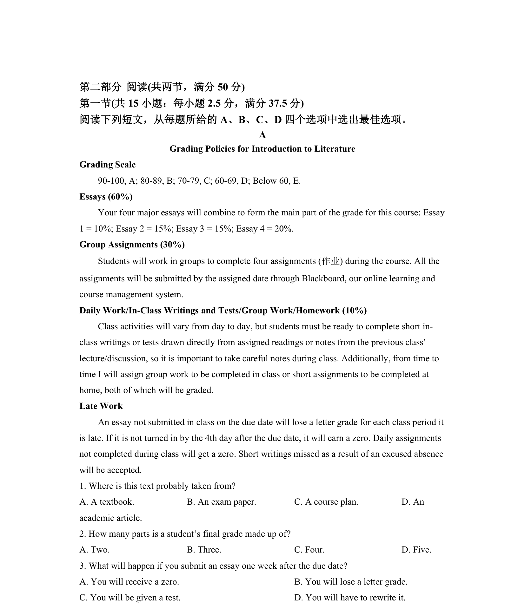
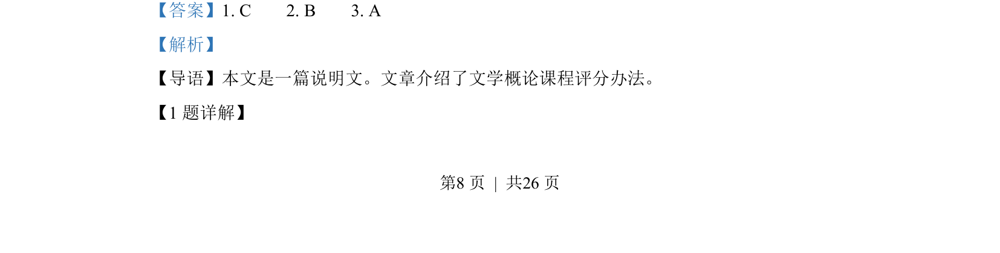
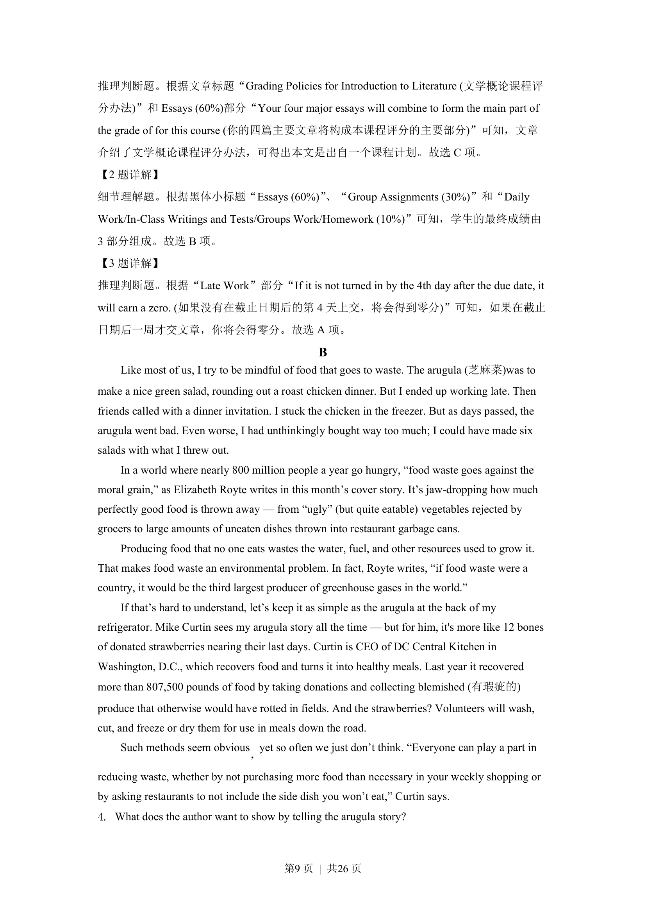

## 篇章题面

## 摘要

本文是一篇说明文。文章介绍了文学概论课程评分办法。

## 关联考点

- [[810-完形填空|完形填空]]
- [[900-词义辨析|词义辨析]]
- [[908-语境理解|语境理解]]
- [[550-说明文|说明文]]

## 答案

`1. C 2. B 3. A`

## 解析

> 📄 原 PDF 第 8 页：`素材/真题/湖南/2008-2024·（湖南）英语高考真题/2022年高考英语试卷（新高考Ⅰ卷）（解析卷）.pdf`
