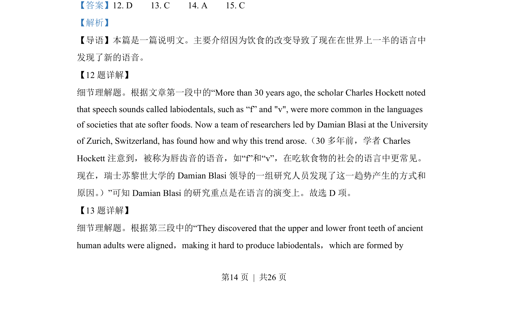
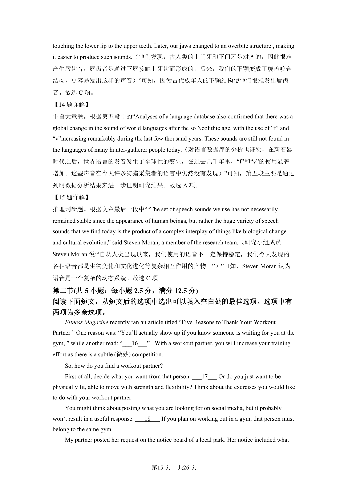
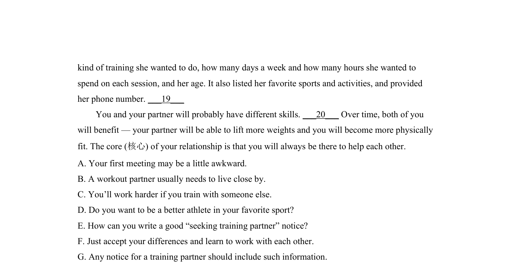

## 篇章题面

## 摘要

本篇是一篇说明文。主要介绍因为饮食的改变导致了现在在世界上一半的语言中 发现了新的语音。

## 关联考点

- [[1031-语篇填空|语篇填空]]
- [[1018-语法填空|语法填空]]

## 答案

`12. D 13. C 14. A 15. C`

## 解析

> 📄 原 PDF 第 14 页：`素材/真题/湖南/2008-2024·（湖南）英语高考真题/2022年高考英语试卷（新高考Ⅰ卷）（解析卷）.pdf`
