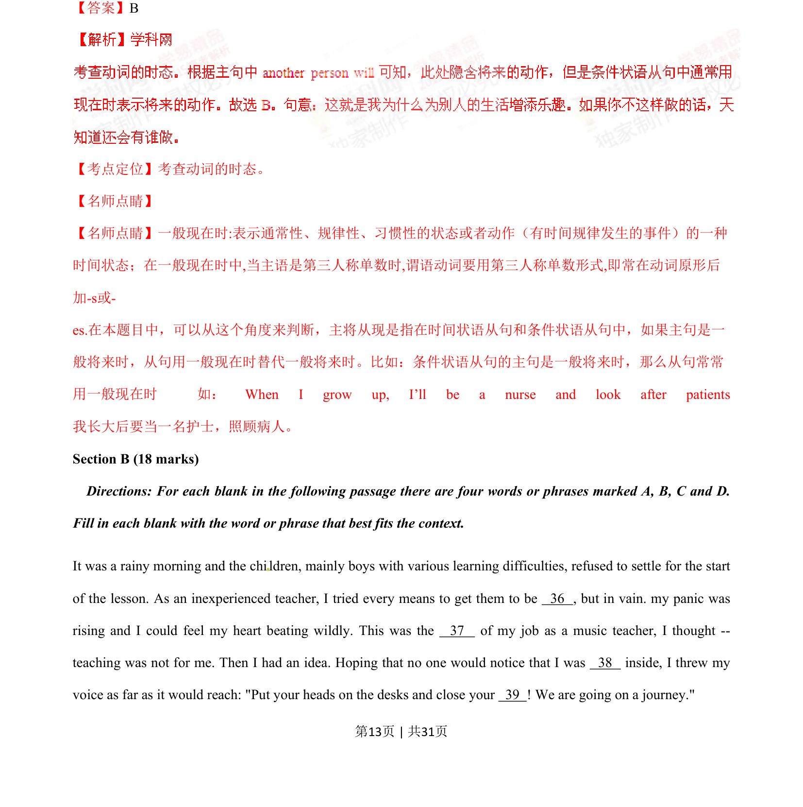
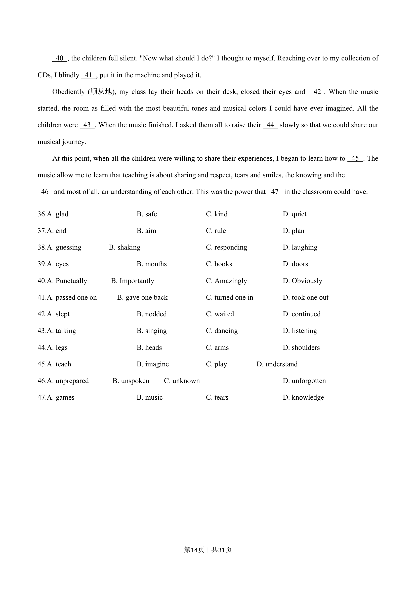
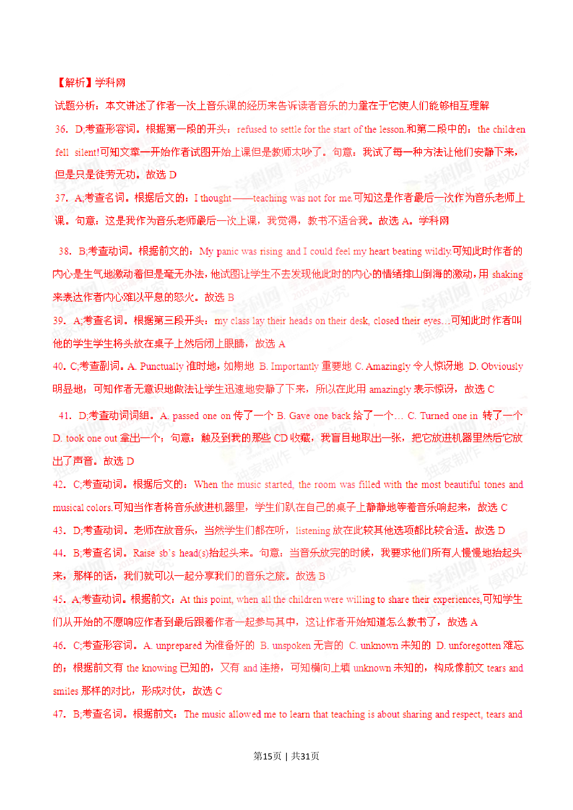
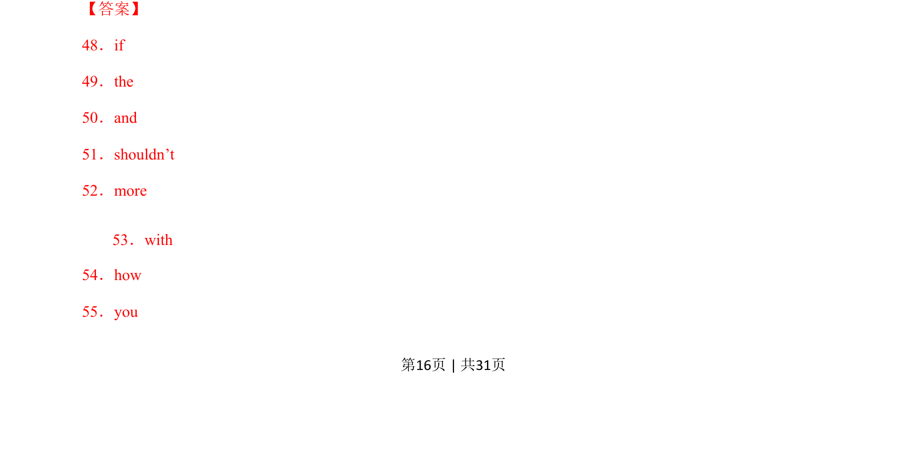
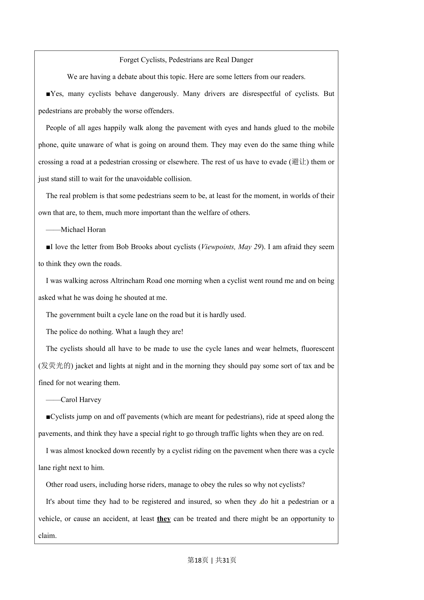
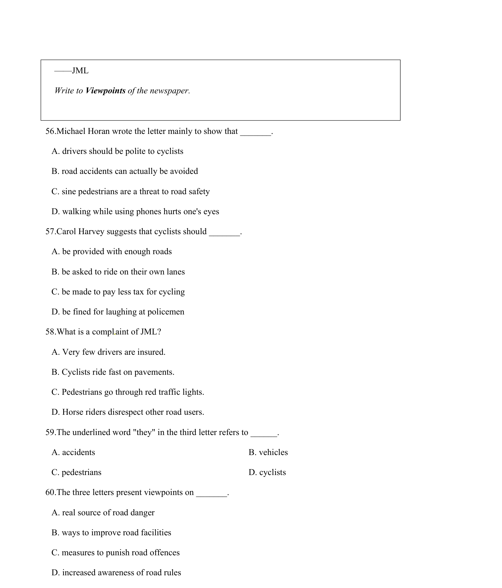

## 篇章题面

## 摘要

本文是一篇记叙文。文章主要讲述了作者和家人在旅行过程中经历过的趣事与冒 险，并且作者和家人都十分期待即将经历的冒险。

## 关联考点

- [[810-完形填空|完形填空]]
- [[900-词义辨析|词义辨析]]
- [[908-语境理解|语境理解]]
- [[146-记叙文要素|记叙文]]

## 答案

`21. C 22. A 23. D 24. C 25. B 26. A 27. D 28. B 29. A 30. C 31. A 32. D 33. C 34. D 35. B`

## 解析

> 📄 原 PDF 第 18 页：`素材/真题/湖南/2008-2024·（湖南）英语高考真题/2022年高考英语试卷（新高考Ⅰ卷）（解析卷）.pdf`
