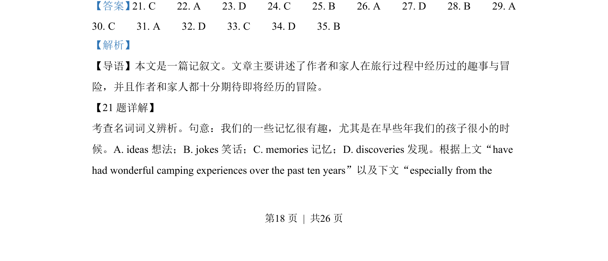
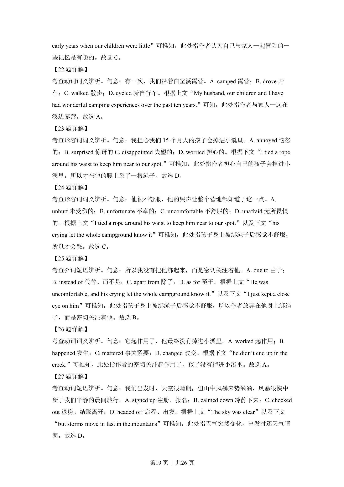
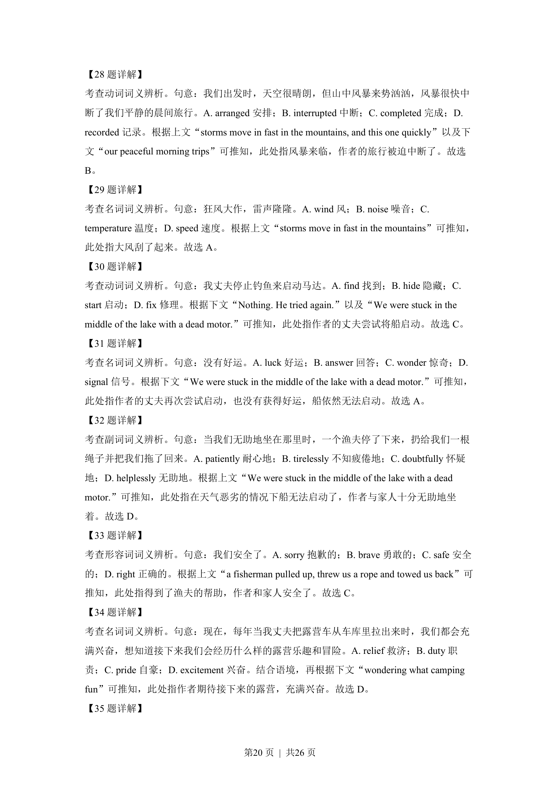
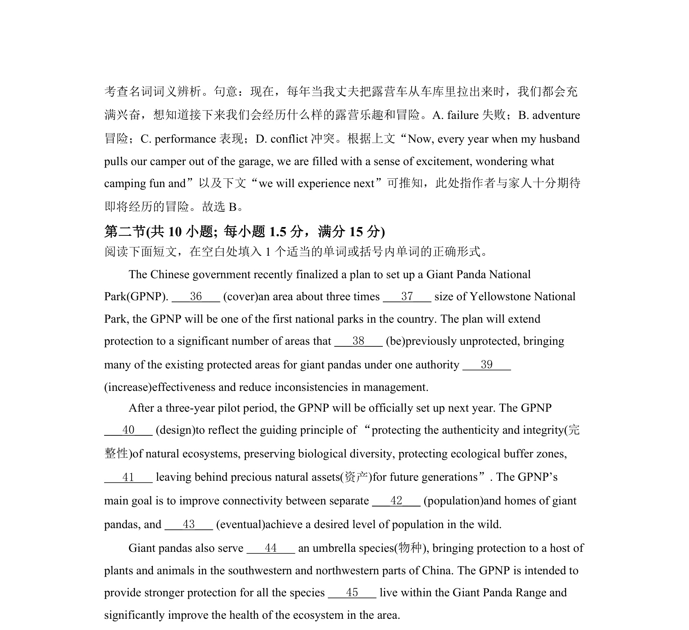
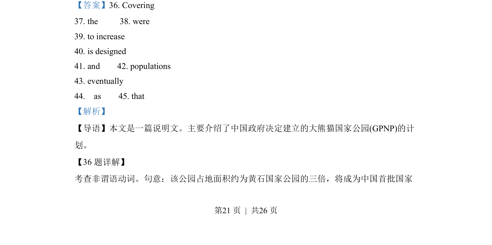
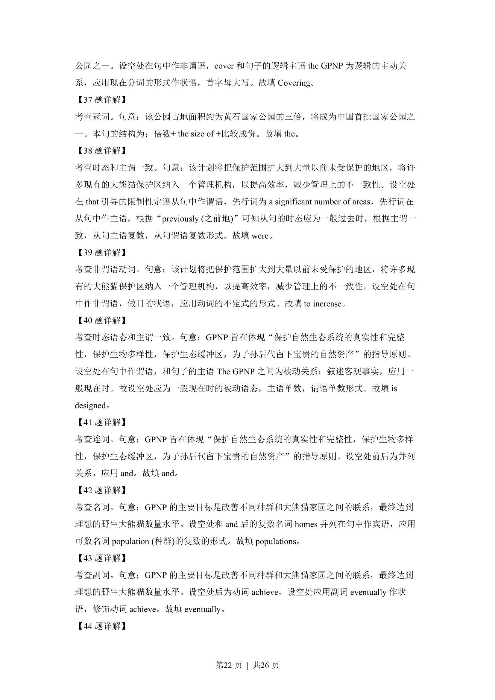
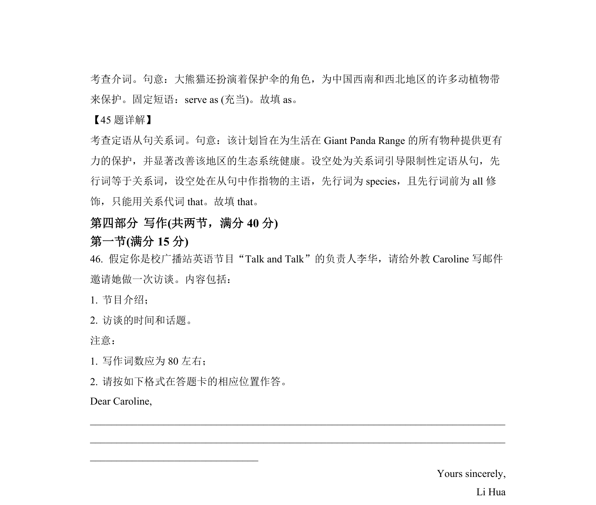

## 篇章题面

## 摘要

本文是一篇说明文。主要介绍了中国政府决定建立的大熊猫国家公园(GPNP)的计 划。

## 关联考点

- [[1031-语篇填空|语篇填空]]
- [[1018-语法填空|语法填空]]
- [[550-说明文|说明文]]

## 答案

`36. Covering 37. the 38. were 39. to increase 40. is designed 41. and 42. populations 43. eventually 44. as 45. that`

## 解析

> 📄 原 PDF 第 21 页：`素材/真题/湖南/2008-2024·（湖南）英语高考真题/2022年高考英语试卷（新高考Ⅰ卷）（解析卷）.pdf`
