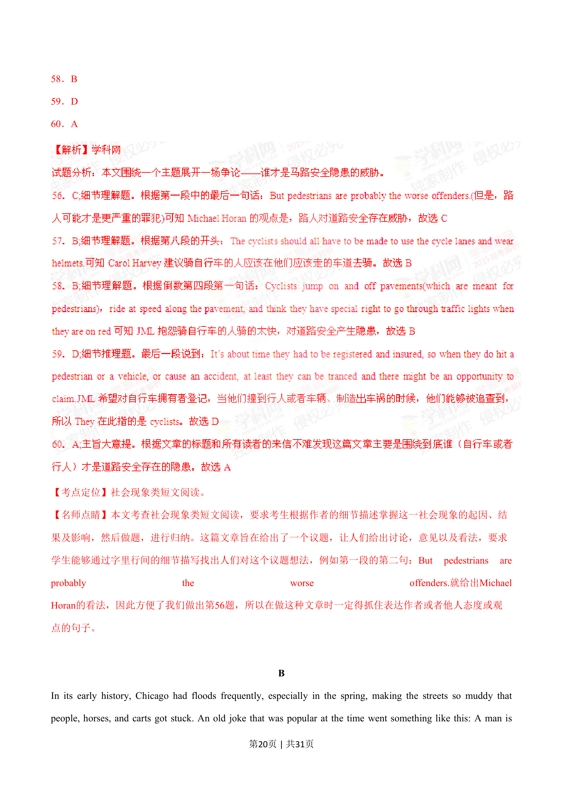
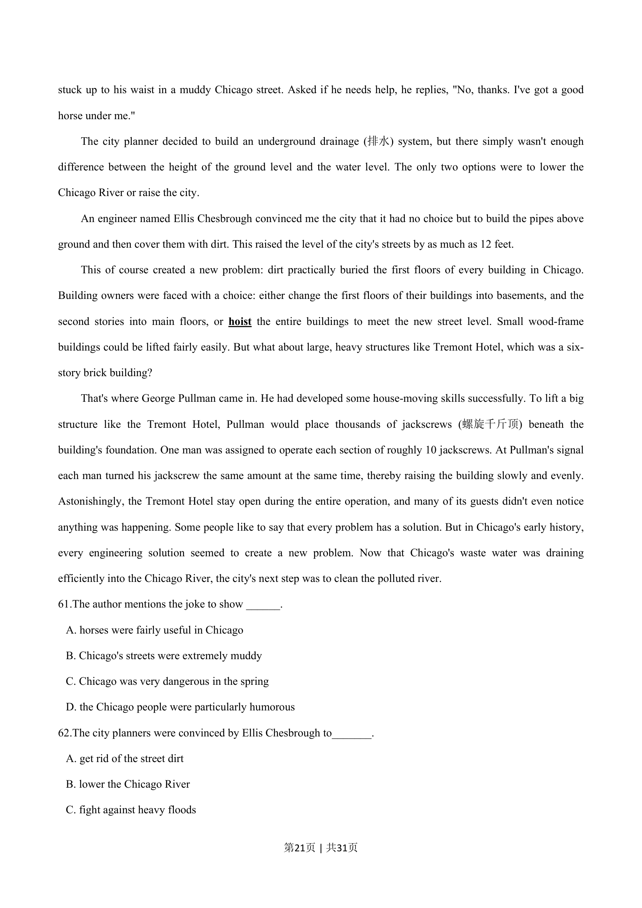

## 篇章题面

## 摘要

本篇书面表达属于应用文，假定你是校广播站“Talk and Talk”的负贵人李华， 请给外教Caroline 写邮件邀请她做一次访谈。

## 关联考点

- [[996-书面表达|书面表达]]
- [[1007-应用文写作|应用文写作]]

## 答案

`Dear Caroline, This is my first time that I have invited you to attend our program —Talk and Talk. It is ten years since Talk and Talk was established. This is an amazing program where you can share your ideas with students. Now, when having trouble in learning English well, plenty of students urge `

## 解析

> 📄 原 PDF 第 23 页：`素材/真题/湖南/2008-2024·（湖南）英语高考真题/2022年高考英语试卷（新高考Ⅰ卷）（解析卷）.pdf`
