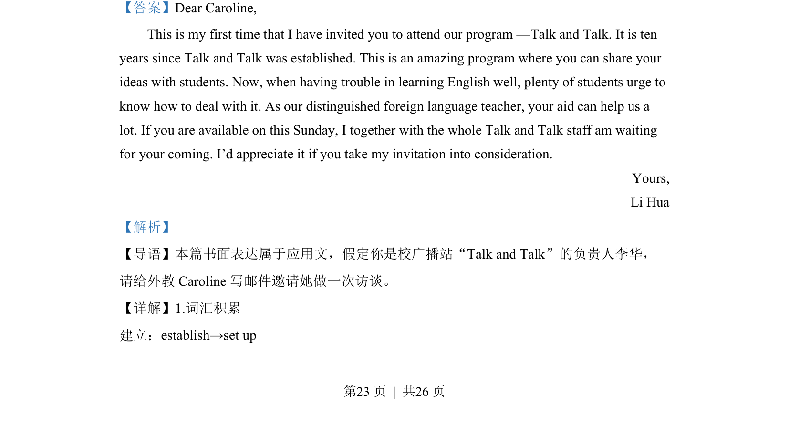
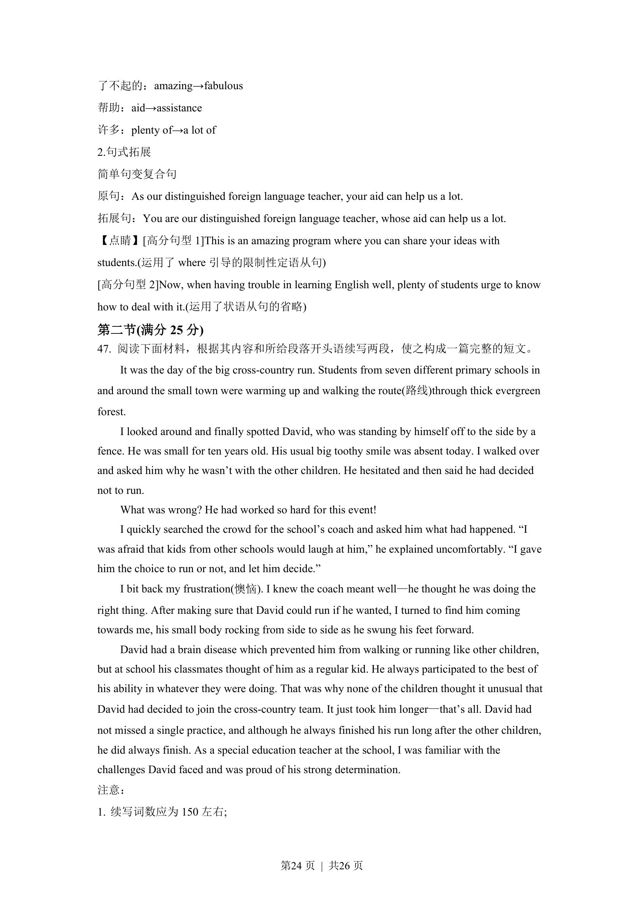
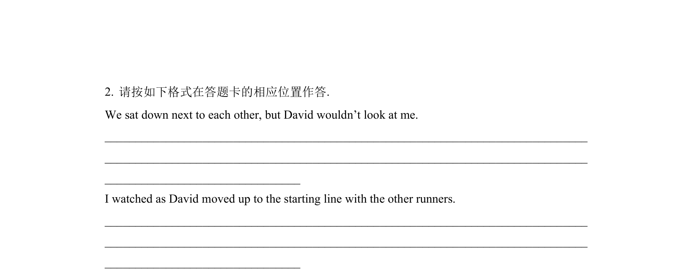
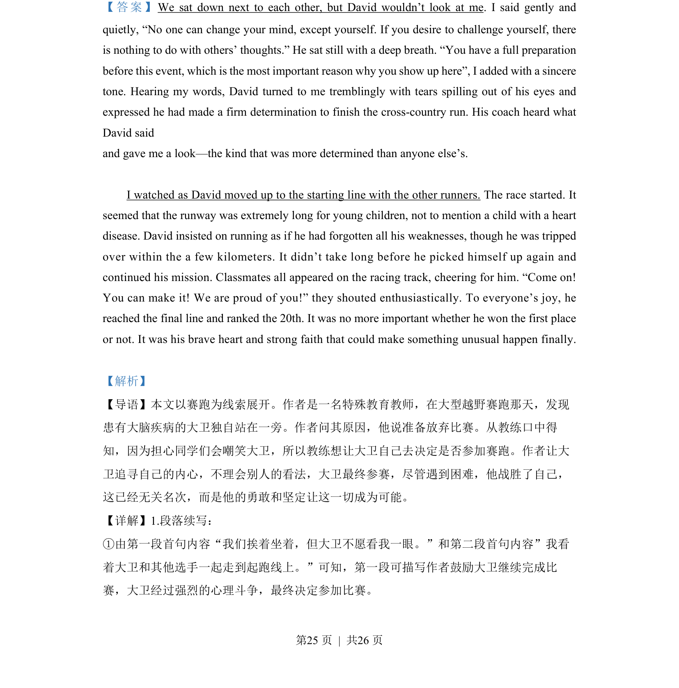
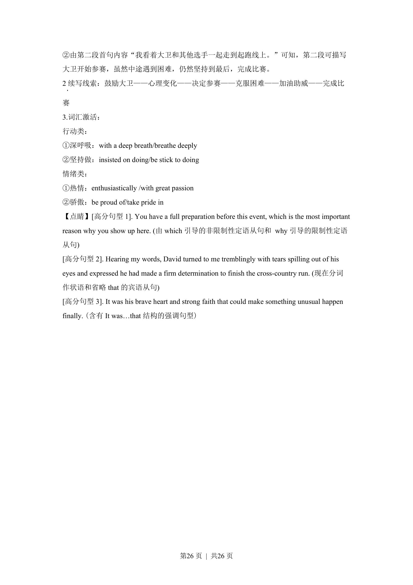

## 篇章题面

## 摘要

本文以赛跑为线索展开。作者是一名特殊教育教师，在大型越野赛跑那天，发现 患有大脑疾病的大卫独自站在一旁。作者问其原因，他说准备放弃比赛。从教练口中得 知，因为担心同学们会嘲笑大卫，所以教练想让大卫自己去决定是否参加赛跑。作者让大 卫追寻自己的内心，不理会别人的看法，大卫最终参赛，尽管遇到困难，他战胜了自己， 这已经无关名次，而是他的勇敢和坚定让这一切成为可能。

## 关联考点

- [[996-书面表达|书面表达]]
- [[1007-应用文写作|应用文写作]]

## 答案

`We sat down next to each other, but David wouldn’t look at me. I said gently and quietly, “No one can change your mind, except yourself. If you desire to challenge yourself, there is nothing to do with others’ thoughts.” He sat still with a deep breath. “You have a full preparation before this event`

## 解析

> 📄 原 PDF 第 25 页：`素材/真题/湖南/2008-2024·（湖南）英语高考真题/2022年高考英语试卷（新高考Ⅰ卷）（解析卷）.pdf`
