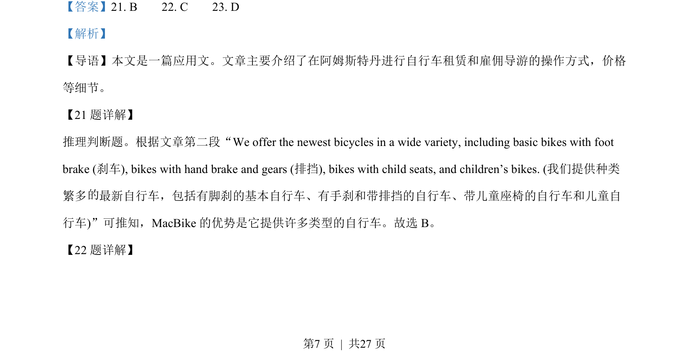
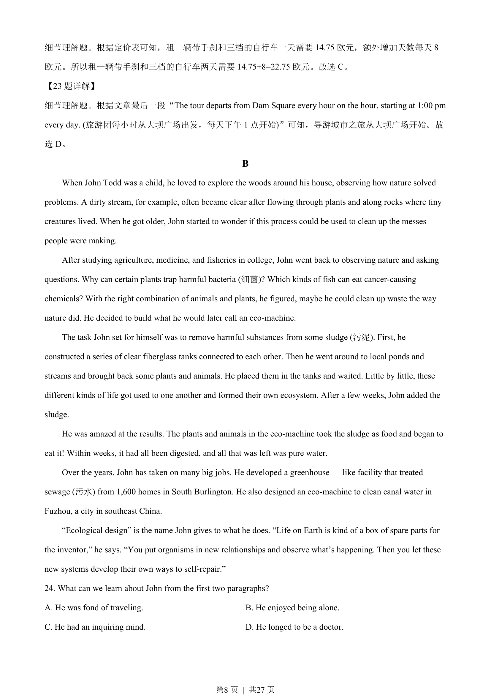
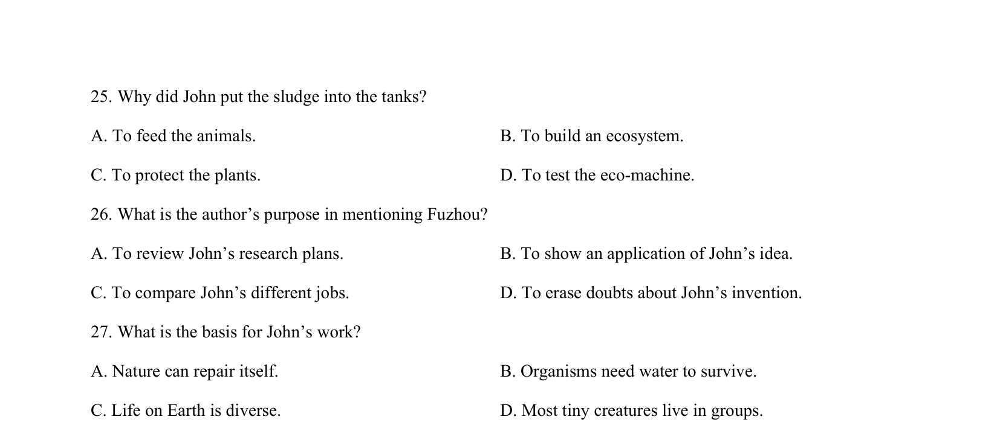
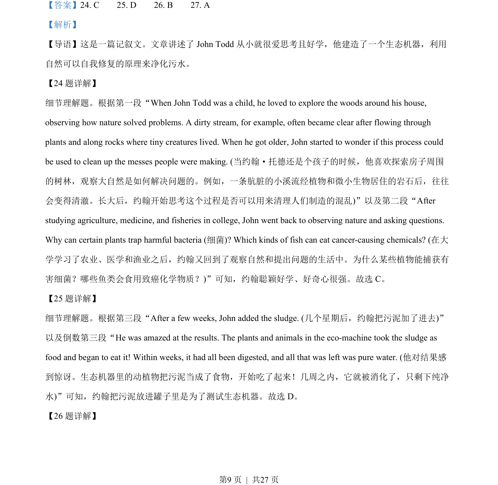
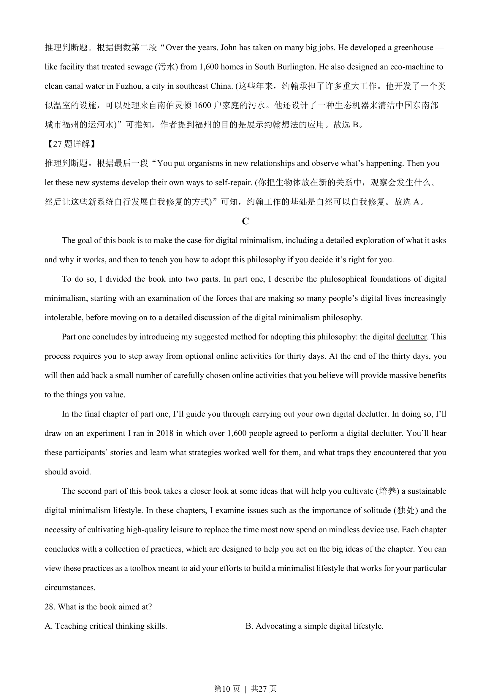
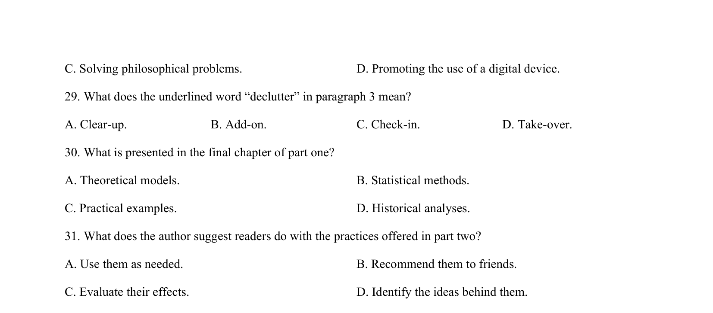

## 篇章题面

## 摘要

这是一篇记叙文。文章讲述了John Todd 从小就很爱思考且好学，他建造了一个生态机器，利用 自然可以自我修复的原理来净化污水。

## 关联考点

- [[724-reading comprehension|阅读理解]]
- [[689-Specific Information|细节理解]]
- [[887-推理判断|推理判断]]

## 答案

`24. C 25. D 26. B 27. A`

## 解析

> 📄 原 PDF 第 9 页：`素材/真题/湖南/2008-2024·（湖南）英语高考真题/2023年高考英语试卷（新课标Ⅰ卷）（解析卷）.pdf`
