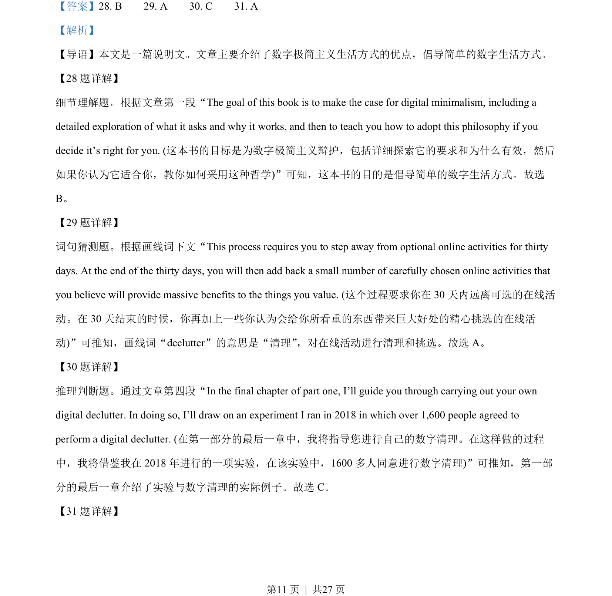
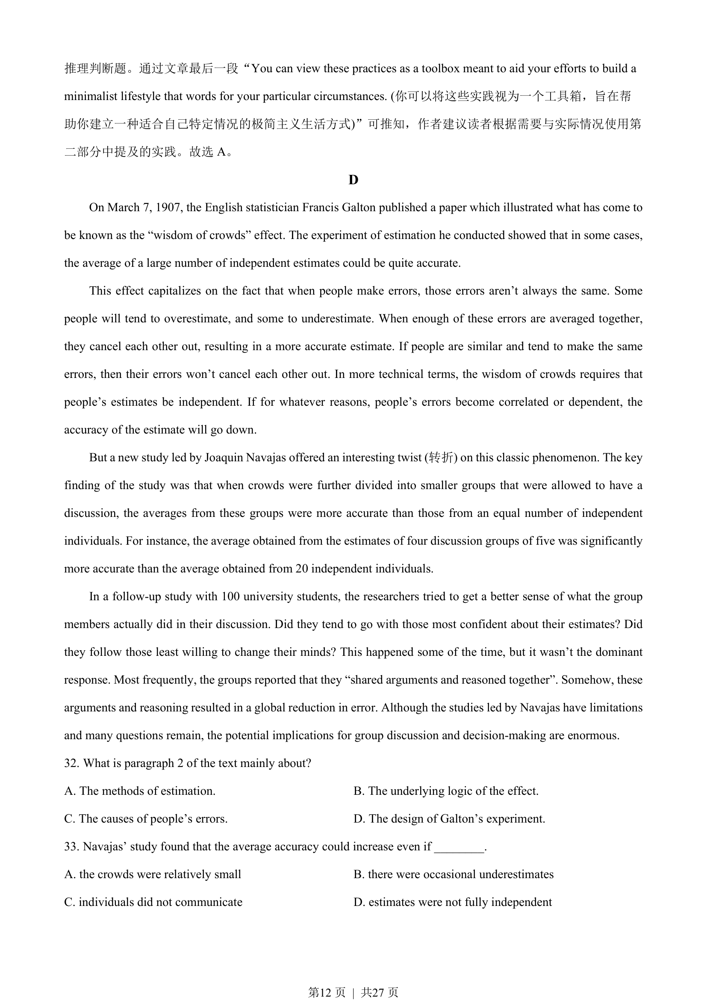
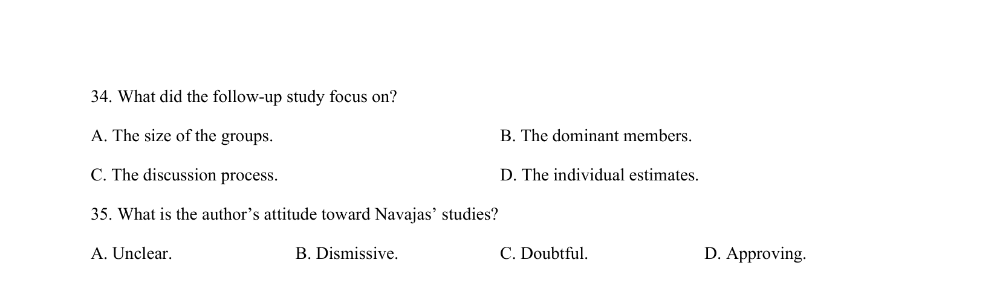
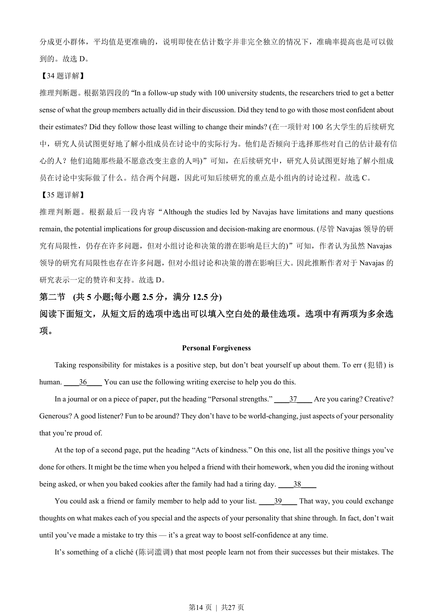

## 篇章题面

## 摘要

本文是说明文。没有人是一座孤岛，文章陈述了“群体智慧”效应。实验表明，在某些情况下大 量独立估计的平均值可能是相当准确的。

## 关联考点

- [[724-reading comprehension|阅读理解]]
- [[689-Specific Information|细节理解]]
- [[887-推理判断|推理判断]]

## 答案

`32. B 33. D 34. C 35. D`

## 解析

> 📄 原 PDF 第 13 页：`素材/真题/湖南/2008-2024·（湖南）英语高考真题/2023年高考英语试卷（新课标Ⅰ卷）（解析卷）.pdf`
