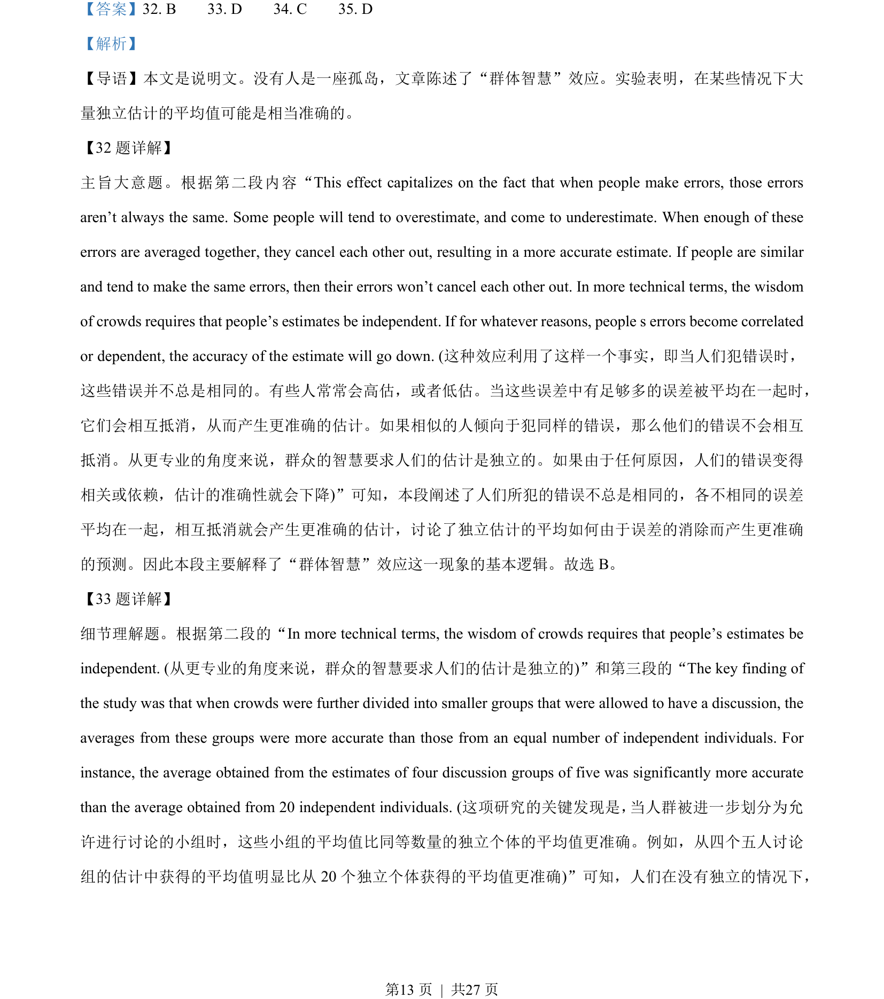
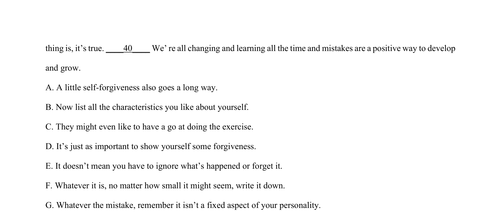
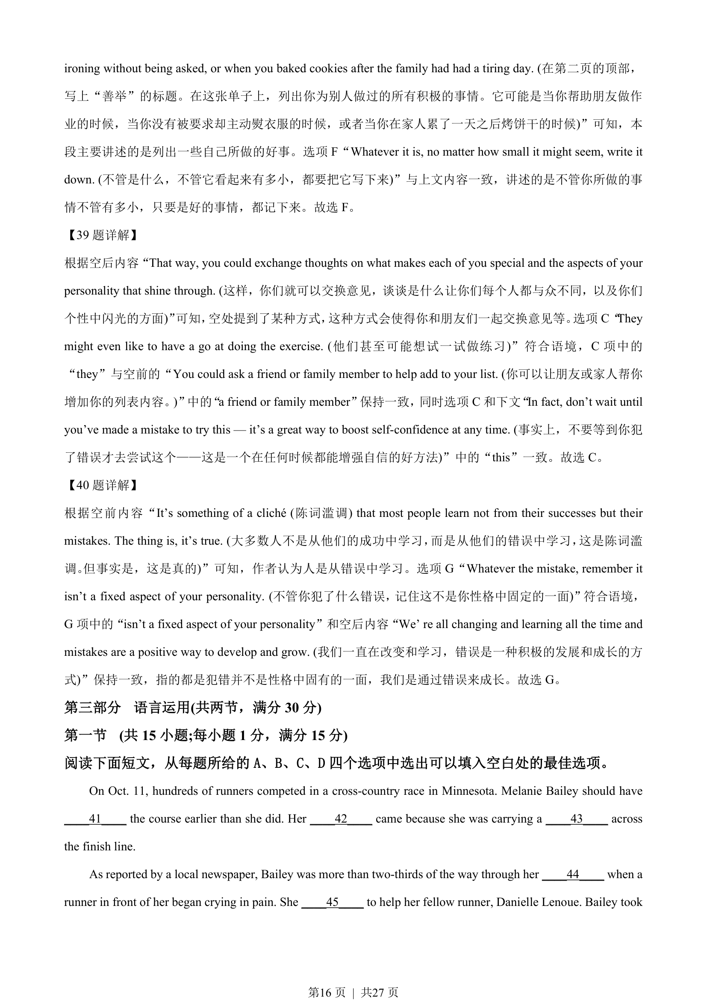
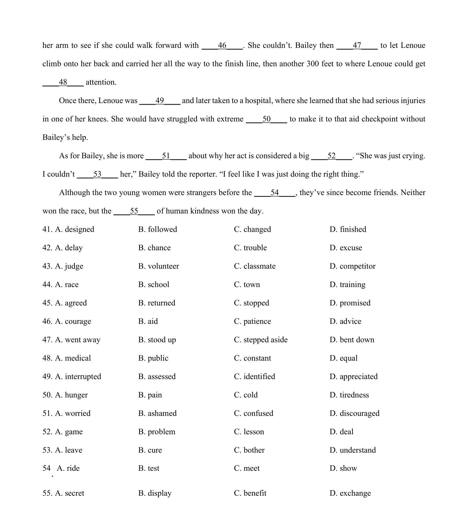

## 篇章题面

## 摘要

本文为一篇说明文。文章鼓励人们练习自我宽恕，并提供了一个简单的写作练习来增强自信。通 过列出个人的优点和善良的行为，人们可以学会原谅自己的错误，并从中成长。

## 关联考点

- [[994-七选五|七选五]]
- [[1014-篇章结构|篇章结构]]

## 答案

`36. D 37. B 38. F 39. C 40. G`

## 解析

> 📄 原 PDF 第 15 页：`素材/真题/湖南/2008-2024·（湖南）英语高考真题/2023年高考英语试卷（新课标Ⅰ卷）（解析卷）.pdf`
