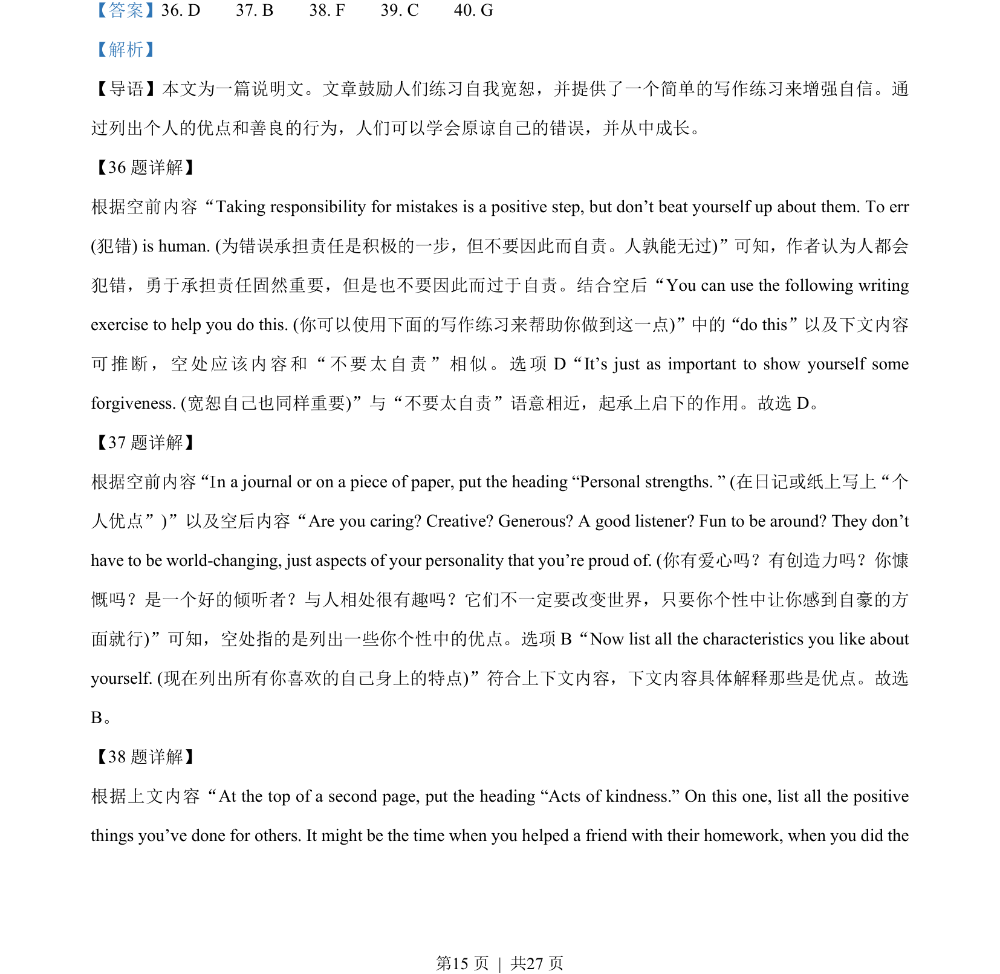
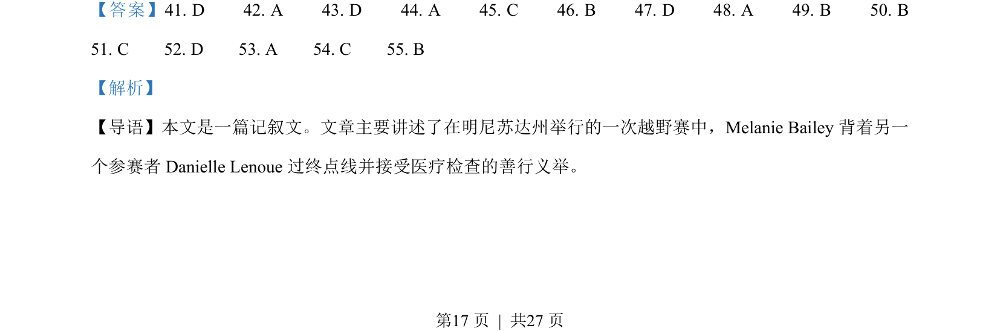
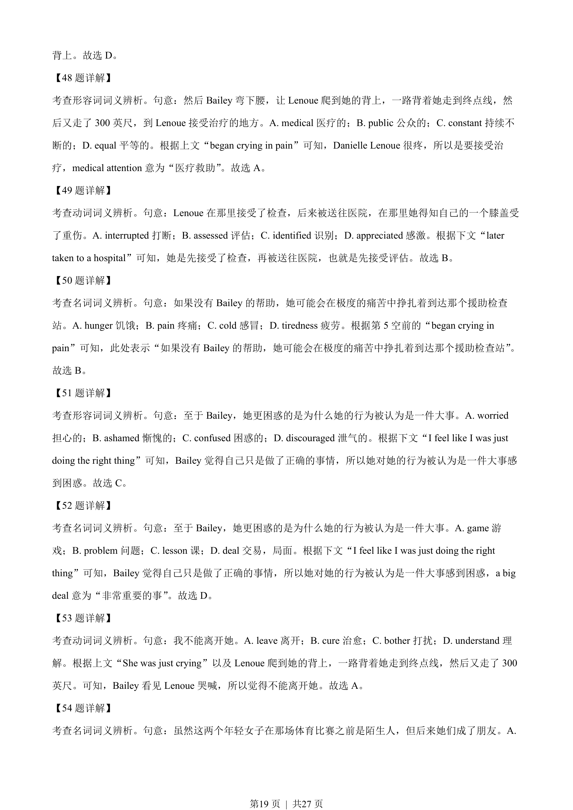

## 篇章题面

## 摘要

本文是一篇记叙文。文章主要讲述了在明尼苏达州举行的一次越野赛中，Melanie Bailey 背着另一 个参赛者Danielle Lenoue 过终点线并接受医疗检查的善行义举。

## 关联考点

- [[810-完形填空|完形填空]]
- [[900-词义辨析|词义辨析]]
- [[908-语境理解|语境理解]]
- [[146-记叙文要素|记叙文]]

## 答案

`41. D 42. A 43. D 44. A 45. C 46. B 47. D 48. A 49. B 50. B 51. C 52. D 53. A 54. C 55. B`

## 解析

> 📄 原 PDF 第 17 页：`素材/真题/湖南/2008-2024·（湖南）英语高考真题/2023年高考英语试卷（新课标Ⅰ卷）（解析卷）.pdf`
