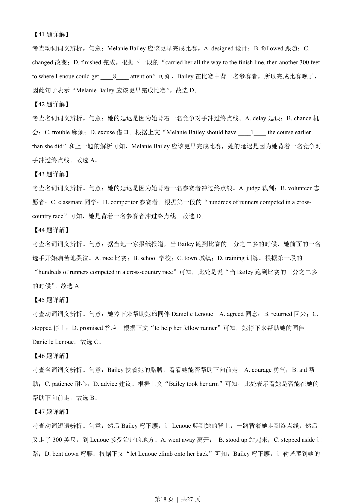
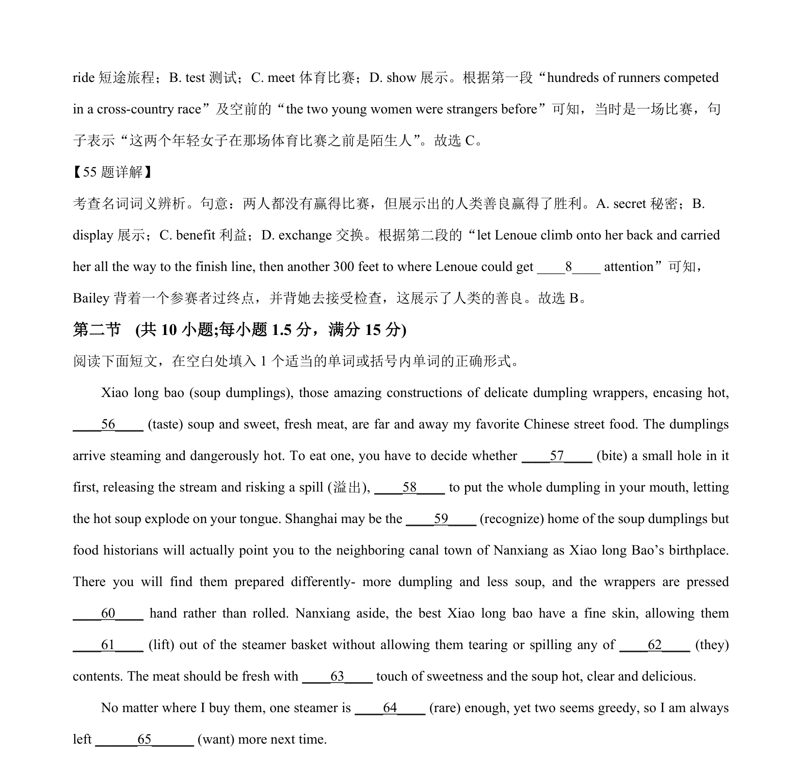
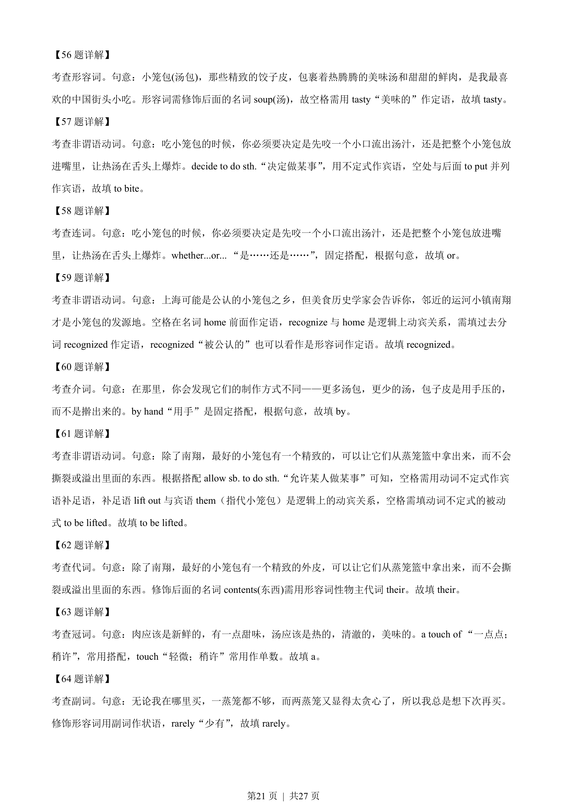

## 篇章题面

## 摘要

本文是一篇说明文。文章介绍了中国美食——小笼包，讲述了小笼包美味，发源地以及制作方法 等等。

## 关联考点

- [[1031-语篇填空|语篇填空]]
- [[1018-语法填空|语法填空]]
- [[550-说明文|说明文]]

## 答案

`56. tasty 57. to bite 58. or 59. recognized 60. by 61. to be lifted 62. their 63. a 64. rarely 65. wanting`

## 解析

> 📄 原 PDF 第 20 页：`素材/真题/湖南/2008-2024·（湖南）英语高考真题/2023年高考英语试卷（新课标Ⅰ卷）（解析卷）.pdf`
