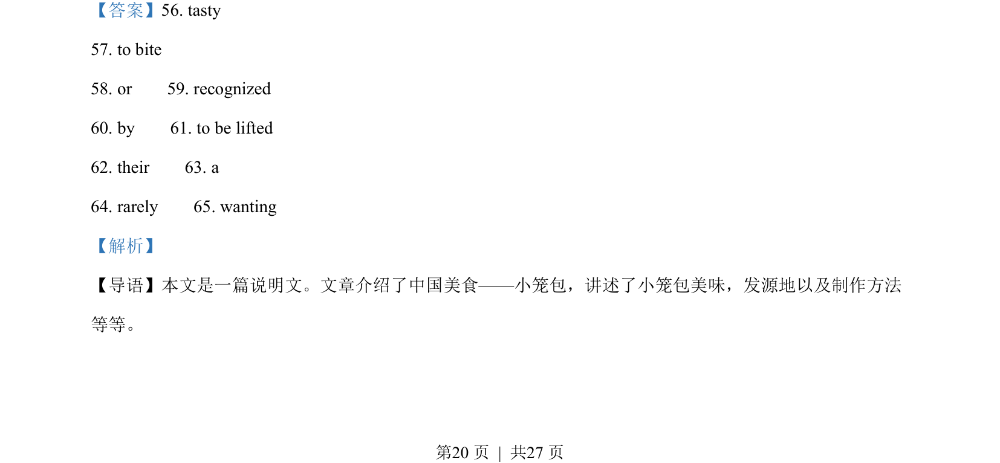
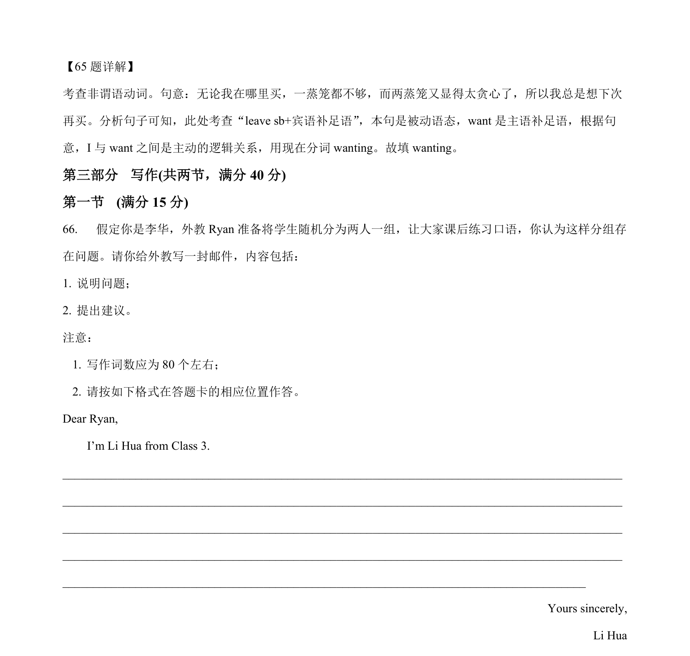
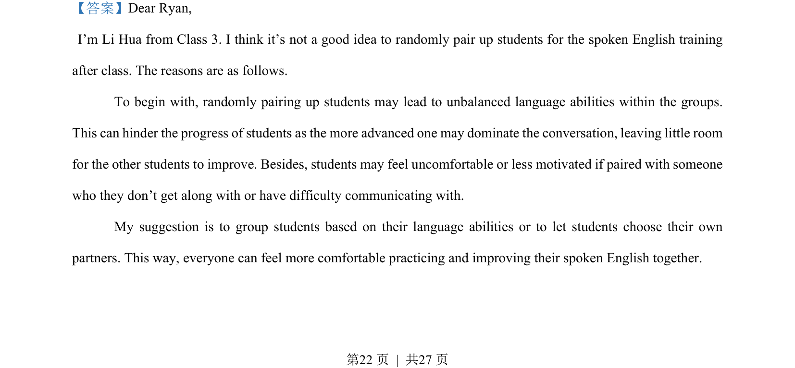
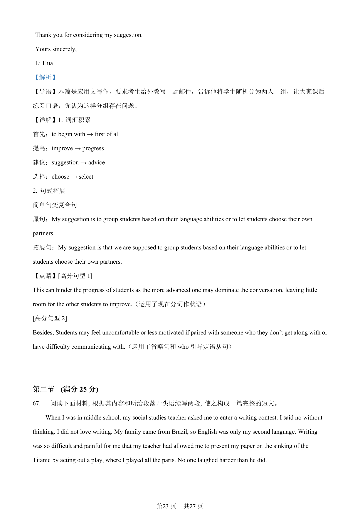
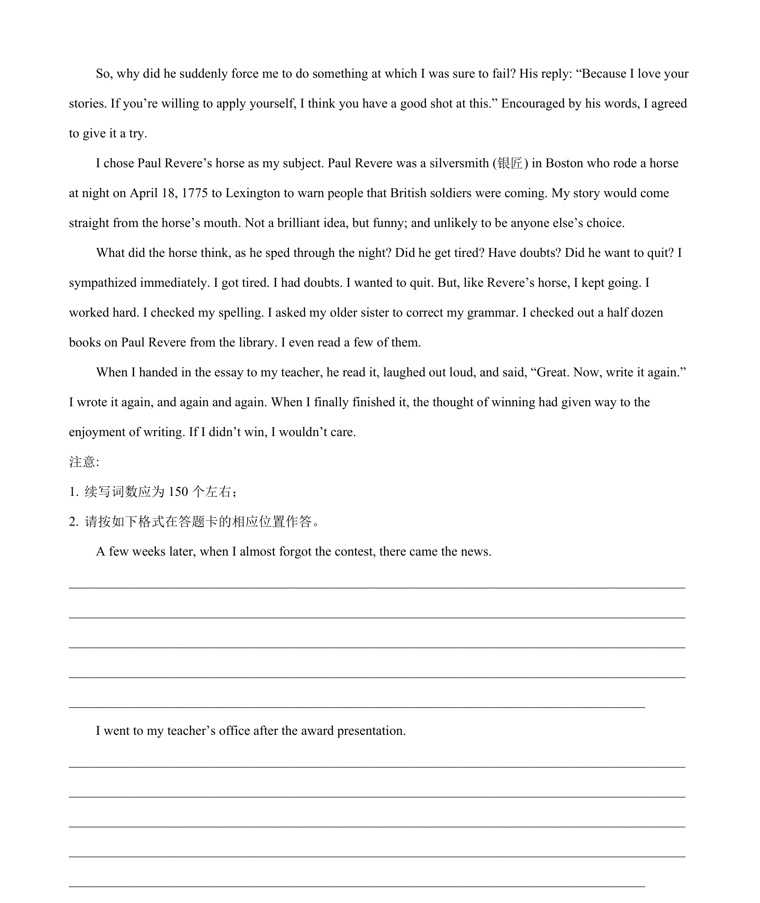

## 篇章题面

## 摘要

本篇是应用文写作，要求考生给外教写一封邮件，告诉他将学生随机分为两人一组，让大家课后 练习口语，你认为这样分组存在问题。

## 关联考点

- [[996-书面表达|书面表达]]
- [[1007-应用文写作|应用文写作]]

## 答案

`Dear Ryan, I’m Li Hua from Class 3. I think it’s not a good idea to randomly pair up students for the spoken English training after class. The reasons are as follows. To begin with, randomly pairing up students may lead to unbalanced language abilities within the groups. This can hinder the progress`

## 解析

> 📄 原 PDF 第 22 页：`素材/真题/湖南/2008-2024·（湖南）英语高考真题/2023年高考英语试卷（新课标Ⅰ卷）（解析卷）.pdf`
