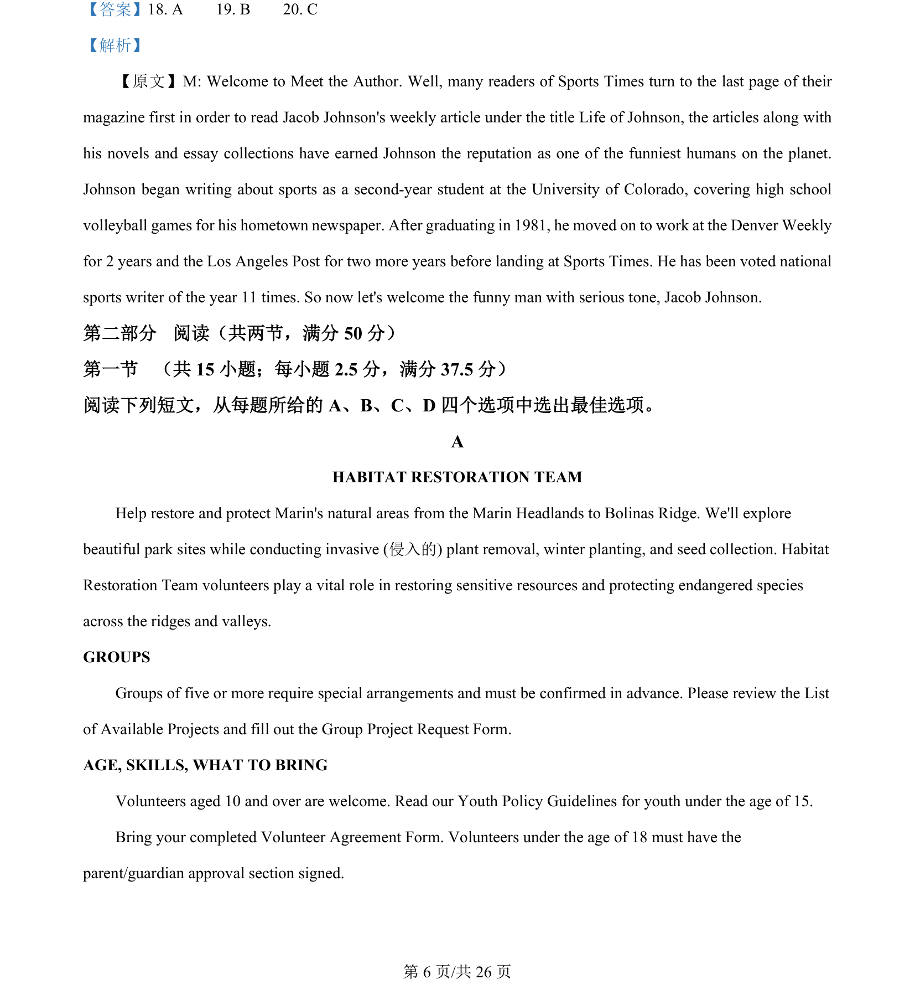
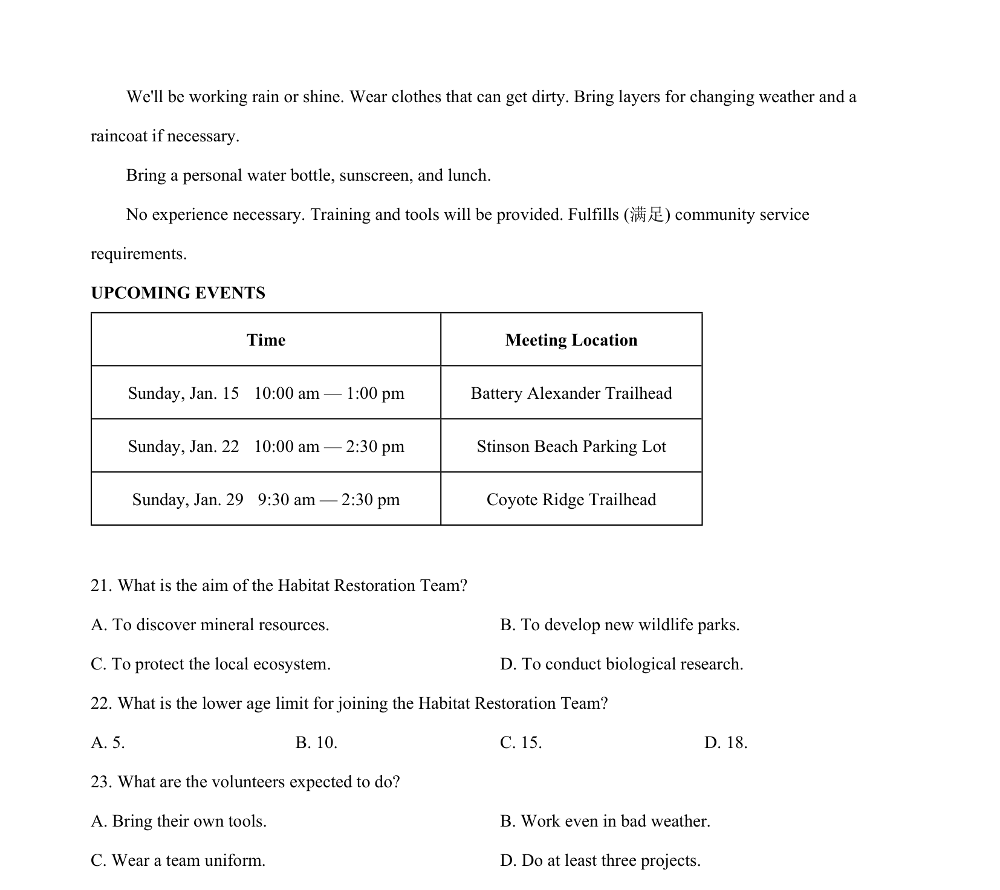
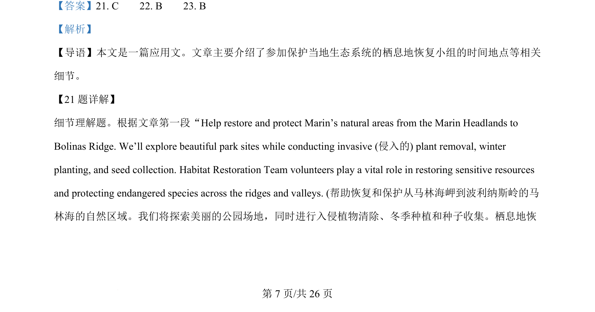
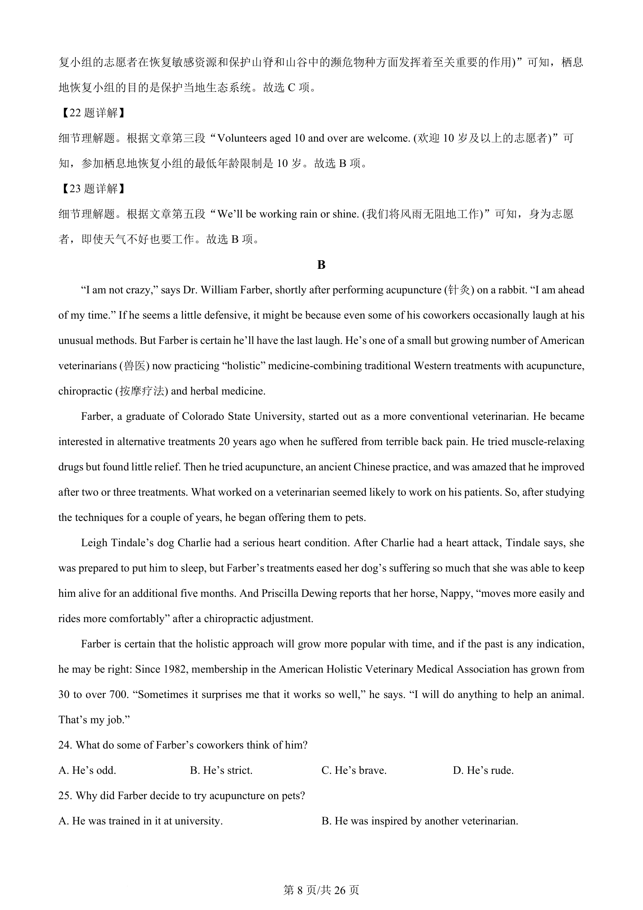
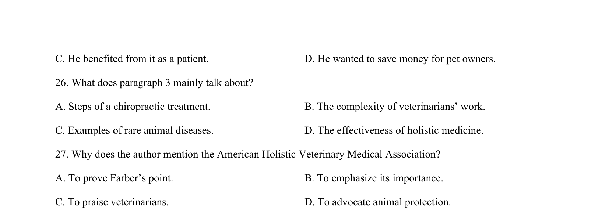

## 篇章题面

## 摘要

本文是一篇应用文。文章主要介绍了参加保护当地生态系统的栖息地恢复小组的时间地点等相关 细节。

## 关联考点

- [[724-reading comprehension|阅读理解]]
- [[689-Specific Information|细节理解]]
- [[887-推理判断|推理判断]]
- [[651-应用文|应用文]]

## 答案

`21. C 22. B 23. B`

## 解析

> 📄 原 PDF 第 7 页：`素材/真题/湖南/2008-2024·（湖南）英语高考真题/2024年高考英语试卷（新课标Ⅰ卷）（解析卷）.pdf`
