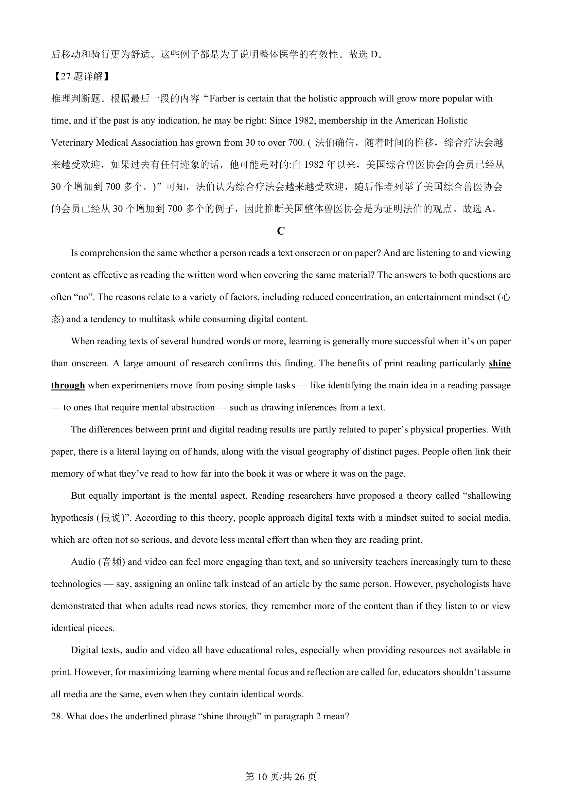
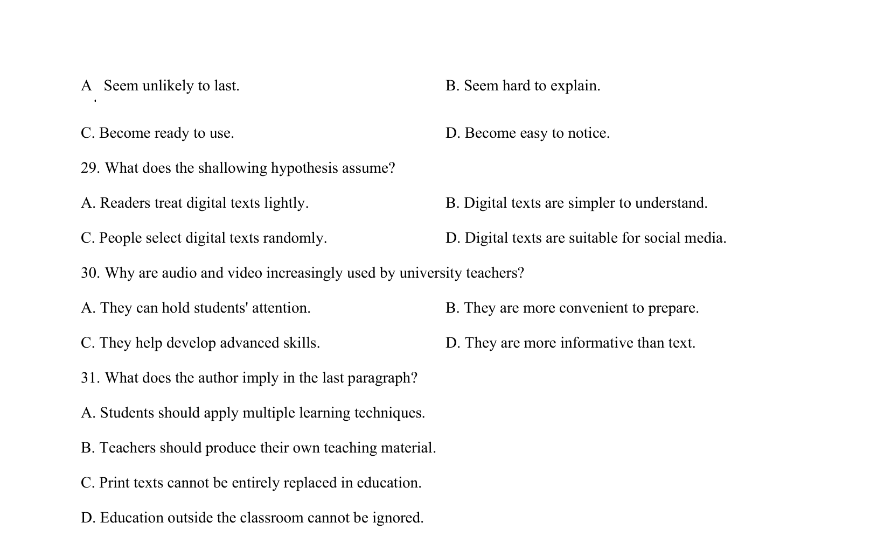
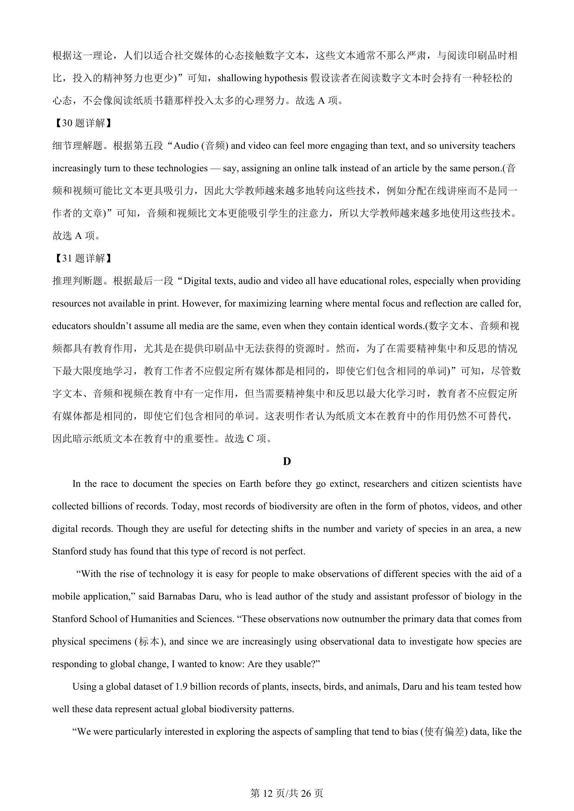

## 篇章题面

## 摘要

本文是议论文。主要讨论了纸质阅读与数字阅读、音频和视频学习方式的差异和效果。

## 关联考点

- [[724-reading comprehension|阅读理解]]
- [[689-Specific Information|细节理解]]
- [[887-推理判断|推理判断]]

## 答案

`28. D 29. A 30. A 31. C`

## 解析

> 📄 原 PDF 第 11 页：`素材/真题/湖南/2008-2024·（湖南）英语高考真题/2024年高考英语试卷（新课标Ⅰ卷）（解析卷）.pdf`
