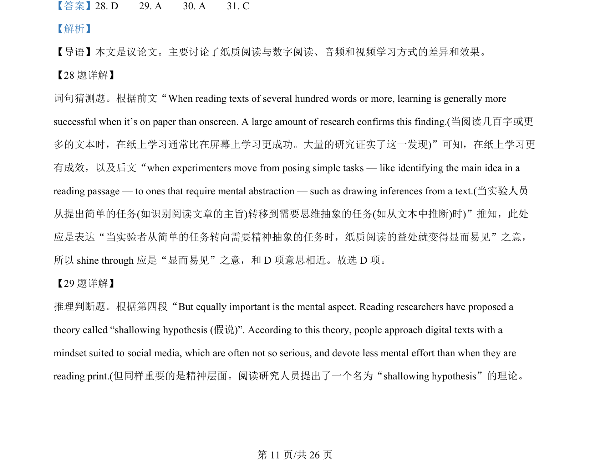
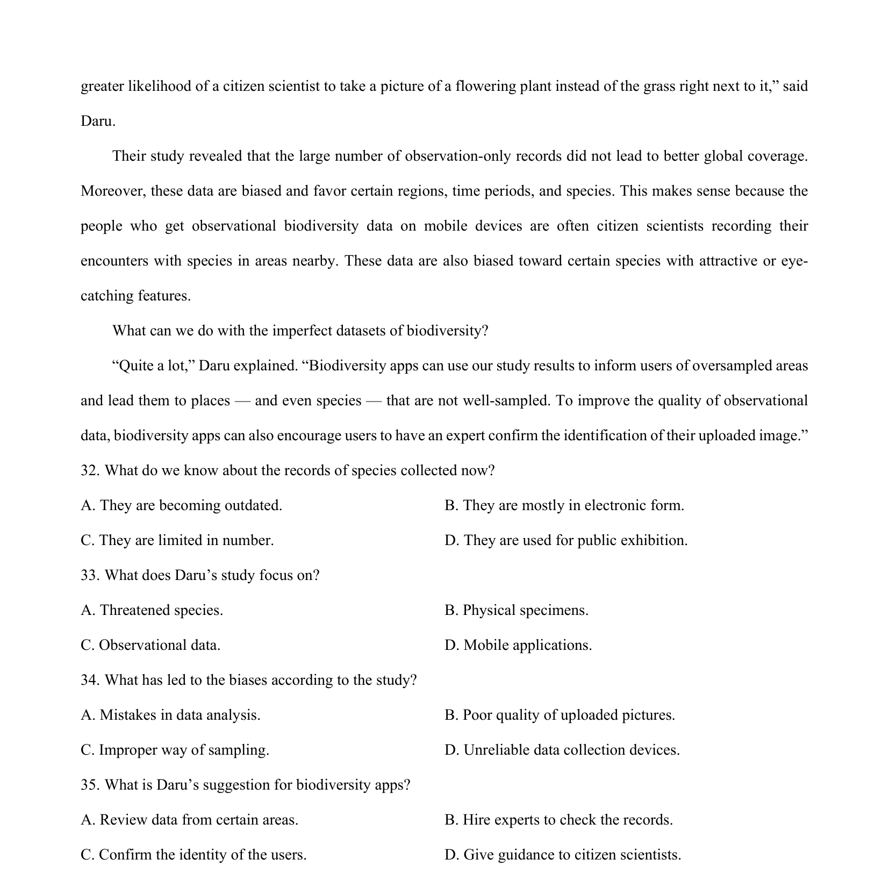
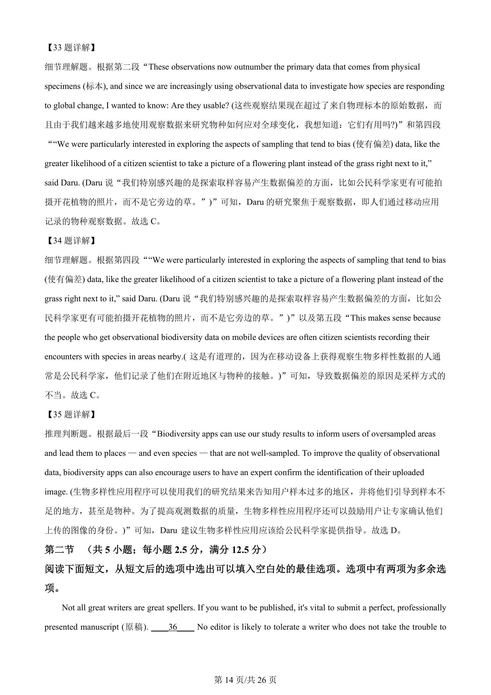
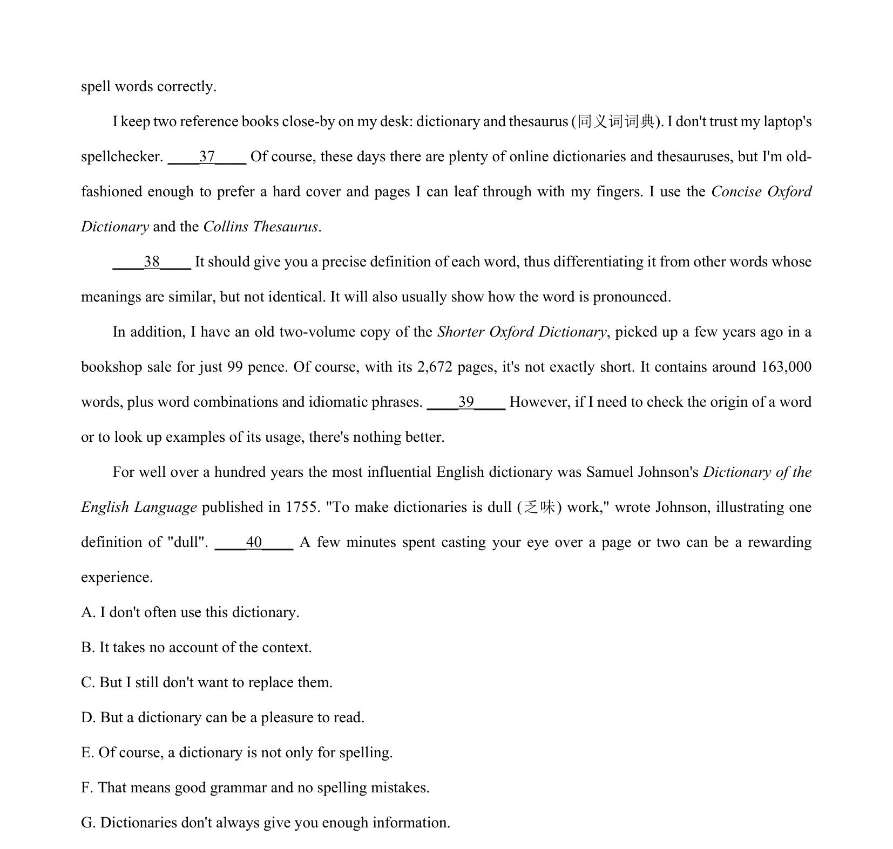

## 篇章题面

## 摘要

本文是一篇说明文。文章主要介绍了斯坦福大学的一项研究发现，数字生物多样性记录存在偏见， 建议应用程序引导公民科学家获取更好的数据。

## 关联考点

- [[724-reading comprehension|阅读理解]]
- [[689-Specific Information|细节理解]]
- [[887-推理判断|推理判断]]
- [[550-说明文|说明文]]

## 答案

`32. B 33. C 34. C 35. D`

## 解析

> 📄 原 PDF 第 13 页：`素材/真题/湖南/2008-2024·（湖南）英语高考真题/2024年高考英语试卷（新课标Ⅰ卷）（解析卷）.pdf`
