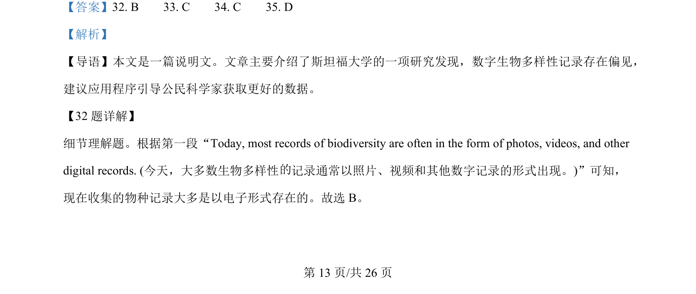
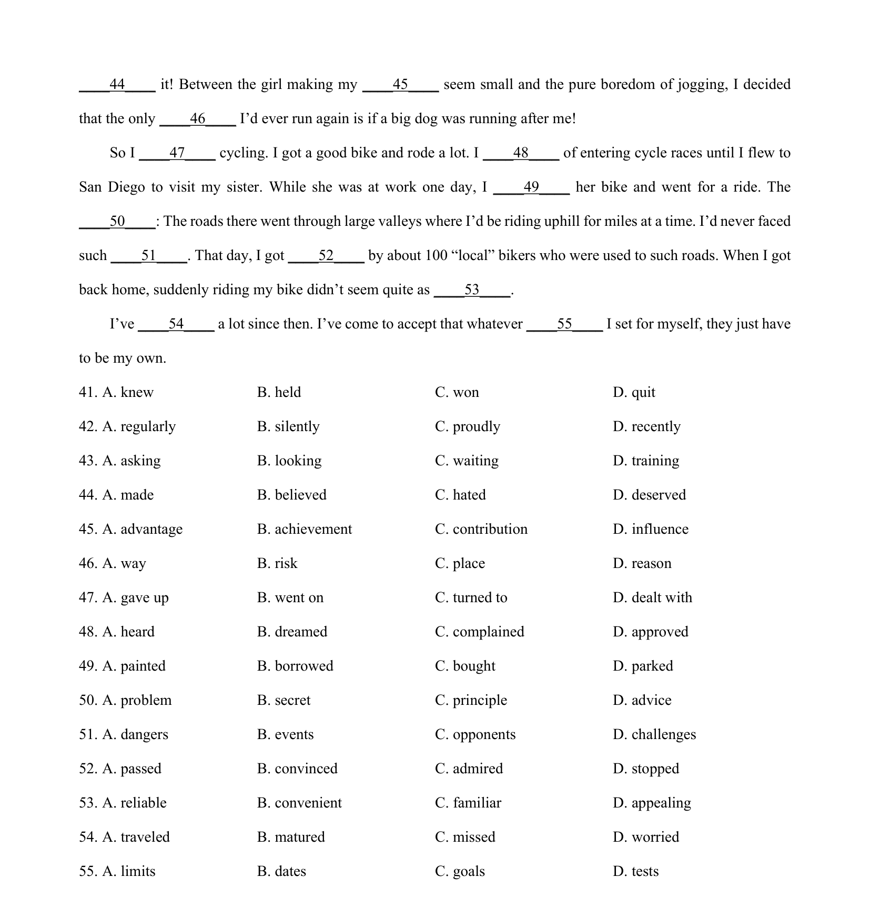

## 篇章题面

## 摘要

这是一篇说明文。文章主要介绍了作者使用英语词典的经验和心得以及从中获得的乐趣。

## 关联考点

- [[994-七选五|七选五]]
- [[1014-篇章结构|篇章结构]]

## 答案

`36. F 37. B 38. E 39. A 40. D`

## 解析

> 📄 原 PDF 第 15 页：`素材/真题/湖南/2008-2024·（湖南）英语高考真题/2024年高考英语试卷（新课标Ⅰ卷）（解析卷）.pdf`
