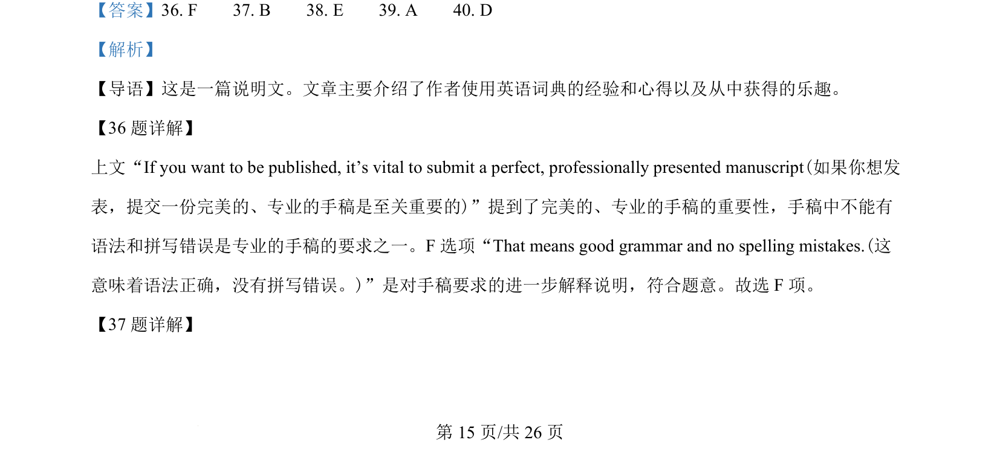
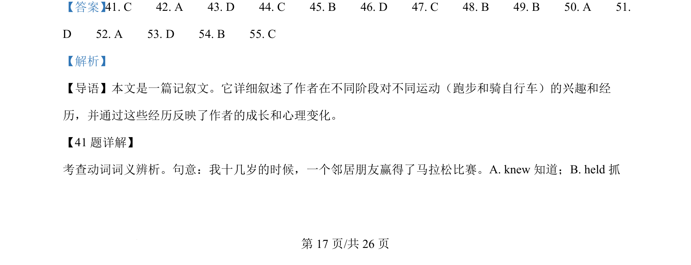
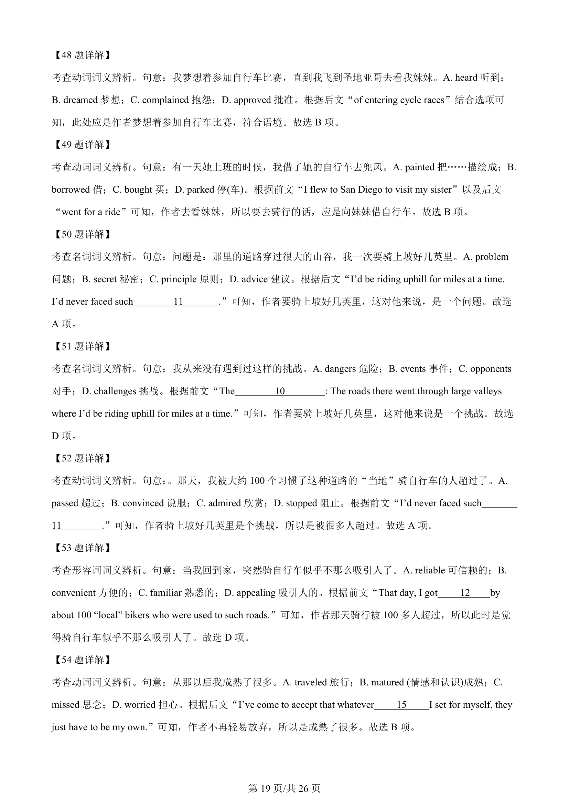

## 篇章题面

## 摘要

本文是一篇记叙文。它详细叙述了作者在不同阶段对不同运动（跑步和骑自行车）的兴趣和经 历，并通过这些经历反映了作者的成长和心理变化。

## 关联考点

- [[810-完形填空|完形填空]]
- [[900-词义辨析|词义辨析]]
- [[908-语境理解|语境理解]]
- [[146-记叙文要素|记叙文]]

## 答案

`41. C 42. A 43. D 44. C 45. B 46. D 47. C 48. B 49. B 50. A 51. D 52. A 53. D 54. B 55. C`

## 解析

> 📄 原 PDF 第 17 页：`素材/真题/湖南/2008-2024·（湖南）英语高考真题/2024年高考英语试卷（新课标Ⅰ卷）（解析卷）.pdf`
