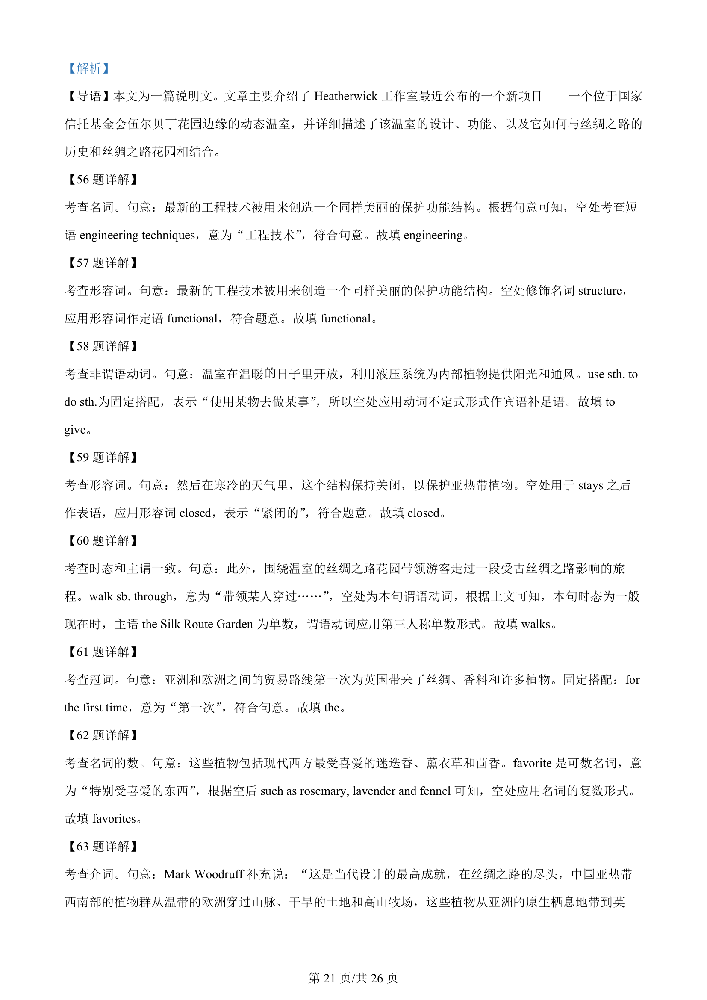
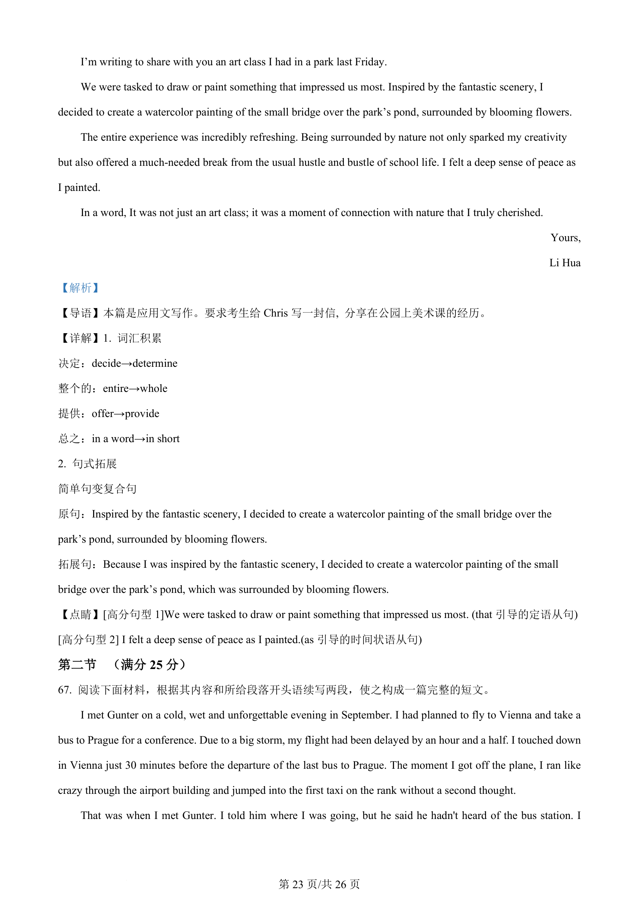
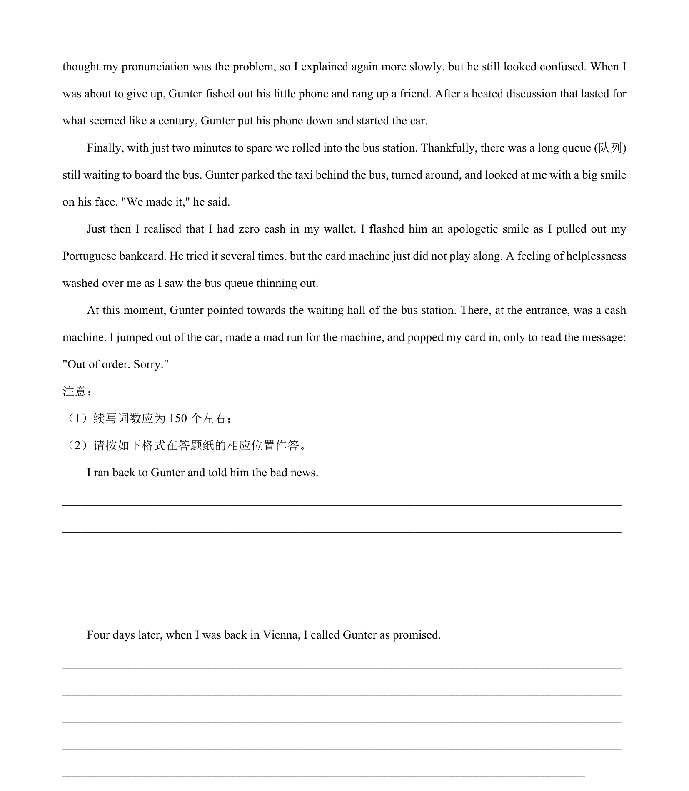

## 篇章题面

## 摘要

本篇是应用文写作。要求考生给Chris 写一封信, 分享在公园上美术课的经历。

## 关联考点

- [[996-书面表达|书面表达]]
- [[1007-应用文写作|应用文写作]]

## 答案

`Dear Chris, I’m writing to share with you an art class I had in a park last Friday. We were tasked to draw or paint something that impressed us most. Inspired by the fantastic scenery, I decided to create a watercolor painting of the small bridge over the park’s pond, surrounded by blooming flowers.`

## 解析

> 📄 原 PDF 第 22 页：`素材/真题/湖南/2008-2024·（湖南）英语高考真题/2024年高考英语试卷（新课标Ⅰ卷）（解析卷）.pdf`
