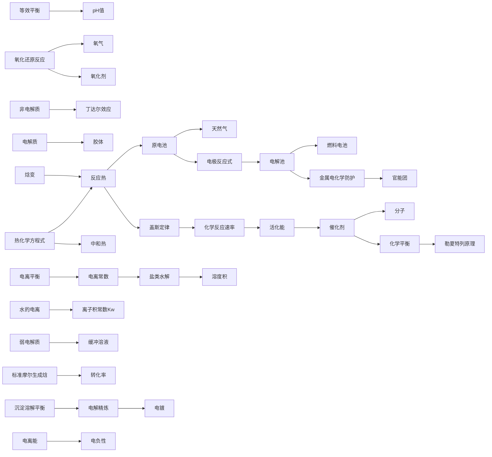
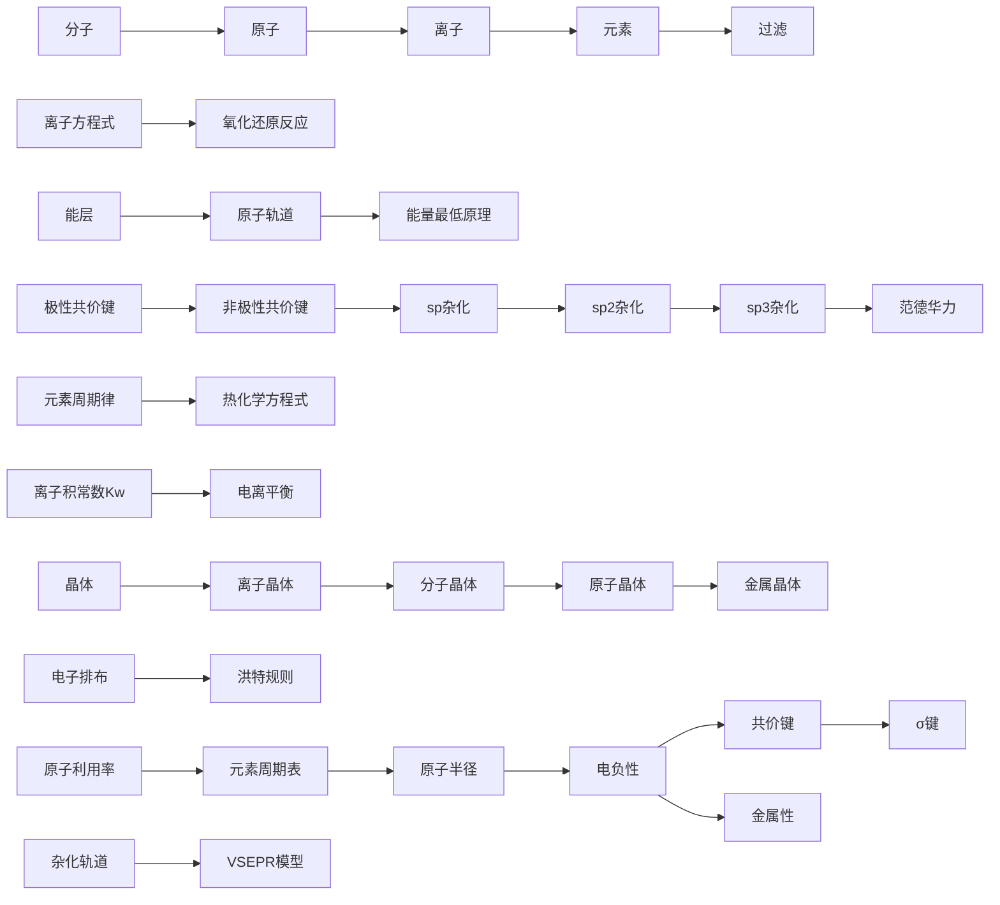
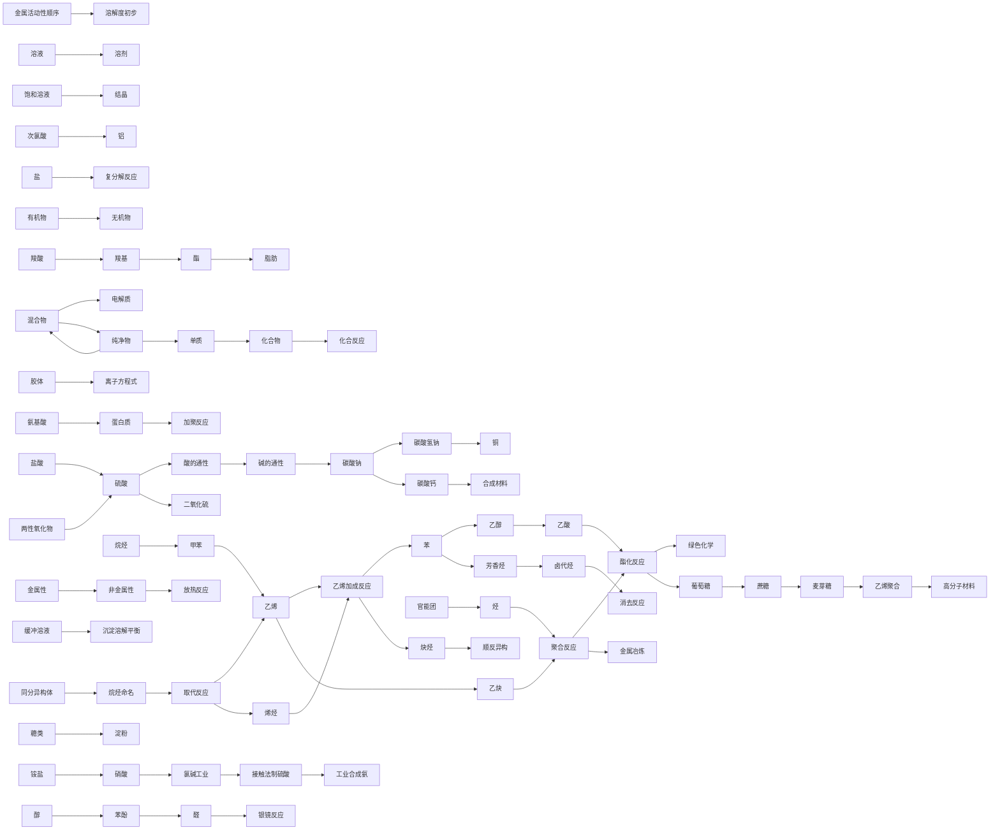

# 化学纵向总览 · 概念成长链

> 沿各领域主干，概念逐学段连续生长（前置←→延伸）。
> 由 `strand_map_化学.yaml` 生成，覆盖 196 概念节点。
> Mermaid 流程图（Obsidian 阅读模式渲染）；箭头 = 延伸方向；点节点跳词条。

## 化学实验（3 节点 / 2 链接）

## 反应原理（42 节点 / 31 链接）

## 物质结构（36 节点 / 26 链接）

## 物质性质与分类（82 节点 / 68 链接）

## 综合（116 节点 / 82 链接）

```mermaid
graph LR
  n0["化学变化"]
  n1["物理变化"]
  n2["化石燃料"]
  n3["天然气"]
  n4["新能源"]
  n5["燃烧条件"]
  n6["催化剂"]
  n7["分解反应"]
  n8["化合反应"]
  n9["氧化反应"]
  n10["氧气"]
  n11["质量守恒定律"]
  n12["一氧化碳"]
  n13["二氧化碳"]
  n14["同素异形体"]
  n15["碳"]
  n16["水"]
  n17["溶解度初步"]
  n18["溶剂"]
  n19["溶液"]
  n20["溶质"]
  n21["结晶"]
  n22["饱和溶液"]
  n23["合金"]
  n24["置换反应"]
  n25["金属活动性顺序"]
  n26["铁"]
  n27["铜"]
  n28["铝"]
  n29["复分解反应"]
  n30["盐"]
  n31["碳酸钠"]
  n32["铁锈"]
  n33["合成材料"]
  n34["无机物"]
  n35["有机物"]
  n36["糖类"]
  n37["脂肪"]
  n38["酸雨"]
  n39["pH值"]
  n40["中和反应"]
  n41["氢氧化钙"]
  n42["氢氧化钠"]
  n43["盐酸"]
  n44["丁达尔效应"]
  n45["弱电解质"]
  n46["氧化剂"]
  n47["氧化还原反应"]
  n48["混合物"]
  n49["还原剂"]
  n50["非电解质"]
  n51["两性氧化物"]
  n52["氢氧化铁"]
  n53["氢氧化铝"]
  n54["铝热反应"]
  n55["次氯酸"]
  n56["氯气"]
  n57["氯水"]
  n58["漂白粉"]
  n59["过氧化钠"]
  n60["钠"]
  n61["二氧化硫"]
  n62["氨气"]
  n63["铵盐"]
  n64["加聚反应"]
  n65["烷烃"]
  n66["苯"]
  n67["极性共价键"]
  n68["结构式"]
  n69["绿色化学"]
  n70["勒夏特列原理"]
  n71["原电池"]
  n72["吸热反应"]
  n73["放热反应"]
  n74["中和热"]
  n75["标准摩尔生成焓"]
  n76["热化学方程式"]
  n77["键能"]
  n78["水的电离"]
  n79["溶度积Ksp"]
  n80["等效平衡"]
  n81["转化率"]
  n82["燃料电池"]
  n83["电解池"]
  n84["铅蓄电池"]
  n85["洪特规则"]
  n86["电离能"]
  n87["能层"]
  n88["能量最低原理"]
  n89["晶体"]
  n90["晶胞"]
  n91["π键"]
  n92["σ键"]
  n93["氢键"]
  n94["范德华力"]
  n95["配位键"]
  n96["配合物"]
  n97["键角"]
  n98["键长"]
  n99["同分异构体"]
  n100["顺反异构"]
  n101["羧酸"]
  n102["醇"]
  n103["银镜反应"]
  n104["缩聚反应"]
  n105["氨基酸"]
  n106["淀粉"]
  n107["纤维素"]
  n108["VSEPR模型"]
  n109["取代反应"]
  n110["杂化轨道"]
  n111["消去反应"]
  n112["溶度积"]
  n113["结构简式"]
  n114["均摊法"]
  n115["原子利用率"]
  n0 --> n1
  n1 --> n9
  n9 --> n7
  n7 --> n6
  n11 --> n14
  n14 --> n13
  n13 --> n48
  n8 --> n47
  n10 --> n12
  n12 --> n16
  n16 --> n15
  n15 --> n5
  n5 --> n2
  n2 --> n4
  n26 --> n24
  n26 --> n51
  n24 --> n19
  n18 --> n20
  n20 --> n42
  n42 --> n41
  n41 --> n40
  n40 --> n30
  n29 --> n35
  n34 --> n27
  n27 --> n28
  n27 --> n32
  n28 --> n23
  n28 --> n26
  n23 --> n25
  n17 --> n22
  n21 --> n43
  n33 --> n38
  n46 --> n49
  n49 --> n60
  n60 --> n59
  n59 --> n56
  n56 --> n55
  n61 --> n62
  n62 --> n50
  n44 --> n57
  n57 --> n58
  n58 --> n31
  n32 --> n52
  n52 --> n53
  n53 --> n54
  n54 --> n63
  n3 --> n109
  n69 --> n115
  n73 --> n72
  n72 --> n83
  n70 --> n78
  n112 --> n79
  n79 --> n71
  n82 --> n84
  n84 --> n76
  n74 --> n75
  n81 --> n80
  n39 --> n45
  n85 --> n86
  n92 --> n91
  n91 --> n110
  n108 --> n93
  n93 --> n95
  n95 --> n96
  n96 --> n90
  n90 --> n114
  n114 --> n87
  n88 --> n98
  n98 --> n77
  n77 --> n97
  n97 --> n67
  n94 --> n89
  n113 --> n68
  n68 --> n99
  n100 --> n66
  n111 --> n102
  n103 --> n101
  n37 --> n36
  n106 --> n107
  n107 --> n105
  n64 --> n104
  n104 --> n65
  click n0 "001-化学变化"
  click n1 "004-物理变化"
  click n2 "009-化石燃料"
  click n3 "010-天然气"
  click n4 "012-新能源"
  click n5 "020-燃烧条件"
  click n6 "039-催化剂"
  click n7 "040-分解反应"
  click n8 "041-化合反应"
  click n9 "043-氧化反应"
  click n10 "044-氧气"
  click n11 "058-质量守恒定律"
  click n12 "063-一氧化碳"
  click n13 "064-二氧化碳"
  click n14 "066-同素异形体"
  click n15 "068-碳"
  click n16 "072-水"
  click n17 "077-溶解度初步"
  click n18 "082-溶剂"
  click n19 "083-溶液"
  click n20 "087-溶质"
  click n21 "089-结晶"
  click n22 "092-饱和溶液"
  click n23 "093-合金"
  click n24 "095-置换反应"
  click n25 "101-金属活动性顺序"
  click n26 "104-铁"
  click n27 "105-铜"
  click n28 "106-铝"
  click n29 "109-复分解反应"
  click n30 "114-盐"
  click n31 "117-碳酸钠"
  click n32 "121-铁锈"
  click n33 "124-合成材料"
  click n34 "127-无机物"
  click n35 "128-有机物"
  click n36 "130-糖类"
  click n37 "132-脂肪"
  click n38 "135-酸雨"
  click n39 "136-pH值"
  click n40 "137-中和反应"
  click n41 "138-氢氧化钙"
  click n42 "139-氢氧化钠"
  click n43 "141-盐酸"
  click n44 "151-丁达尔效应"
  click n45 "157-弱电解质"
  click n46 "160-氧化剂"
  click n47 "162-氧化还原反应"
  click n48 "163-混合物"
  click n49 "174-还原剂"
  click n50 "176-非电解质"
  click n51 "180-两性氧化物"
  click n52 "184-氢氧化铁"
  click n53 "185-氢氧化铝"
  click n54 "193-铝热反应"
  click n55 "196-次氯酸"
  click n56 "199-氯气"
  click n57 "202-氯水"
  click n58 "204-漂白粉"
  click n59 "208-过氧化钠"
  click n60 "209-钠"
  click n61 "217-二氧化硫"
  click n62 "220-氨气"
  click n63 "230-铵盐"
  click n64 "240-加聚反应"
  click n65 "244-烷烃"
  click n66 "247-苯"
  click n67 "264-极性共价键"
  click n68 "269-结构式"
  click n69 "279-绿色化学"
  click n70 "282-勒夏特列原理"
  click n71 "287-原电池"
  click n72 "290-吸热反应"
  click n73 "294-放热反应"
  click n74 "301-中和热"
  click n75 "307-标准摩尔生成焓"
  click n76 "309-热化学方程式"
  click n77 "315-键能"
  click n78 "324-水的电离"
  click n79 "331-溶度积Ksp"
  click n80 "355-等效平衡"
  click n81 "356-转化率"
  click n82 "366-燃料电池"
  click n83 "368-电解池"
  click n84 "374-铅蓄电池"
  click n85 "387-洪特规则"
  click n86 "390-电离能"
  click n87 "394-能层"
  click n88 "396-能量最低原理"
  click n89 "409-晶体"
  click n90 "413-晶胞"
  click n91 "423-π键"
  click n92 "424-σ键"
  click n93 "435-氢键"
  click n94 "437-范德华力"
  click n95 "440-配位键"
  click n96 "441-配合物"
  click n97 "443-键角"
  click n98 "444-键长"
  click n99 "446-同分异构体"
  click n100 "455-顺反异构"
  click n101 "470-羧酸"
  click n102 "475-醇"
  click n103 "480-银镜反应"
  click n104 "500-缩聚反应"
  click n105 "510-氨基酸"
  click n106 "512-淀粉"
  click n107 "514-纤维素"
  click n108 "584-VSEPR模型"
  click n109 "651-取代反应"
  click n110 "720-杂化轨道"
  click n111 "756-消去反应"
  click n112 "762-溶度积"
  click n113 "817-结构简式"
  click n114 "881-均摊法"
  click n115 "992-原子利用率"
```

