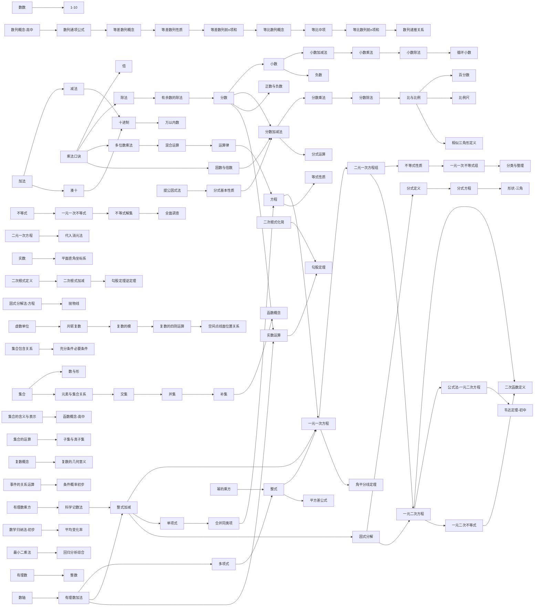
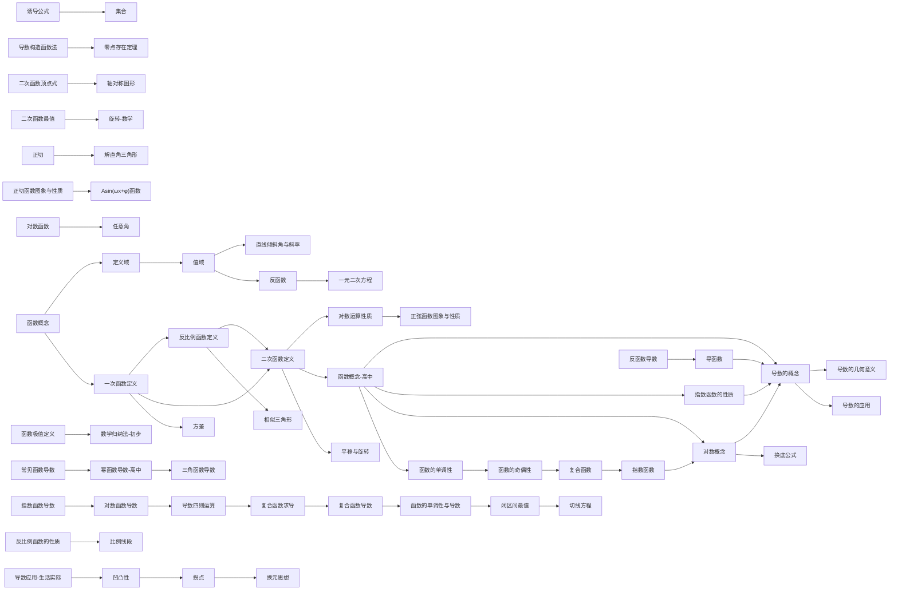
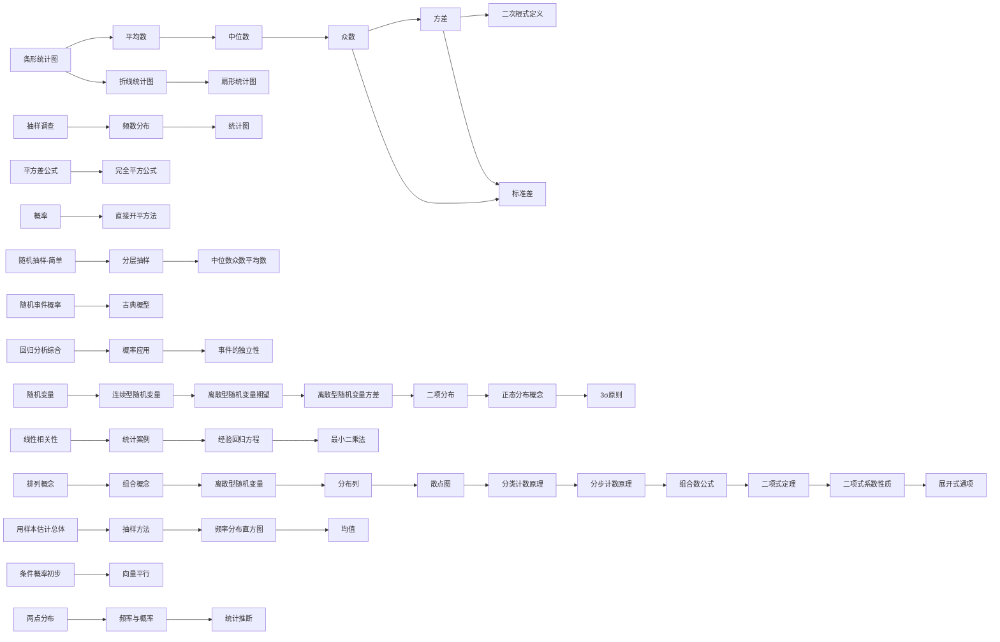

# 数学纵向总览 · 概念成长链

> 沿四领域主干，概念从小一到高三连续生长（前置←→延伸）。
> 由 `strand_map_数学.yaml` 生成，覆盖 371 概念节点。
> 图为 Mermaid 流程图（Obsidian 阅读模式渲染）；箭头 = 延伸方向。

## 数与代数（114 节点 / 102 链接）

## 函数（60 节点 / 51 链接）

## 图形与几何（153 节点 / 132 链接）

```mermaid
graph LR
  n0["形状-三角"]
  n1["形状-椭圆"]
  n2["形状-菱形"]
  n3["对称"]
  n4["圆柱"]
  n5["球"]
  n6["长度单位"]
  n7["线段"]
  n8["角"]
  n9["周长"]
  n10["面积"]
  n11["平行与垂直"]
  n12["平行四边形与梯形"]
  n13["平移与旋转"]
  n14["平均数"]
  n15["多边形面积"]
  n16["表面积"]
  n17["体积"]
  n18["圆周率"]
  n19["圆的周长与面积"]
  n20["圆锥"]
  n21["二元一次方程组"]
  n22["几何图形"]
  n23["射线"]
  n24["有理数"]
  n25["直线方程"]
  n26["直线的截距"]
  n27["点线面体"]
  n28["相似三角形"]
  n29["相似三角形的判定"]
  n30["直线"]
  n31["角平分线定理"]
  n32["角平分线性质"]
  n33["准线"]
  n34["焦半径"]
  n35["点到直线距离"]
  n36["对顶角"]
  n37["平面直角坐标系"]
  n38["空间向量的坐标运算"]
  n39["空间点线面位置关系"]
  n40["相交线"]
  n41["黄金分割"]
  n42["邻补角"]
  n43["观察物体"]
  n44["数对"]
  n45["SSS判定"]
  n46["三角形内角和"]
  n47["三角形外角"]
  n48["全等三角形性质"]
  n49["幂的乘方"]
  n50["等腰三角形性质"]
  n51["等边三角形"]
  n52["轴对称图形"]
  n53["三角形中位线"]
  n54["函数概念"]
  n55["勾股定理"]
  n56["平行四边形判定"]
  n57["平行四边形定义性质"]
  n58["自变量与因变量"]
  n59["中心对称"]
  n60["中心对称图形"]
  n61["二次函数顶点式"]
  n62["切线"]
  n63["切线长定理"]
  n64["圆-定义"]
  n65["圆周角定理"]
  n66["圆心角"]
  n67["垂径定理"]
  n68["弧长公式"]
  n69["扇形面积公式"]
  n70["抛物线"]
  n71["点和圆的位置关系"]
  n72["三视图"]
  n73["仰角俯角"]
  n74["位似"]
  n75["余弦"]
  n76["平行投影"]
  n77["平行线分线段成比例"]
  n78["正切"]
  n79["正弦"]
  n80["正投影"]
  n81["特殊角三角函数值"]
  n82["相似三角形定义"]
  n83["相似三角形性质"]
  n84["解直角三角形"]
  n85["锐角三角函数应用"]
  n86["三角函数线"]
  n87["任意角"]
  n88["余弦函数图象与性质"]
  n89["弧度制"]
  n90["正切函数图象与性质"]
  n91["正弦函数图象与性质"]
  n92["诱导公式"]
  n93["事件的关系运算"]
  n94["向量的减法"]
  n95["向量的加法"]
  n96["向量的数乘"]
  n97["向量的数量积"]
  n98["向量的概念"]
  n99["复数概念"]
  n100["复数的几何意义"]
  n101["平面向量基本定理"]
  n102["球的表面积体积"]
  n103["用样本估计总体"]
  n104["空间几何体-多面体"]
  n105["空间直线平面垂直"]
  n106["空间直线平面平行"]
  n107["空间角"]
  n108["空间距离"]
  n109["随机事件概率"]
  n110["随机抽样-简单"]
  n111["双曲线定义与方程"]
  n112["双曲线渐近线"]
  n113["圆的一般方程"]
  n114["圆的标准方程"]
  n115["数列概念-高中"]
  n116["椭圆定义与方程"]
  n117["椭圆离心率"]
  n118["直线倾斜角与斜率"]
  n119["直线和圆位置关系-高中"]
  n120["直线方程-一般式"]
  n121["直线方程-点斜式"]
  n122["空间向量坐标表示"]
  n123["空间向量基本概念"]
  n124["空间平面法向量"]
  n125["三角函数导数"]
  n126["切线方程"]
  n127["导数应用-生活实际"]
  n128["导数的几何意义"]
  n129["常见函数导数"]
  n130["指数函数导数"]
  n131["三角形全等"]
  n132["因式分解"]
  n133["直角三角形"]
  n134["反比例函数的性质"]
  n135["向量坐标运算"]
  n136["比例线段"]
  n137["焦点三角形"]
  n138["虚数单位"]
  n139["象限"]
  n140["二次函数最值"]
  n141["几何概型"]
  n142["向量平行"]
  n143["圆的方程"]
  n144["平行线性质"]
  n145["平行线的判定"]
  n146["异面直线"]
  n147["弦长公式"]
  n148["棱柱的结构特征"]
  n149["椭圆标准方程"]
  n150["椭圆焦点"]
  n151["概率"]
  n152["点到平面的距离"]
  n0 --> n1
  n0 --> n2
  n0 --> n46
  n3 --> n13
  n4 --> n5
  n5 --> n43
  n6 --> n7
  n6 --> n9
  n7 --> n8
  n7 --> n23
  n8 --> n11
  n8 --> n40
  n11 --> n12
  n11 --> n145
  n12 --> n15
  n12 --> n57
  n9 --> n10
  n10 --> n15
  n15 --> n16
  n15 --> n55
  n16 --> n17
  n17 --> n20
  n18 --> n19
  n19 --> n20
  n37 --> n21
  n37 --> n54
  n37 --> n98
  n37 --> n116
  n48 --> n82
  n82 --> n85
  n85 --> n79
  n72 --> n104
  n98 --> n96
  n98 --> n101
  n101 --> n138
  n116 --> n149
  n31 --> n24
  n22 --> n27
  n30 --> n8
  n36 --> n42
  n42 --> n11
  n145 --> n144
  n144 --> n40
  n139 --> n44
  n47 --> n131
  n131 --> n50
  n50 --> n132
  n46 --> n51
  n51 --> n133
  n133 --> n45
  n32 --> n52
  n52 --> n49
  n52 --> n140
  n57 --> n56
  n56 --> n58
  n118 --> n26
  n118 --> n143
  n26 --> n14
  n62 --> n151
  n70 --> n33
  n70 --> n61
  n59 --> n60
  n60 --> n64
  n64 --> n66
  n66 --> n65
  n65 --> n67
  n63 --> n68
  n68 --> n69
  n69 --> n71
  n71 --> n119
  n119 --> n109
  n119 --> n116
  n28 --> n74
  n74 --> n81
  n81 --> n111
  n111 --> n112
  n111 --> n134
  n136 --> n29
  n29 --> n83
  n83 --> n77
  n77 --> n41
  n53 --> n85
  n79 --> n75
  n75 --> n78
  n84 --> n73
  n73 --> n76
  n76 --> n80
  n80 --> n72
  n87 --> n89
  n89 --> n86
  n86 --> n92
  n91 --> n88
  n88 --> n90
  n96 --> n135
  n135 --> n97
  n97 --> n99
  n100 --> n103
  n141 --> n93
  n142 --> n95
  n95 --> n94
  n94 --> n101
  n39 --> n146
  n146 --> n106
  n106 --> n105
  n105 --> n148
  n148 --> n102
  n102 --> n110
  n120 --> n118
  n143 --> n126
  n126 --> n123
  n126 --> n127
  n123 --> n122
  n122 --> n38
  n38 --> n124
  n124 --> n107
  n107 --> n152
  n152 --> n108
  n108 --> n25
  n25 --> n121
  n121 --> n35
  n35 --> n114
  n114 --> n113
  n113 --> n119
  n149 --> n150
  n150 --> n117
  n117 --> n111
  n112 --> n70
  n33 --> n34
  n137 --> n147
  n147 --> n115
  n128 --> n129
  n125 --> n130
  click n0 "011-形状-三角"
  click n1 "012-形状-椭圆"
  click n2 "013-形状-菱形"
  click n3 "014-对称"
  click n4 "020-圆柱"
  click n5 "021-球"
  click n6 "027-长度单位"
  click n7 "028-线段"
  click n8 "029-角"
  click n9 "040-周长"
  click n10 "043-面积"
  click n11 "048-平行与垂直"
  click n12 "049-平行四边形与梯形"
  click n13 "054-平移与旋转"
  click n14 "055-平均数"
  click n15 "062-多边形面积"
  click n16 "065-表面积"
  click n17 "066-体积"
  click n18 "073-圆周率"
  click n19 "074-圆的周长与面积"
  click n20 "079-圆锥"
  click n21 "084-二元一次方程组"
  click n22 "085-几何图形"
  click n23 "090-射线"
  click n24 "096-有理数"
  click n25 "1026-直线方程"
  click n26 "1028-直线的截距"
  click n27 "103-点线面体"
  click n28 "1033-相似三角形"
  click n29 "1035-相似三角形的判定"
  click n30 "104-直线"
  click n31 "1103-角平分线定理"
  click n32 "1104-角平分线性质"
  click n33 "1165-准线"
  click n34 "1168-焦半径"
  click n35 "1211-点到直线距离"
  click n36 "128-对顶角"
  click n37 "132-平面直角坐标系"
  click n38 "1339-空间向量的坐标运算"
  click n39 "1340-空间点线面位置关系"
  click n40 "139-相交线"
  click n41 "1419-黄金分割"
  click n42 "142-邻补角"
  click n43 "1421-观察物体"
  click n44 "1422-数对"
  click n45 "146-SSS判定"
  click n46 "147-三角形内角和"
  click n47 "149-三角形外角"
  click n48 "152-全等三角形性质"
  click n49 "165-幂的乘方"
  click n50 "171-等腰三角形性质"
  click n51 "172-等边三角形"
  click n52 "174-轴对称图形"
  click n53 "179-三角形中位线"
  click n54 "188-函数概念"
  click n55 "189-勾股定理"
  click n56 "194-平行四边形判定"
  click n57 "195-平行四边形定义性质"
  click n58 "203-自变量与因变量"
  click n59 "207-中心对称"
  click n60 "208-中心对称图形"
  click n61 "214-二次函数顶点式"
  click n62 "217-切线"
  click n63 "218-切线长定理"
  click n64 "220-圆-定义"
  click n65 "221-圆周角定理"
  click n66 "223-圆心角"
  click n67 "224-垂径定理"
  click n68 "225-弧长公式"
  click n69 "226-扇形面积公式"
  click n70 "227-抛物线"
  click n71 "230-点和圆的位置关系"
  click n72 "235-三视图"
  click n73 "237-仰角俯角"
  click n74 "238-位似"
  click n75 "239-余弦"
  click n76 "246-平行投影"
  click n77 "247-平行线分线段成比例"
  click n78 "249-正切"
  click n79 "250-正弦"
  click n80 "251-正投影"
  click n81 "253-特殊角三角函数值"
  click n82 "257-相似三角形定义"
  click n83 "258-相似三角形性质"
  click n84 "262-解直角三角形"
  click n85 "264-锐角三角函数应用"
  click n86 "271-三角函数线"
  click n87 "275-任意角"
  click n88 "276-余弦函数图象与性质"
  click n89 "303-弧度制"
  click n90 "308-正切函数图象与性质"
  click n91 "310-正弦函数图象与性质"
  click n92 "312-诱导公式"
  click n93 "317-事件的关系运算"
  click n94 "322-向量的减法"
  click n95 "323-向量的加法"
  click n96 "327-向量的数乘"
  click n97 "328-向量的数量积"
  click n98 "329-向量的概念"
  click n99 "330-复数概念"
  click n100 "333-复数的几何意义"
  click n101 "336-平面向量基本定理"
  click n102 "343-球的表面积体积"
  click n103 "344-用样本估计总体"
  click n104 "346-空间几何体-多面体"
  click n105 "351-空间直线平面垂直"
  click n106 "352-空间直线平面平行"
  click n107 "353-空间角"
  click n108 "354-空间距离"
  click n109 "361-随机事件概率"
  click n110 "362-随机抽样-简单"
  click n111 "368-双曲线定义与方程"
  click n112 "369-双曲线渐近线"
  click n113 "372-圆的一般方程"
  click n114 "373-圆的标准方程"
  click n115 "381-数列概念-高中"
  click n116 "389-椭圆定义与方程"
  click n117 "391-椭圆离心率"
  click n118 "393-直线倾斜角与斜率"
  click n119 "394-直线和圆位置关系-高中"
  click n120 "395-直线方程-一般式"
  click n121 "398-直线方程-点斜式"
  click n122 "399-空间向量坐标表示"
  click n123 "401-空间向量基本概念"
  click n124 "411-空间平面法向量"
  click n125 "416-三角函数导数"
  click n126 "422-切线方程"
  click n127 "437-导数应用-生活实际"
  click n128 "440-导数的几何意义"
  click n129 "447-常见函数导数"
  click n130 "452-指数函数导数"
  click n131 "515-三角形全等"
  click n132 "516-因式分解"
  click n133 "518-直角三角形"
  click n134 "539-反比例函数的性质"
  click n135 "541-向量坐标运算"
  click n136 "568-比例线段"
  click n137 "571-焦点三角形"
  click n138 "588-虚数单位"
  click n139 "590-象限"
  click n140 "640-二次函数最值"
  click n141 "667-几何概型"
  click n142 "750-向量平行"
  click n143 "782-圆的方程"
  click n144 "849-平行线性质"
  click n145 "850-平行线的判定"
  click n146 "861-异面直线"
  click n147 "867-弦长公式"
  click n148 "934-棱柱的结构特征"
  click n149 "941-椭圆标准方程"
  click n150 "942-椭圆焦点"
  click n151 "945-概率"
  click n152 "977-点到平面的距离"
```

## 统计与概率（55 节点 / 43 链接）

## 综合与实践（133 节点 / 92 链接）

```mermaid
graph LR
  n0["多少"]
  n1["1-10"]
  n2["0"]
  n3["序数"]
  n4["大小"]
  n5["长短"]
  n6["轻重"]
  n7["形状-圆"]
  n8["形状-方"]
  n9["形状-三角"]
  n10["形状-菱形"]
  n11["对称"]
  n12["位置"]
  n13["加法"]
  n14["长方体"]
  n15["正方体"]
  n16["圆柱"]
  n17["时间-钟表"]
  n18["人民币认识"]
  n19["找规律"]
  n20["长度单位"]
  n21["线段"]
  n22["乘法口诀"]
  n23["搭配"]
  n24["万以内数"]
  n25["质量单位"]
  n26["推理"]
  n27["分数"]
  n28["年月日"]
  n29["小数"]
  n30["近似数"]
  n31["平行四边形与梯形"]
  n32["条形统计图"]
  n33["统筹优化"]
  n34["平移与旋转"]
  n35["鸡兔同笼"]
  n36["可能性"]
  n37["找次品"]
  n38["圆周率"]
  n39["数与形"]
  n40["负数"]
  n41["比例尺"]
  n42["不等式"]
  n43["几何图形"]
  n44["射线"]
  n45["应用题（行程工程利润）"]
  n46["数轴"]
  n47["有理数乘方"]
  n48["有理数加法"]
  n49["正数与负数"]
  n50["点线面体"]
  n51["直线"]
  n52["移项"]
  n53["等式性质"]
  n54["角平分线性质"]
  n55["随机变量"]
  n56["集合包含关系"]
  n57["展开式通项"]
  n58["焦半径"]
  n59["二元一次方程"]
  n60["代入消元法"]
  n61["全面调查"]
  n62["加减消元法"]
  n63["命题"]
  n64["垂线"]
  n65["实数"]
  n66["对顶角"]
  n67["平方根"]
  n68["平面直角坐标系"]
  n69["抽样调查"]
  n70["无理数"]
  n71["相交线"]
  n72["立方根"]
  n73["3σ原则"]
  n74["黄金分割"]
  n75["观察物体"]
  n76["数对"]
  n77["分类与整理"]
  n78["ASA-AAS-HL判定"]
  n79["SAS判定"]
  n80["SSS判定"]
  n81["全等三角形性质"]
  n82["完全平方公式"]
  n83["提公因式法"]
  n84["三角形中位线"]
  n85["中位数"]
  n86["函数概念"]
  n87["勾股定理"]
  n88["勾股定理逆定理"]
  n89["勾股数"]
  n90["标准差"]
  n91["正方形"]
  n92["自变量与因变量"]
  n93["中心对称"]
  n94["二次函数定义"]
  n95["切线"]
  n96["切线长定理"]
  n97["因式分解法-方程"]
  n98["垂径定理"]
  n99["旋转-数学"]
  n100["根的判别式"]
  n101["直接开平方法"]
  n102["配方法"]
  n103["韦达定理-初中"]
  n104["三视图"]
  n105["锐角三角函数应用"]
  n106["充分条件必要条件"]
  n107["充要条件"]
  n108["全称量词与存在量词"]
  n109["函数概念-高中"]
  n110["子集与真子集"]
  n111["对数函数"]
  n112["换底公式"]
  n113["事件的独立性"]
  n114["古典概型"]
  n115["随机事件概率"]
  n116["频率与概率"]
  n117["数列概念-高中"]
  n118["函数极值定义"]
  n119["反函数导数"]
  n120["导数构造函数法"]
  n121["平均变化率"]
  n122["瞬时变化率"]
  n123["两点分布"]
  n124["线性相关性"]
  n125["整数"]
  n126["焦点三角形"]
  n127["象限"]
  n128["几何概型"]
  n129["参数取值范围"]
  n130["均值"]
  n131["定义域"]
  n132["换元思想"]
  n0 --> n4
  n1 --> n2
  n1 --> n3
  n1 --> n4
  n2 --> n13
  n4 --> n13
  n18 --> n29
  n19 --> n39
  n19 --> n117
  n24 --> n22
  n24 --> n30
  n40 --> n46
  n40 --> n48
  n7 --> n8
  n7 --> n38
  n8 --> n9
  n8 --> n10
  n8 --> n14
  n8 --> n15
  n10 --> n11
  n10 --> n91
  n34 --> n95
  n14 --> n16
  n15 --> n16
  n75 --> n104
  n5 --> n20
  n6 --> n25
  n12 --> n76
  n76 --> n41
  n76 --> n59
  n76 --> n68
  n77 --> n32
  n77 --> n36
  n77 --> n66
  n36 --> n115
  n23 --> n26
  n26 --> n35
  n33 --> n37
  n17 --> n28
  n71 --> n63
  n71 --> n81
  n87 --> n8
  n87 --> n105
  n114 --> n116
  n114 --> n128
  n125 --> n27
  n49 --> n47
  n53 --> n52
  n52 --> n45
  n45 --> n43
  n50 --> n21
  n44 --> n51
  n64 --> n72
  n72 --> n65
  n63 --> n67
  n67 --> n70
  n70 --> n127
  n60 --> n62
  n62 --> n42
  n61 --> n69
  n80 --> n79
  n79 --> n78
  n78 --> n54
  n82 --> n83
  n91 --> n86
  n88 --> n89
  n89 --> n31
  n92 --> n131
  n103 --> n94
  n103 --> n109
  n101 --> n102
  n102 --> n100
  n100 --> n97
  n100 --> n103
  n99 --> n93
  n98 --> n96
  n74 --> n84
  n110 --> n56
  n106 --> n107
  n107 --> n108
  n108 --> n100
  n112 --> n111
  n130 --> n85
  n90 --> n115
  n58 --> n126
  n122 --> n118
  n121 --> n119
  n132 --> n129
  n129 --> n120
  n57 --> n55
  n73 --> n124
  n113 --> n123
  click n0 "002-多少"
  click n1 "003-1-10"
  click n2 "004-0"
  click n3 "005-序数"
  click n4 "006-大小"
  click n5 "007-长短"
  click n6 "008-轻重"
  click n7 "009-形状-圆"
  click n8 "010-形状-方"
  click n9 "011-形状-三角"
  click n10 "013-形状-菱形"
  click n11 "014-对称"
  click n12 "015-位置"
  click n13 "016-加法"
  click n14 "018-长方体"
  click n15 "019-正方体"
  click n16 "020-圆柱"
  click n17 "023-时间-钟表"
  click n18 "025-人民币认识"
  click n19 "026-找规律"
  click n20 "027-长度单位"
  click n21 "028-线段"
  click n22 "030-乘法口诀"
  click n23 "031-搭配"
  click n24 "035-万以内数"
  click n25 "036-质量单位"
  click n26 "037-推理"
  click n27 "041-分数"
  click n28 "044-年月日"
  click n29 "045-小数"
  click n30 "046-近似数"
  click n31 "049-平行四边形与梯形"
  click n32 "050-条形统计图"
  click n33 "051-统筹优化"
  click n34 "054-平移与旋转"
  click n35 "056-鸡兔同笼"
  click n36 "060-可能性"
  click n37 "069-找次品"
  click n38 "073-圆周率"
  click n39 "077-数与形"
  click n40 "078-负数"
  click n41 "080-比例尺"
  click n42 "083-不等式"
  click n43 "085-几何图形"
  click n44 "090-射线"
  click n45 "091-应用题（行程工程利润）"
  click n46 "092-数轴"
  click n47 "097-有理数乘方"
  click n48 "100-有理数加法"
  click n49 "102-正数与负数"
  click n50 "103-点线面体"
  click n51 "104-直线"
  click n52 "106-移项"
  click n53 "108-等式性质"
  click n54 "1104-角平分线性质"
  click n55 "1133-随机变量"
  click n56 "1137-集合包含关系"
  click n57 "1160-展开式通项"
  click n58 "1168-焦半径"
  click n59 "119-二元一次方程"
  click n60 "120-代入消元法"
  click n61 "121-全面调查"
  click n62 "123-加减消元法"
  click n63 "124-命题"
  click n64 "125-垂线"
  click n65 "127-实数"
  click n66 "128-对顶角"
  click n67 "129-平方根"
  click n68 "132-平面直角坐标系"
  click n69 "133-抽样调查"
  click n70 "135-无理数"
  click n71 "139-相交线"
  click n72 "140-立方根"
  click n73 "1402-3σ原则"
  click n74 "1419-黄金分割"
  click n75 "1421-观察物体"
  click n76 "1422-数对"
  click n77 "1423-分类与整理"
  click n78 "144-ASA-AAS-HL判定"
  click n79 "145-SAS判定"
  click n80 "146-SSS判定"
  click n81 "152-全等三角形性质"
  click n82 "163-完全平方公式"
  click n83 "167-提公因式法"
  click n84 "179-三角形中位线"
  click n85 "180-中位数"
  click n86 "188-函数概念"
  click n87 "189-勾股定理"
  click n88 "191-勾股定理逆定理"
  click n89 "192-勾股数"
  click n90 "199-标准差"
  click n91 "200-正方形"
  click n92 "203-自变量与因变量"
  click n93 "207-中心对称"
  click n94 "212-二次函数定义"
  click n95 "217-切线"
  click n96 "218-切线长定理"
  click n97 "219-因式分解法-方程"
  click n98 "224-垂径定理"
  click n99 "228-旋转-数学"
  click n100 "229-根的判别式"
  click n101 "231-直接开平方法"
  click n102 "233-配方法"
  click n103 "234-韦达定理-初中"
  click n104 "235-三视图"
  click n105 "264-锐角三角函数应用"
  click n106 "278-充分条件必要条件"
  click n107 "279-充要条件"
  click n108 "280-全称量词与存在量词"
  click n109 "281-函数概念-高中"
  click n110 "297-子集与真子集"
  click n111 "298-对数函数"
  click n112 "307-换底公式"
  click n113 "318-事件的独立性"
  click n114 "320-古典概型"
  click n115 "361-随机事件概率"
  click n116 "363-频率与概率"
  click n117 "381-数列概念-高中"
  click n118 "420-函数极值定义"
  click n119 "425-反函数导数"
  click n120 "439-导数构造函数法"
  click n121 "449-平均变化率"
  click n122 "463-瞬时变化率"
  click n123 "467-两点分布"
  click n124 "502-线性相关性"
  click n125 "517-整数"
  click n126 "571-焦点三角形"
  click n127 "590-象限"
  click n128 "667-几何概型"
  click n129 "721-参数取值范围"
  click n130 "786-均值"
  click n131 "821-定义域"
  click n132 "885-换元思想"
```

