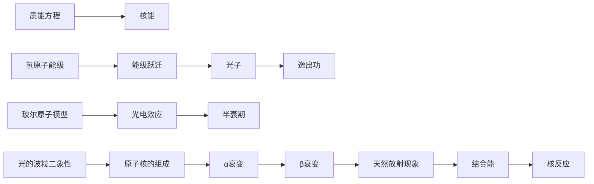
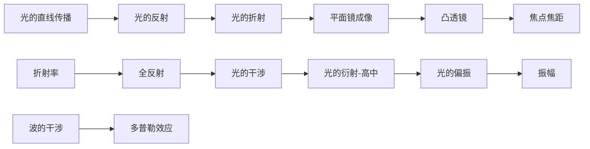
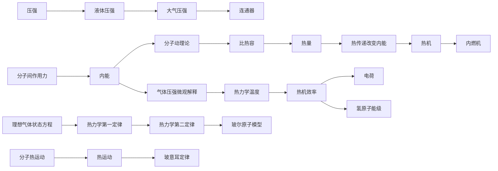
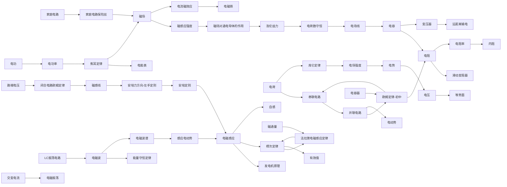
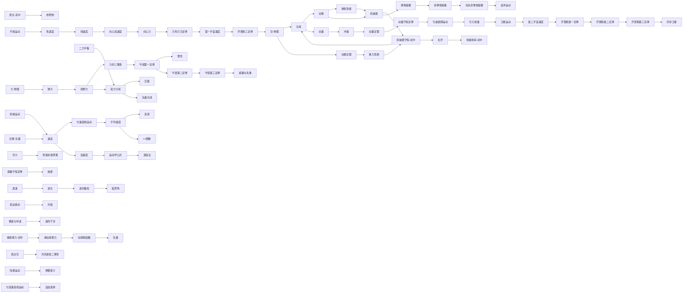
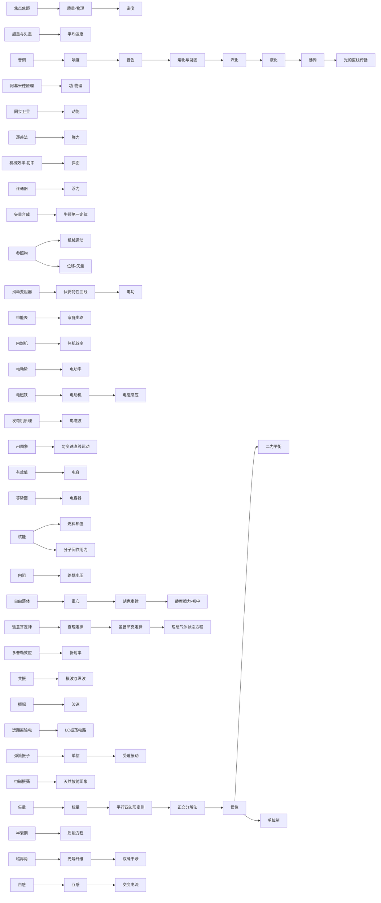

# 物理纵向总览 · 概念成长链

> 沿各领域主干，概念逐学段连续生长（前置←→延伸）。
> 由 `strand_map_物理.yaml` 生成，覆盖 201 概念节点。
> Mermaid 流程图（Obsidian 阅读模式渲染）；箭头 = 延伸方向；点节点跳词条。

## 近代物理（16 节点 / 12 链接）

## 光学（14 节点 / 11 链接）

## 热学（24 节点 / 20 链接）

## 电磁学（51 节点 / 50 链接）

## 力学（81 节点 / 71 链接）

## 综合（89 节点 / 56 链接）

