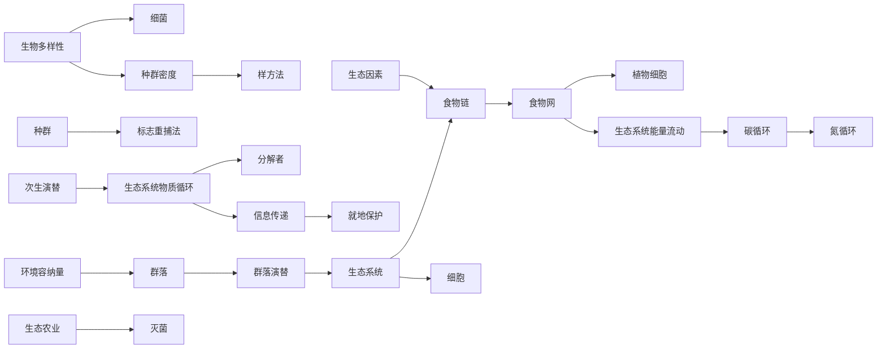
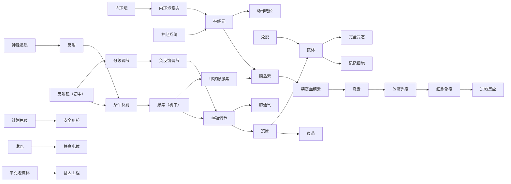
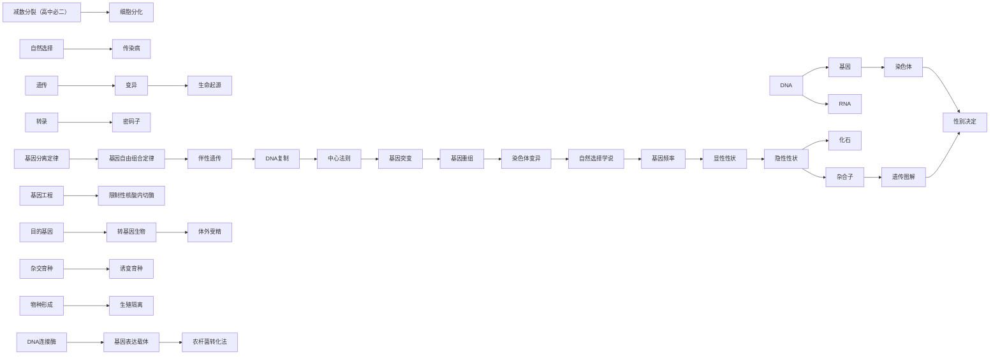
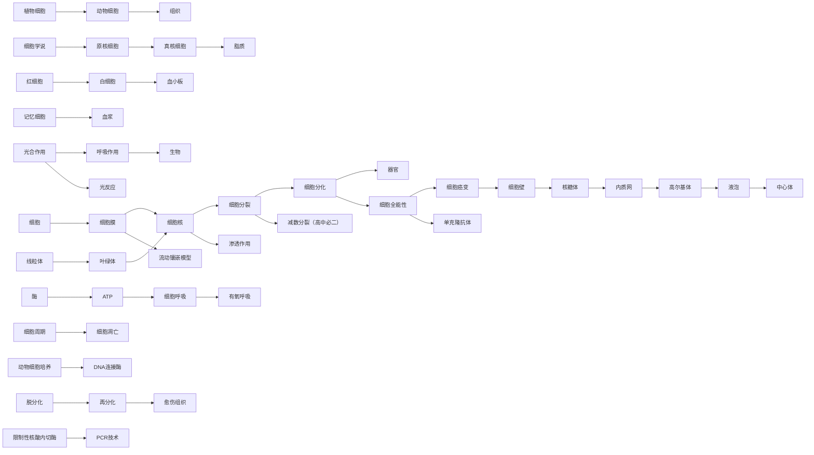
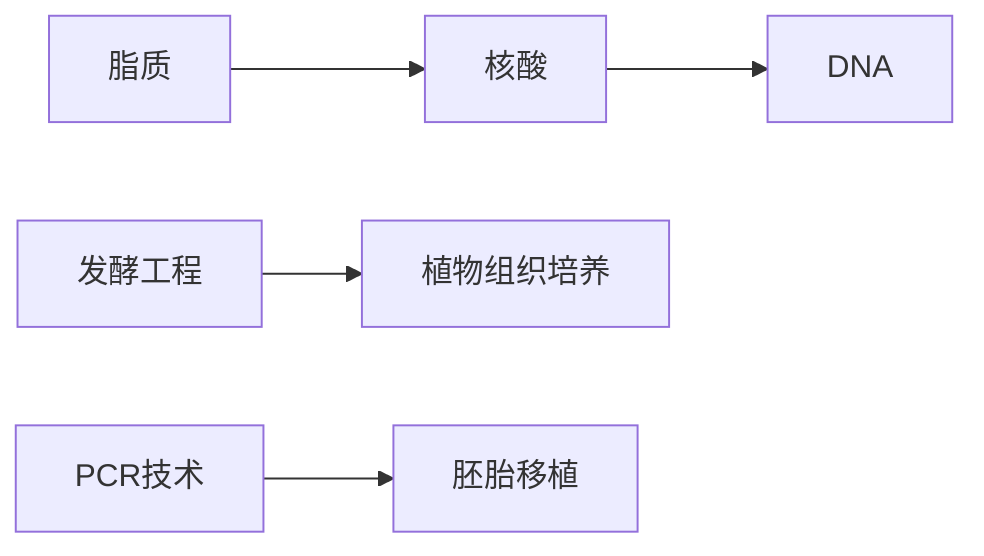
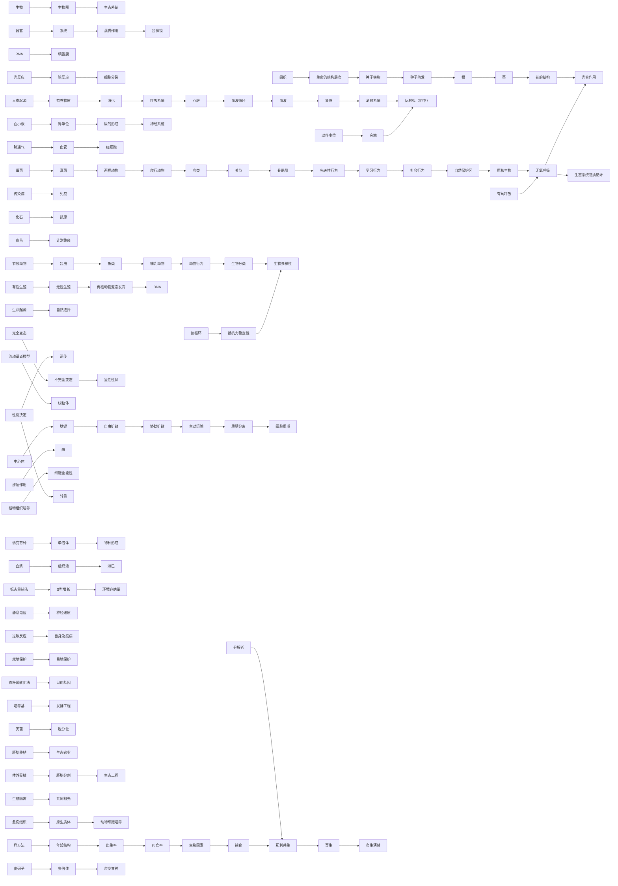

# 生物纵向总览 · 概念成长链

> 沿各领域主干，概念逐学段连续生长（前置←→延伸）。
> 由 `strand_map_生物.yaml` 生成，覆盖 213 概念节点。
> Mermaid 流程图（Obsidian 阅读模式渲染）；箭头 = 延伸方向；点节点跳词条。

## 生态（25 节点 / 20 链接）

## 稳态与调节（33 节点 / 30 链接）

## 遗传变异进化（41 节点 / 31 链接）

## 细胞与代谢（49 节点 / 38 链接）

## 分子与生物技术（7 节点 / 4 链接）

## 综合（138 节点 / 103 链接）

